大厂高阶班之 JUC并发编程与源码分析 尚硅谷讲师:周阳 2021.3V2.6

\1.   本课程前置要求说明................................................................................................... 34

1.1.   如何突破月薪25K，达到年薪30W以上？........................................................ 34

1.2.   本课程学生对象.................................................................................................. 34

1.2.1.    已经学完尚硅谷零基础就业班的6个月的学习........................................... 34

·   零基础就业班JUC知识串讲复习，快快过一下.............................................. 34

·   零基础就业班，阳哥JUC四大口诀............................................................ 34

·   高内聚低耦合前提下，封装思想.................................................................. 34

·   线程.............................................................................................................. 34

·   操作.............................................................................................................. 34

·   资源类.......................................................................................................... 34

·   判断、干活、通知........................................................................................ 34

·   防止虚假唤醒,wait方法要注意.................................................................... 34

·   注意标志位flag，可能是volatile的............................................................ 34

·   JUC要求的知识内容，请回忆下................................................................. 34

·   ReentrantLock........................................................................................... 34

·   ReentrantReadWriteLock......................................................................... 34

·   Condition..................................................................................................... 34

·   工具类.......................................................................................................... 34

·   CountDownLatch......................................................................................... 34

·   CyclicBarrier........................................................................................... 34

·   Semaphore................................................................................................... 34

·   线程池与阻塞队列........................................................................................ 34

·   ForkJoinPool与ForkJoinTask............................................................... 34

·   Java8新特性函数式编程、方法引用、lambda Express............................. 35

·   原子操作类Atomic...................................................................................... 35

·   volatile......................................................................................................... 35

·   Callable和FutureTask................................................................................ 35

·   。。。。。。............................................................................................... 35

1.2.2.    且................................................................................................................. 35

1.2.3.    实际工作过1~5年的Java开发工程师....................................................... 35

1.3.    本课程的难度对标.............................................................................................. 35

1.3.1.    阿里P6---P7................................................................................................ 35

·   易中难章节说明............................................................................................... 35

1.3.2.    阿里P6、P7对高级Java开发工程师的要求明细...................................... 35

·   技术栈.............................................................................................................. 35

·   阿里手册规范................................................................................................... 35

\2.    线程基础知识复习...................................................................................................... 35

2.1.    先拜拜大神......................................................................................................... 35

2.1.1.    Doug Lea(道格.利)....................................................................................... 35

2.2.    零基础就业班讲解时阳哥JUC四大口诀........................................................... 35

2.2.1.    高内聚低耦合前提下，封装思想.................................................................. 35

·   线程................................................................................................................. 35

·   操作.............................................................................................................. 35

·   资源类.......................................................................................................... 36

2.2.2.    判断、干活、通知........................................................................................ 36

2.2.3.    防止虚假唤醒,wait方法要注意使用while判断........................................... 36

2.2.4.    注意标志位flag，可能是volatile的............................................................ 36

2.3.    为什么多线程极其重要？？？........................................................................... 36

2.3.1.    硬件方面...................................................................................................... 36

·   摩尔定律失效................................................................................................... 36

2.3.2.    软件方面...................................................................................................... 36

·   zhuanability..................................................................................................... 36

·   高并发系统，异步+回调等生产需求............................................................... 36

2.4.    从start一个线程说起........................................................................................ 36

2.4.1.    Java线程理解以及openjdk中的实现......................................................... 36

·   private native void start0();.............................................................................. 36

·   Java语言本身底层就是C++语言.................................................................... 36

·   OpenJDK源码网址......................................................................................... 37

·   http://openjdk.java.net/................................................................................ 37

·   建议下载源码到本地观看............................................................................. 37

·   openjdk8\hotspot\src\share\vm\runtime...................................................... 37

2.4.2.    更加底层的C++源码解读............................................................................ 37

·   openjdk8\jdk\src\share\native\java\lang.......................................................... 37

·   thread.c........................................................................................................ 37

·   openjdk8\hotspot\src\share\vm\prims............................................................. 37

·   jvm.cpp........................................................................................................ 37

·   openjdk8\hotspot\src\share\vm\runtime.......................................................... 38

·   thread.cpp.................................................................................................... 38

2.5.    Java多线程相关概念......................................................................................... 38

2.5.1.    进程.............................................................................................................. 38

·   是程序的⼀次执⾏，是系统进⾏资源分配和调度的独⽴单位，每⼀个进程都有它⾃⼰的内存空间和系统资源................................................................................................................ 38

2.5.2.    线程.............................................................................................................. 39

·   在同⼀个进程内⼜可以执⾏多个任务，⽽这每⼀个任务我们就可以看做是⼀个线程  39

·   ⼀个进程会有1个或多个线程的..................................................................... 39

2.5.3.    面试题：何为进程和线程？......................................................................... 39

·   Subtopic.......................................................................................................... 39

·   Subtopic.......................................................................................................... 39

·   Subtopic.......................................................................................................... 40

·   Subtopic.......................................................................................................... 40

·   Subtopic.......................................................................................................... 41

·   Subtopic.......................................................................................................... 42

·   Subtopic.......................................................................................................... 42

·   Subtopic.......................................................................................................... 42

·   Subtopic.......................................................................................................... 43

·   Subtopic.......................................................................................................... 43

·   Subtopic.......................................................................................................... 44

2.5.4.    管程.............................................................................................................. 44

·   Monitor(监视器)，也就是我们平时所说的锁................................................... 44

·   JVM第3版..................................................................................................... 45

2.6.    用户线程和守护线程.......................................................................................... 46

2.6.1.    Java线程分为用户线程和守护线程， 线程的daemon属性为true表示是守护线程，false表示是用户线程................................................................................................................. 46

2.6.2.    守护线程...................................................................................................... 46

·   是一种特殊的线程，在后台默默地完成一些系统性的服务，比如垃圾回收线程 46

2.6.3.    用户线程...................................................................................................... 46

·   是系统的工作线程，它会完成这个程序需要完成的业务操作......................... 46

2.6.4.    code............................................................................................................. 46

2.6.5.    重点.............................................................................................................. 47

·   当程序中所有用户线程执行完毕之后，不管守护线程是否结束，系统都会自动退出  47

·   如果用户线程全部结束了，意味着程序需要完成的业务操作已经结束了，系统可以退出 了。所以当系统只剩下守护进程的时候，java虚拟机会自动退出............................... 47

·   设置守护线程，需要在start()方法之前进行................................................... 47

\3.    CompletableFuture.................................................................................................... 47

3.1.    Future和Callable接口...................................................................................... 47

3.2.    从之前的FutureTask说开去............................................................................. 48

3.2.1.    本源的Future接口相关架构........................................................................ 48

3.2.2.    Code............................................................................................................ 49

·   get()阻塞.......................................................................................................... 50

·   一旦调用get()方法，不管是否计算完成都会导致阻塞，o(╥﹏╥)o............ 50

3.2.3.    Code2.......................................................................................................... 50

·   isDone()轮询................................................................................................... 51

·   轮询的方式会耗费无谓的CPU资源，而且也不见得能及时地得到计算结果. 51

·   如果想要异步获取结果,通常都会以轮询的方式去获取结果 尽量不要阻塞. 51

3.2.4.    小总结.......................................................................................................... 51

·   不见不散.......................................................................................................... 51

·   过时不候...................................................................................................... 51

·   轮询.............................................................................................................. 51

3.2.5.    想完成一些复杂的任务................................................................................ 51

·   应对Future的完成时间，完成了可以告诉我，也就是我们的回调通知......... 51

·   将两个异步计算合成一个异步计算，这两个异步计算互相独立，同时第二个又依赖第一个的结果。   52

·   当Future集合中某个任务最快结束时，返回结果。....................................... 52

·   等待Future结合中的所有任务都完成。......................................................... 52

·   。。。。。。................................................................................................... 52

3.3.    对Future的改进................................................................................................ 52

3.3.1.    CompletableFuture和CompletionStage源码分别介绍............................. 52

·   类架构说明...................................................................................................... 52

·   接口CompletionStage.................................................................................... 52

·   是什么.......................................................................................................... 52

·   类CompletableFuture..................................................................................... 52

·   是什么.......................................................................................................... 53

3.3.2.    核心的四个静态方法，来创建一个异步操作............................................... 53

·   runAsync 无 返回值....................................................................................... 53

·   public static CompletableFuture<Void> runAsync(Runnable runnable).... 53

·   public static CompletableFuture<Void> runAsync(Runnable runnable,Executor executor)  53

·   supplyAsync 有 返回值.................................................................................. 53

·   public static <U> CompletableFuture<U> supplyAsync(Supplier<U> supplier) 53

·   public static <U> CompletableFuture<U> supplyAsync(Supplier<U> supplier,Executor executor)   53

·   上述Executor executor参数说明................................................................... 53

·   没有指定Executor的方法，直接使用默认的ForkJoinPool.commonPool() 作为它的线程池执行异步代码。......................................................................................................... 53

·   如果指定线程池，则使用我们自定义的或者特别指定的线程池执行异步代码 53

·   Code................................................................................................................ 53

·   无 返回值..................................................................................................... 53

·   有 返回值..................................................................................................... 54

·   Code之通用演示，减少阻塞和轮询............................................................... 55

·   从Java8开始引入了CompletableFuture，它是Future的功能增强版， 可以传入回调对象，当异步任务完成或者发生异常时，自动调用回调对象的回调方法........................ 55

·   code............................................................................................................. 55

·   解释下为什么默认线程池关闭，自定义线程池记得关闭............................. 57

·   CompletableFuture的优点.............................................................................. 57

·   异步任务结束时，会自动回调某个对象的方法；........................................ 57

·   异步任务出错时，会自动回调某个对象的方法；........................................ 57

·   主线程设置好回调后，不再关心异步任务的执行，异步任务之间可以顺序执行 57

3.4.    案例精讲-从电商网站的比价需求说开去........................................................... 57

3.4.1.    函数式编程已经主流.................................................................................... 57

·   大厂面试题看看............................................................................................... 57

·   Lambda +Stream+链式调用+Java8函数式编程带走..................................... 58

·   Runnable..................................................................................................... 58

·   Function....................................................................................................... 58

·   Consumer.................................................................................................... 58

·   Supplier....................................................................................................... 58

·   BiConsumer................................................................................................. 59

·   小总结.......................................................................................................... 59

3.4.2.    先说说join和get对比................................................................................. 59

3.4.3.    说说你过去工作中的项目亮点？.................................................................. 59

3.4.4.    大厂业务需求说明........................................................................................ 59

·   切记，功能→性能........................................................................................... 59

·   对内微服务多系统调用.................................................................................... 59

·   对外网站比价................................................................................................... 59

3.4.5.    一波流Java8函数式编程带走..................................................................... 60

3.5.    CompletableFuture常用方法............................................................................ 63

3.5.1.    获得结果和触发计算.................................................................................... 63

·   获取结果.......................................................................................................... 63

·   public T  get().......................................................................................... 63

·   不见不散...................................................................................................... 63

·   public T  get(long timeout, TimeUnit unit)............................................... 63

·   过时不候...................................................................................................... 63

·   public T  getNow(T valueIfAbsent)......................................................... 63

·   没有计算完成的情况下，给我一个替代结果............................................... 63

·   **立即获取结果不阻塞**.................................................................................... 63

·   计算完，返回计算完成后的结果.................................................................. 63

·   没算完，返回设定的valueIfAbsent值........................................................ 63

·   Code............................................................................................................ 63

·   public T  join()......................................................................................... 64

·   主动触发计算................................................................................................... 65

·   **public boolean** complete(T value).................................................... 65

·   是否打断get方法立即返回括号值.............................................................. 65

·   code............................................................................................................. 65

3.5.2.    对计算结果进行处理.................................................................................... 66

·   thenApply........................................................................................................ 66

·   计算结果存在依赖关系，这两个线程串行化............................................... 66

·   code............................................................................................................. 66

·   由于存在依赖关系(当前步错，不走下一步)，当前步骤有异常的话就叫停。 67

·   handle.............................................................................................................. 68

·   code............................................................................................................. 68

·   有异常也可以往下一步走，根据带的异常参数可以进一步处理.................. 69

·   总结................................................................................................................. 69

3.5.3.    对计算结果进行消费.................................................................................... 70

·   接收任务的处理结果，并消费处理，无返回结果............................................ 70

·   thenAccept...................................................................................................... 70

·   补充................................................................................................................. 70

·   Code之任务之间的顺序执行....................................................................... 70

·   thenRun....................................................................................................... 70

·   thenRun(Runnable runnable)...................................................................... 70

·   任务 A 执行完执行 B，并且 B 不需要 A 的结果..................................... 70

·   thenAccept................................................................................................... 70

·   thenAccept(Consumer action).................................................................... 70

·   任务 A 执行完执行 B，B 需要 A 的结果，但是任务 B 无返回值........... 70

·   thenApply..................................................................................................... 70

·   thenApply(Function fn)................................................................................ 70

·   任务 A 执行完执行 B，B 需要 A 的结果，同时任务 B 有返回值........... 70

·   code............................................................................................................. 70

3.5.4.    对计算速度进行选用.................................................................................... 71

·   谁快用谁.......................................................................................................... 71

·   applyToEither.................................................................................................. 71

·   code................................................................................................................. 71

3.5.5.    对计算结果进行合并.................................................................................... 72

·   两个CompletionStage任务都完成后，最终能把两个任务的结果一起交给thenCombine 来处理   72

·   先完成的先等着，等待其它分支任务.............................................................. 73

·   thenCombine................................................................................................... 73

·   code标准版，好理解先拆分....................................................................... 73

·   code表达式................................................................................................. 74

\4.    说说Java“锁”事......................................................................................................... 76

4.1.    大厂面试题复盘................................................................................................. 76

4.2.    从轻松的乐观锁和悲观锁开讲........................................................................... 77

4.2.1.    悲观锁.......................................................................................................... 77

·   适合写操作多的场景，先加锁可以保证写操作时数据正确。......................... 77

·   显式的锁定之后再操作同步资源..................................................................... 77

4.2.2.    伪代码说明................................................................................................... 77

4.2.3.    乐观锁.......................................................................................................... 78

·   适合读操作多的场景，不加锁的特点能够使其读操作的性能大幅提升。....... 78

·   乐观锁则直接去操作同步资源，是一种无锁算法，得之我幸不得我命，再抢 78

·   乐观锁一般有两种实现方式：......................................................................... 78

·   采用版本号机制........................................................................................... 78

·   CAS（Compare-and-Swap，即比较并替换）算法实现............................. 78

4.3.    通过8种情况演示锁运行案例，看看我们到底锁的是什么............................... 78

4.3.1.    承前启后的复习一下.................................................................................... 78

·   锁相关的8种案例演示.................................................................................... 78

·   看看JVM中对应的锁在哪里？....................................................................... 78

4.3.2.    synchronized有三种应用方式..................................................................... 79

·   JDK源码(notify方法)说明举例........................................................................ 79

·   8种锁的案例实际体现在3个地方.................................................................. 79

·   作用于实例方法，当前实例加锁，进入同步代码前要获得当前实例的锁； 79

·   作用于代码块，对括号里配置的对象加锁。............................................... 79

·   作用于静态方法，当前类加锁，进去同步代码前要获得当前类对象的锁； 79

4.3.3.    从字节码角度分析synchronized实现......................................................... 79

·   javap -c ***.class文件反编译.......................................................................... 79

·   -c            对代码进行反汇编............................................... 80

·   假如你需要更多信息.................................................................................... 80

·   javap -v ***.class文件反编译...................................................................... 80

·   -v -verbose       输出附加信息（包括行号、本地变量表，反汇编等详细信息）   80

·   synchronized同步代码块................................................................................ 80

·   javap -c ***.class文件反编译...................................................................... 80

·   反编译.......................................................................................................... 80

·   synchronized同步代码块............................................................................ 80

·   实现使用的是monitorenter和monitorexit指令.......................................... 80

·   一定是一个enter两个exit吗？.................................................................. 80

·   m1方法里面自己添加一个异常试试............................................................ 80

·   synchronized普通同步方法............................................................................ 81

·   javap -v ***.class文件反编译...................................................................... 81

·   反编译.......................................................................................................... 81

·   synchronized普通同步方法......................................................................... 81

·   调用指令将会检查方法的ACC_SYNCHRONIZED访问标志是否被设置。 如果设置了，执行线程会将先持有monitor然后再执行方法， 最后在方法完成(无论是正常完成还是非正常完成)时释放 monitor............................................................................................................... 81

·   synchronized静态同步方法............................................................................ 81

·   javap -v ***.class文件反编译...................................................................... 81

·   反编译.......................................................................................................... 81

·   synchronized静态同步方法......................................................................... 82

·   ACC_STATIC, ACC_SYNCHRONIZED访问标志区分该方法是否静态同步方法  82

4.3.4.    反编译**synchronized**锁的是什么............................................................. 82

·   **什么是管程monitor**........................................................................................ 82

·   大厂面试题讲解........................................................................................... 82

·   为什么任何一个对象都可以成为一个锁....................................................... 82

·   **管程**.............................................................................................................. 82

·   在HotSpot虚拟机中，monitor采用ObjectMonitor实现............................ 83

·   上述C++源码解读....................................................................................... 83

·   ObjectMonitor.java→ObjectMonitor.cpp→objectMonitor.hpp................ 83

·   objectMonitor.hpp.................................................................................... 83

·   每个对象天生都带着一个对象监视器.......................................................... 84

4.3.5.    对于**synchronized关键字**， 我们在《**Synchronized****与锁升级**》 章节还会再深度讲解  84

·   提前剧透，混个眼熟........................................................................................ 84

4.4.    公平锁和非公平锁.............................................................................................. 84

4.4.1.    从ReentrantLock卖票编码演示公平和非公平现象.................................... 84

4.4.2.    何为公平锁/非公平锁?................................................................................. 86

·   源码解读.......................................................................................................... 86

·   面试题.............................................................................................................. 86

·   为什么会有公平锁/非公平锁的设计为什么默认非公平？............................ 86

·   使⽤公平锁会有什么问题............................................................................. 87

·   什么时候用公平？什么时候用非公平？....................................................... 87

4.4.3.    预埋伏AQS................................................................................................. 87

·   更进一步的源码深度分析见后续第13章........................................................ 88

4.5.    可重入锁(又名递归锁)....................................................................................... 88

4.5.1.    说明.............................................................................................................. 88

4.5.2.    “可重入锁”这四个字分开来解释：............................................................... 89

·   可：可以。...................................................................................................... 89

·   重：再次。...................................................................................................... 89

·   入：进入。...................................................................................................... 89

·   锁：同步锁。................................................................................................... 89

·   进入什么.......................................................................................................... 89

·   进入同步域（即同步代码块/方法或显式锁锁定的代码）............................ 89

·   一句话.............................................................................................................. 89

·   一个线程中的多个流程可以获取同一把锁，持有这把同步锁可以再次进入。 89

·   自己可以获取自己的内部锁......................................................................... 89

4.5.3.    可重入锁种类............................................................................................... 89

·   隐式锁（即synchronized关键字使用的锁）默认是可重入锁........................ 89

·   同步块.......................................................................................................... 90

·   同步方法...................................................................................................... 90

·   Synchronized的重入的实现机理.................................................................... 91

·   为什么任何一个对象都可以成为一个锁....................................................... 92

·   显式锁（即Lock）也有ReentrantLock这样的可重入锁。............................ 92

4.6.    死锁及排查......................................................................................................... 94

4.6.1.    是什么.......................................................................................................... 94

·   产生死锁主要原因........................................................................................... 94

·   系统资源不足............................................................................................... 94

·   进程运行推进的顺序不合适......................................................................... 94

·   资源分配不当............................................................................................... 94

4.6.2.    请写一个死锁代码case............................................................................... 94

4.6.3.    如何排查死锁............................................................................................... 96

·   纯命令.............................................................................................................. 96

·   jps -l............................................................................................................. 96

·   jstack 进程编号........................................................................................... 96

·   图形化.............................................................................................................. 96

·   jconsole....................................................................................................... 96

4.7.    写锁(独占锁)/读锁(共享锁)................................................................................ 96

4.7.1.    源码深度分析见后续第14章....................................................................... 96

4.8.    自旋锁SpinLock.................................................................................................. 96

4.8.1.    源码深度分析见后续第8章......................................................................... 96

4.9.    无锁→独占锁→读写锁→邮戳锁........................................................................ 96

4.9.1.    有没有比读写锁更快的锁？......................................................................... 96

·   StampedLock.................................................................................................. 96

4.9.2.    源码深度分析见后续第14章....................................................................... 96

4.10.   无锁→偏向锁→轻量锁→重量锁........................................................................ 96

4.10.1.     源码深度分析见后续第12章................................................................... 96

4.11.   其它细节............................................................................................................ 96

4.11.1.     不可以String同一把锁............................................................................ 96

·   严禁这么做...................................................................................................... 96

\5.    LockSupport与线程中断........................................................................................... 97

5.1.    线程中断机制..................................................................................................... 97

5.1.1.    从阿里蚂蚁金服面试题讲起......................................................................... 97

5.1.2.    什么是中断？............................................................................................... 97

5.1.3.    中断的相关API方法.................................................................................... 98

5.1.4.    面试题：如何使用中断标识停止线程？....................................................... 98

·   在需要中断的线程中不断监听中断状态， 一旦发生中断，就执行相应的中断处理业务逻辑。 98

·   修改状态...................................................................................................... 98

·   停止程序的运行........................................................................................... 98

·   。。。。。。............................................................................................... 98

·   方法................................................................................................................. 99

·   通过一个volatile变量实现.......................................................................... 99

·   通过AtomicBoolean.................................................................................. 100

·   通过Thread类自带的中断api方法实现................................................... 101

·   API............................................................................................................. 101

·   实例方法interrupt()，没有返回值............................................................. 101

·   源码分析.................................................................................................... 101

·   实例方法isInterrupted，返回布尔值......................................................... 102

·   源码分析.................................................................................................... 103

·   code........................................................................................................... 103

·   **当前线程的中断标识为true，是不是就立刻停止？**..................................... 104

·   说明............................................................................................................ 104

·   code02....................................................................................................... 105

·   **code02后手案例(重要，面试就是它，操蛋)**............................................ 106

·   结论............................................................................................................ 106

·   小总结........................................................................................................ 106

·   中断只是一种协同机制，修改中断标识位仅此而已，不是立刻stop打断 106

·   静态方法Thread.interrupted()....................................................................... 106

·   静态方法Thread.interrupted()................................................................... 107

·   code........................................................................................................... 107

·   说明............................................................................................................ 108

·   都会返回中断状态，两者对比................................................................... 108

·....................................................................................................................... 108

·....................................................................................................................... 108

5.1.5.    总结............................................................................................................ 109

5.2.    LockSupport是什么......................................................................................... 109

5.2.1.    是什么........................................................................................................ 110

5.3.    线程等待唤醒机制............................................................................................ 111

5.3.1.    3种让线程等待和唤醒的方法.................................................................... 111

·   方式1：使用Object中的wait()方法让线程等待，使用Object中的notify()方法唤醒线程 111

·   方式2：使用JUC包中Condition的await()方法让线程等待，使用signal()方法唤醒线程 111

·   方式3：LockSupport类可以阻塞当前线程以及唤醒指定被阻塞的线程...... 111

5.3.2.    Object类中的wait和notify方法实现线程等待和唤醒.............................. 111

·   代码............................................................................................................... 111

·   正常............................................................................................................ 113

·   异常1......................................................................................................... 114

·   wait方法和notify方法，两个都去掉同步代码块...................................... 116

·   异常情况.................................................................................................... 116

·   异常2......................................................................................................... 116

·   将notify放在wait方法前面....................................................................... 118

·   程序无法执行，无法唤醒........................................................................... 118

·   小总结............................................................................................................ 118

·   wait和notify方法必须要在同步块或者方法里面，且成对出现使用......... 118

·   先wait后notify才OK............................................................................... 118

5.3.3.    Condition接口中的await后signal方法实现线程的等待和唤醒............... 118

·   代码............................................................................................................... 118

·   正常............................................................................................................ 118

·   异常1......................................................................................................... 120

·   去掉lock/unlock......................................................................................... 121

·   异常2......................................................................................................... 122

·   先signal后await....................................................................................... 123

·   小总结............................................................................................................ 123

·   Condtion中的线程等待和唤醒方法之前，需要先获取锁.......................... 123

·   一定要先await后signal，不要反了......................................................... 124

5.3.4.    Object和Condition使用的限制条件......................................................... 124

·   线程先要获得并持有锁，必须在锁块(synchronized或lock)中.................... 124

·   必须要先等待后唤醒，线程才能够被唤醒..................................................... 124

5.3.5.    LockSupport类中的park等待和unpark唤醒.......................................... 124

·   是什么............................................................................................................ 124

·   通过park()和unpark(thread)方法来实现阻塞和唤醒线程的操作.............. 124

·   官网解释.................................................................................................... 124

·   主要方法........................................................................................................ 124

·   API............................................................................................................. 124

·   阻塞............................................................................................................ 125

·   park() /park(Object blocker)...................................................................... 125

·   阻塞当前线程/阻塞传入的具体线程........................................................... 125

·   唤醒............................................................................................................ 125

·   unpark(Thread thread).............................................................................. 125

·   唤醒处于阻塞状态的指定线程................................................................... 126

·   代码............................................................................................................... 126

·   正常+无锁块要求....................................................................................... 126

·   之前错误的先唤醒后等待，LockSupport照样支持................................... 127

·   解释............................................................................................................ 128

·   成双成对要牢记......................................................................................... 128

\6.    Java内存模型之JMM............................................................................................. 128

6.1.    先从大厂面试题开始........................................................................................ 128

6.1.1.    你知道什么是Java内存模型JMM吗？.................................................... 128

6.1.2.    JMM与volatile它们两个之间的关系？(下一章详细讲解)......................... 128

6.1.3.    JMM有哪些特性or它的三大特性是什么？.............................................. 128

6.1.4.    为什么要有JMM，它为什么出现？作用和功能是什么？......................... 128

6.1.5.    happens-before先行发生原则你有了解过吗？......................................... 128

6.2.    计算机硬件存储体系........................................................................................ 128

6.2.1.    问题？和推导出我们需要知道JMM.......................................................... 129

6.3.    Java内存模型Java Memory Model................................................................ 129

6.4.    JMM规范下，三大特性................................................................................... 130

6.4.1.    可见性........................................................................................................ 130

6.4.2.    原子性........................................................................................................ 133

·   指一个操作是不可中断的，即多线程环境下，操作不能被其他线程干扰..... 133

6.4.3.    有序性........................................................................................................ 133

·   简单案例先过个眼熟...................................................................................... 134

6.5.    JMM规范下，多线程对变量的读写过程......................................................... 134

6.5.1.    读取过程.................................................................................................... 134

6.5.2.    小总结........................................................................................................ 135

·   我们定义的所有共享变量都储存在物理主内存中.......................................... 135

·   每个线程都有自己独立的工作内存，里面保存该线程使用到的变量的副本(主内存中该变量的一份拷贝).................................................................................................................... 135

·   线程对共享变量所有的操作都必须先在线程自己的工作内存中进行后写回主内存，不能直接从主内存中读写(不能越级)............................................................................................. 136

·   不同线程之间也无法直接访问其他线程的工作内存中的变量，线程间变量值的传递需要通过主内存来进行(同级不能相互访问).................................................................................. 136

6.6.    JMM规范下，多线程先行发生原则之happens-before.................................. 136

6.6.1.    在JMM中， 如果一个操作执行的结果需要对另一个操作可见性 或者 代码重排序，那么这两个操作之间必须存在happens-before关系。............................................................. 136

6.6.2.    x 、y案例说明.......................................................................................... 136

6.6.3.    先行发生原则说明...................................................................................... 136

6.6.4.    happens-before总原则............................................................................. 137

·   如果一个操作happens-before另一个操作，那么第一个操作的执行结果将对第二个操作可见， 而且第一个操作的执行顺序排在第二个操作之前。................................................ 137

·   两个操作之间存在happens-before关系，并不意味着一定要按照happens-before原则制定的顺序来执行。 如果重排序之后的执行结果与按照happens-before关系来执行的结果一致，那么这种重排序并不非法。........................................................................................................... 137

·   值日............................................................................................................ 137

·   周一张三周二李四，假如有事情调换班可以的.......................................... 137

·   1+2+3 = 3+2+1.......................................................................................... 137

6.6.5.    happens-before之8条............................................................................. 137

·   次序规则：.................................................................................................... 137

·   一个线程内，按照代码顺序，写在前面的操作先行发生于写在后面的操作； 137

·   加深说明.................................................................................................... 137

·   前一个操作的结果可以被后续的操作获取。 讲白点就是前面一个操作把变量X赋值为1，那后面一个操作肯定能知道X已经变成了1。....................................................... 138

·   锁定规则：.................................................................................................... 138

·   一个unLock操作先行发生于后面((这里的“后面”是指时间上的先后))对同一个锁的lock操作；   138

·   volatile变量规则：........................................................................................ 138

·   对一个volatile变量的写操作先行发生于后面对这个变量的读操作， 前面的写对后面的读是可见的，这里的“后面”同样是指时间上的先后。.................................................... 138

·   传递规则：.................................................................................................... 138

·   如果操作A先行发生于操作B，而操作B又先行发生于操作C，则可以得出操作A先行发生于操作C；.......................................................................................................... 138

·   线程启动规则(Thread Start Rule)：.............................................................. 138

·   Thread对象的start()方法先行发生于此线程的每一个动作...................... 138

·   线程中断规则(Thread Interruption Rule)：................................................... 139

·   对线程interrupt()方法的调用先行发生于被中断线程的代码检测到中断事件的发生；  139

·   可以通过Thread.interrupted()检测到是否发生中断.................................. 139

·   线程终止规则(Thread Termination Rule)：.................................................. 139

·   线程中的所有操作都先行发生于对此线程的终止检 测，我们可以通过Thread::join()方法是否结束、 Thread::isAlive()的返回值等手段检测线程是否已经终止执行。............ 139

·   对象终结规则(Finalizer Rule)：.................................................................... 139

·   一个对象的初始化完成（构造函数执行结束）先行发生于它的finalize()方法的开始   139

·   说人话........................................................................................................ 139

·   对象没有完成初始化之前，是不能调用finalized()方法的......................... 139

6.6.6.    案例说明.................................................................................................... 139

·   code............................................................................................................... 139

·   解释............................................................................................................... 139

·   修复............................................................................................................ 140

·   把getter/setter方法都定义为synchronized方法..................................... 140

·   把value定义为volatile变量，由于setter方法对value的修改不依赖value的原值，满足volatile关键字使用场景................................................................................... 140

\7.    volatile与Java内存模型......................................................................................... 140

7.1.    被volatile修改的变量有2大特点................................................................... 140

7.1.1.    特点............................................................................................................ 140

·   可见性............................................................................................................ 140

·   有序性............................................................................................................ 140

·   排序要求.................................................................................................... 141

7.1.2.    volatile的内存语义.................................................................................... 141

·   当写一个volatile变量时，JMM会把该线程对应的本地内存中的共享变量值立即刷新回主内存中。   141

·   当读一个volatile变量时，JMM会把该线程对应的本地内存设置为无效，直接从主内存中读取共享变量...................................................................................................................... 141

·   所以volatile的写内存语义是直接刷新到主内存中，读的内存语义是直接从主内存中读取。  141

7.2.    ***内存屏障(面试重点必须拿下)\***.......................................................................... 141

7.2.1.    先说生活case............................................................................................ 141

·   没有管控，顺序难保...................................................................................... 141

·   设定规则，禁止乱序...................................................................................... 142

·   上海南京路步行街武警“人墙”当红灯......................................................... 142

7.2.2.    是什么........................................................................................................ 143

7.2.3.    volatile凭什么可以保证可见性和有序性？？？........................................ 144

·   内存屏障 (Memory Barriers / Fences).......................................................... 144

7.2.4.    JVM中提供了四类内存屏障指令............................................................... 144

·   一句话............................................................................................................ 144

·   上一章讲解过happens-before先行发生原则，类似接口规范，落地？... 144

·   落地靠什么？............................................................................................. 144

·   你凭什么可以保证？你管用吗？................................................................ 144

·   C++源码分析................................................................................................. 144

·   IDEA工具里面找Unsafe.class.............................................................. 144

·   Unsafe.java............................................................................................. 145

·   Unsafe.cpp............................................................................................... 145

·   OrderAccess.hpp....................................................................................... 146

·   orderAccess_linux_x86.inline.hpp............................................................ 146

·   四大屏障分别是什么意思.............................................................................. 147

·   orderAccess_linux_x86.inline.hpp............................................................ 148

7.2.5.    **如下内容困难，可能会导致学生懵逼，课堂要讲解细致 分2次讲解+复习** 148

·........................................................................................................................... 148

·   happens-before 之 volatile 变量规则.......................................................... 149

·   JMM 就将内存屏障插⼊策略分为 4 种........................................................ 149

·   写............................................................................................................... 149

·   1. 在每个 volatile 写操作的前⾯插⼊⼀个 StoreStore 屏障.................. 149

·   2. 在每个 volatile 写操作的后⾯插⼊⼀个 StoreLoad 屏障................... 149

·   对比图........................................................................................................ 149

·....................................................................................................................... 149

·   读............................................................................................................... 150

·   3. 在每个 volatile 读操作的后⾯插⼊⼀个 LoadLoad 屏障................... 150

·   4. 在每个 volatile 读操作的后⾯插⼊⼀个 LoadStore 屏障................... 150

7.3.    volatile特性..................................................................................................... 150

7.3.1.    保证可见性................................................................................................. 150

·   说明............................................................................................................... 150

·   保证不同线程对这个变量进行操作时的可见性，即变量一旦改变所有线程立即可见   150

·   Code.............................................................................................................. 150

·   不加volatile，没有可见性，程序无法停止................................................ 151

·   加了volatile，保证可见性，程序可以停止................................................ 151

·   上述代码原理解释......................................................................................... 151

·   volatile变量的读写过程............................................................................. 152

7.3.2.    没有原子性................................................................................................. 154

·   volatile变量的复合操作(如i++)不具有原子性............................................... 154

·   Code.............................................................................................................. 154

·   从i++的字节码角度说明............................................................................ 155

·   不保证原子性............................................................................................. 156

·   读取赋值一个普通变量的情况................................................................... 156

·   既然一修改就是可见，为什么还不能保证原子性？...................................... 157

·   volatile主要是对其中部分指令做了处理................................................... 157

·   结论............................................................................................................... 159

·   读取赋值一个volatile变量的情况............................................................. 159

·   面试回答........................................................................................................ 159

·   JVM的字节码，i++分成三步，间隙期不同步非原子操作(i++)................. 159

7.3.3.    指令禁重排................................................................................................. 160

·   说明与案例.................................................................................................... 160

·   **volatile的底层实现是通过内存屏障，2次复习**........................................... 161

·   volatile有关的禁止指令重排的行为........................................................... 161

·   四大屏障的插入情况.................................................................................. 162

·   在每一个volatile写操作前面插入一个StoreStore屏障............................ 162

·   StoreStore屏障可以保证在volatile写之前，其前面的所有普通写操作都已经刷新到主内存中。   162

·   在每一个volatile写操作后面插入一个StoreLoad屏障............................ 162

·   StoreLoad屏障的作用是避免volatile写与后面可能有的volatile读/写操作重排序 162

·   在每一个volatile读操作后面插入一个LoadLoad屏障............................. 162

·   LoadLoad屏障用来禁止处理器把上面的volatile读与下面的普通读重排序。  162

·   在每一个volatile读操作后面插入一个LoadStore屏障............................ 162

·   LoadStore屏障用来禁止处理器把上面的volatile读与下面的普通写重排序。 162

·   Code说明.................................................................................................. 162

7.4.    如何正确使用volatile....................................................................................... 163

7.4.1.    单一赋值可以，but含复合运算赋值不可以(i++之类)................................ 163

·   **volatile int** **a** = 10................................................................................ 163

·   **volatile boolean** **flag** = **false**............................................................ 163

7.4.2.    状态标志，判断业务是否结束................................................................... 163

7.4.3.    开销较低的读，写锁策略........................................................................... 164

7.4.4.    DCL双端锁的发布..................................................................................... 165

·   问题............................................................................................................... 165

·   单线程看问题代码...................................................................................... 166

·   由于存在指令重排序.................................................................................. 166

·   多线程看问题代码...................................................................................... 166

·   解决01.......................................................................................................... 167

·   加volatile修饰........................................................................................... 168

·   面试题，反周志明老师的案例，你还有不加volatile的方法吗..................... 168

·   解决02.......................................................................................................... 168

·   采用静态内部类的方式实现....................................................................... 168

7.5.    最后的小总结................................................................................................... 168

7.5.1.    内存屏障是什么......................................................................................... 168

7.5.2.    内存屏障能干嘛......................................................................................... 168

·   阻止屏障两边的指令重排序........................................................................... 169

·   写数据时加入屏障，强制将线程私有工作内存的数据刷回主物理内存......... 169

·   读数据时加入屏障，线程私有工作内存的数据失效，重新到主物理内存中获取最新数据  169

7.5.3.    内存屏障四大指令...................................................................................... 169

·   在每一个volatile写操作前面插入一个StoreStore屏障............................... 169

·   在每一个volatile写操作后面插入一个StoreLoad屏障................................ 169

·   在每一个volatile读操作后面插入一个LoadLoad屏障................................. 169

·   在每一个volatile读操作后面插入一个LoadStore屏障................................ 169

7.5.4.    Subtopic..................................................................................................... 169

7.5.5.    凭什么我们java写了一个volatile关键字 系统底层加入内存屏障？两者关系怎么勾搭上的?       169

·   字节码层面.................................................................................................... 170

·   关键字............................................................................................................ 170

7.5.6.    volatile可见性............................................................................................ 170

7.5.7.    volatile禁重排............................................................................................ 170

·   写指令............................................................................................................ 170

·   读指令............................................................................................................ 171

7.5.8.    对比java.util.concurrent.locks.Lock来理解................................ 171

7.5.9.    一句话总结................................................................................................. 172

·........................................................................................................................... 172

\8.    CAS......................................................................................................................... 172

8.1.    没有CAS之前................................................................................................. 172

8.1.1.    多线程环境不使用原子类保证线程安全（基本数据类型）....................... 172

8.1.2.    多线程环境  使用原子类保证线程安全（基本数据类型）.................... 173

8.2.    是什么.............................................................................................................. 174

8.2.1.    说明............................................................................................................ 174

·   原理............................................................................................................... 175

8.2.2.    硬件级别保证............................................................................................. 175

8.2.3.    CASDemo代码......................................................................................... 176

8.2.4.    2019年回答到上面即可，但2020年受到疫情影响，o(╥﹏╥)o............... 177

·   源码分析compareAndSet(int expect,int update).......................................... 177

8.3.    CAS底层原理？如果知道，谈谈你对UnSafe的理解.................................... 178

8.3.1.    UnSafe....................................................................................................... 178

8.3.2.    我们知道i++线程不安全的，那atomicInteger.getAndIncrement().......... 179

8.3.3.    源码分析.................................................................................................... 180

·   **new** AtomicInteger().getAndIncrement();.......................................... 180

8.3.4.    底层汇编.................................................................................................... 181

·   native修饰的方法代表是底层方法................................................................ 181

·   cmpxchg........................................................................................................ 182

·   在不同的操作系统下会调用不同的cmpxchg重载函数， 阳哥本次用的是win10系统 182

·   总结............................................................................................................... 183

8.4.    原子引用.......................................................................................................... 184

8.4.1.    AtomicInteger原子整型，可否有其它原子类型？.................................... 184

·   AtomicBook................................................................................................... 184

·   AtomicOrder.................................................................................................. 184

8.4.2.    AtomicReferenceDemo............................................................................. 184

8.5.    自旋锁，借鉴CAS思想.................................................................................. 185

8.5.1.    是什么........................................................................................................ 185

8.5.2.    自己实现一个自旋锁SpinLockDemo........................................................... 186

8.6.    CAS缺点......................................................................................................... 187

8.6.1.    循环时间长开销很大。.............................................................................. 187

8.6.2.    引出来ABA问题？？？............................................................................ 188

·   ABA问题怎么产生的..................................................................................... 188

·   版本号时间戳原子引用.................................................................................. 188

·   AtomicStampedReference............................................................................ 188

·   ABADemo.................................................................................................. 188

·   下一章介绍AtomicMarkableReference................................................. 191

\9.    原子操作类之18罗汉增强...................................................................................... 191

9.1.    是什么.............................................................................................................. 191

9.1.1.    atomic........................................................................................................ 192

·   AtomicBoolean.............................................................................................. 192

·   AtomicInteger................................................................................................ 192

·   AtomicIntegerArray....................................................................................... 192

·   AtomicIntegerFieldUpdater........................................................................... 192

·   AtomicLong................................................................................................... 193

·   AtomicLongArray........................................................................................... 193

·   AtomicLongFieldUpdater.............................................................................. 193

·   AtomicMarkableReference........................................................................... 193

·   AtomicReference........................................................................................... 193

·   AtomicReferenceArray.................................................................................. 193

·   AtomicReferenceFieldUpdater...................................................................... 193

·   AtomicStampedReference............................................................................ 193

·   DoubleAccumulator....................................................................................... 193

·   DoubleAdder................................................................................................. 193

·   LongAccumulator.......................................................................................... 193

·   LongAdder..................................................................................................... 193

9.2.    再分类.............................................................................................................. 194

9.2.1.    基本类型原子类......................................................................................... 194

·   AtomicInteger................................................................................................ 194

·   AtomicBoolean.............................................................................................. 194

·   AtomicLong................................................................................................... 194

·   常用API简介................................................................................................ 194

·   public final int get() //获取当前的值........................................................... 194

·   public final int getAndSet(int newValue)//获取当前的值，并设置新的值. 194

·   public final int getAndIncrement()//获取当前的值，并自增....................... 194

·   public final int getAndDecrement() //获取当前的值，并自减.................... 194

·   public final int getAndAdd(int delta) //获取当前的值，并加上预期的值.... 194

·   boolean compareAndSet(int expect, int update) //如果输入的数值等于预期值，则以原子方式将该值设置为输入值（update）......................................................................... 194

·   Case.............................................................................................................. 194

·   tsleep→countDownLatch......................................................................... 196

9.2.2.    数组类型原子类......................................................................................... 196

·   AtomicIntegerArray....................................................................................... 196

·   AtomicLongArray........................................................................................... 196

·   AtomicReferenceArray.................................................................................. 196

·   Case.............................................................................................................. 196

·   基本使用.................................................................................................... 196

·   要求学生自学............................................................................................. 197

9.2.3.    引用类型原子类......................................................................................... 197

·   AtomicReference........................................................................................... 197

·   自旋锁SpinLockDemo................................................................................. 198

·   AtomicStampedReference............................................................................ 200

·   携带版本号的引用类型原子类，可以解决ABA问题................................ 200

·   解决修改过几次......................................................................................... 201

·   状态戳原子引用......................................................................................... 201

·   ABADemo.................................................................................................. 201

·   AtomicMarkableReference........................................................................... 203

·   原子更新带有标记位的引用类型对象........................................................ 203

·   解决是否修改过......................................................................................... 203

·   它的定义就是将状态戳简化为true|false................................................... 203

·   类似一次性筷子......................................................................................... 203

·   状态戳(true/false)原子引用................................................................... 203

9.2.4.    对象的属性修改原子类.............................................................................. 207

·   AtomicIntegerFieldUpdater........................................................................... 207

·   原子更新对象中int类型字段的值.............................................................. 207

·   AtomicLongFieldUpdater.............................................................................. 207

·   原子更新对象中Long类型字段的值......................................................... 207

·   AtomicReferenceFieldUpdater...................................................................... 207

·   原子更新引用类型字段的值....................................................................... 208

·   使用目的........................................................................................................ 208

·   以一种线程安全的方式操作非线程安全对象内的某些字段....................... 208

·   使用要求........................................................................................................ 208

·   更新的对象属性必须使用 public volatile 修饰符。................................... 208

·   因为对象的属性修改类型原子类都是抽象类，所以每次使用都必须 使用静态方法newUpdater()创建一个更新器，并且需要设置想要更新的类和属性。................................. 208

·   Case.............................................................................................................. 208

·   AtomicIntegerFieldUpdaterDemo........................................................ 208

·   AtomicReferenceFieldUpdater............................................................ 210

·   面试官问你：你在哪里用了volatile.............................................................. 211

·   AtomicReferenceFieldUpdater.................................................................. 211

9.2.5.    原子操作增强类原理深度解析................................................................... 211

·   DoubleAccumulator....................................................................................... 211

·   DoubleAdder................................................................................................. 211

·   LongAccumulator.......................................................................................... 212

·   LongAdder..................................................................................................... 212

·   阿里要命题目................................................................................................. 212

·   点赞计数器，看看性能.................................................................................. 212

·   常用API..................................................................................................... 212

·   入门讲解.................................................................................................... 213

·   LongAdder只能用来计算加法，且从零开始计算...................................... 213

·   LongAccumulator提供了自定义的函数操作............................................. 213

·   LongAdderAPIDemo................................................................................... 214

·   LongAdder高性能对比Code演示............................................................ 215

·   源码、原理分析............................................................................................. 220

·   架构............................................................................................................ 220

·   原理(LongAdder为什么这么快)................................................................ 220

·   官网说明和阿里要求.................................................................................. 220

·   LongAdder是Striped64的子类................................................................ 221

·   Striped64................................................................................................... 221

·   Striped64有几个比较重要的成员函数...................................................... 221

·   最重要2个................................................................................................ 222

·   Striped64中一些变量或者方法的定义...................................................... 222

·   Cell............................................................................................................. 222

·   是 java.util.concurrent.atomic 下 Striped64 的一个内部类..................... 222

·   LongAdder为什么这么快.......................................................................... 223

·   一句话........................................................................................................ 223

·   数学表达.................................................................................................... 224

·   内部有一个base变量，一个Cell[]数组。................................................ 224

·   base变量：非竞态条件下，直接累加到该变量上.................................... 224

·   Cell[]数组：竞态条件下，累加个各个线程自己的槽Cell[i]中................... 224

·....................................................................................................................... 224

·   源码解读深度分析...................................................................................... 224

·   小总结........................................................................................................ 224

·   longAdder.increment()............................................................................... 225

·   add(1L)...................................................................................................... 225

·   条件递增，逐步解析.................................................................................. 225

·   1.最初无竞争时只更新base；.................................................................. 226

·   2.如果更新base失败后，首次新建一个Cell[]数组.................................. 226

·   3.当多个线程竞争同一个Cell比较激烈时，可能就要对Cell[]扩容.......... 226

·   longAccumulate......................................................................................... 226

·   longAccumulate入参说明......................................................................... 226

·   Striped64中一些变量或者方法的定义...................................................... 227

·   步骤............................................................................................................ 227

·   线程hash值：probe................................................................................. 227

·   总纲............................................................................................................ 228

·   计算............................................................................................................ 228

·   刚刚要初始化Cell[]数组(首次新建)........................................................... 229

·   未初始化过Cell[]数组，尝试占有锁并首次初始化cells数组.................... 229

·   兜底............................................................................................................ 229

·   多个线程尝试CAS修改失败的线程会走到这个分支................................ 229

·   Cell数组不再为空且可能存在Cell数组扩容............................................. 229

·   多个线程同时命中一个cell的竞争............................................................ 229

·   总体代码.................................................................................................... 229

·   1................................................................................................................. 230

·   2................................................................................................................. 230

·   3................................................................................................................. 231

·   4................................................................................................................. 231

·   5................................................................................................................. 232

·   6................................................................................................................. 232

·   上6步骤总结............................................................................................. 232

·   sum............................................................................................................ 233

·   为啥在并发情况下sum的值不精确........................................................... 233

·   使用总结.................................................................................................... 234

·   AtomicLong................................................................................................ 234

·   线程安全，可允许一些性能损耗，要求高精度时可使用........................... 234

·   保证精度，性能代价.................................................................................. 234

·   AtomicLong是多个线程针对单个热点值value进行原子操作.................. 234

·   LongAdder................................................................................................. 234

·   当需要在高并发下有较好的性能表现，且对值的精确度要求不高时，可以使用 234

·   保证性能，精度代价.................................................................................. 234

·   LongAdder是每个线程拥有自己的槽，各个线程一般只对自己槽中的那个值进行CAS操作 234

·   小总结............................................................................................................ 234

·   AtomicLong............................................................................................... 234

·   原理............................................................................................................ 234

·   CAS+自旋.................................................................................................. 234

·   incrementAndGet..................................................................................... 234

·   场景............................................................................................................ 234

·   低并发下的全局计算.................................................................................. 234

·   AtomicLong能保证并发情况下计数的准确性，其内部通过CAS来解决并发安全性的问题。   235

·   缺陷............................................................................................................ 235

·   高并发后性能急剧下降.............................................................................. 235

·   why？......................................................................................................... 235

·   AtomicLong的自旋会成为瓶颈................................................................. 235

·   LongAdder vs AtomicLong Performance.................................................. 235

·   http://blog.palominolabs.com/2014/02/10/java-8-performance-improvements-longadder-vs-atomiclong/...................................................................................................... 235

·   LongAdder................................................................................................. 235

·   原理............................................................................................................ 235

·   CAS+Base+Cell数组分散......................................................................... 235

·   空间换时间并分散了热点数据................................................................... 235

·   场景............................................................................................................ 235

·   高并发下的全局计算.................................................................................. 235

·   缺陷............................................................................................................ 235

·   sum求和后还有计算线程修改结果的话，最后结果不够准确................... 236

\10.     聊聊ThreadLocal................................................................................................ 236

10.1.   ThreadLocal简介............................................................................................ 236

10.1.1.     恶心的大厂面试题.................................................................................. 236

·   ThreadLocal中ThreadLocalMap的数据结构和关系？................................ 236

·   ThreadLocal的key是弱引用，这是为什么？.............................................. 236

·   ThreadLocal内存泄露问题你知道吗？......................................................... 236

·   ThreadLocal中最后为什么要加remove方法？........................................... 236

·   ....................................................................................................................... 236

10.1.2.     是什么.................................................................................................... 236

10.1.3.     能干嘛.................................................................................................... 236

10.1.4.     api介绍.................................................................................................. 237

10.1.5.     永远的helloworld讲起........................................................................... 237

·   按照总销售额统计，方便集团公司做计划统计............................................. 237

·   群雄逐鹿起纷争......................................................................................... 237

·   Code.......................................................................................................... 237

·   上述需求变化了............................................................................................. 239

·   不参加总和计算，希望各自分灶吃饭， 各凭销售本事提成，按照出单数各自统计 239

·   比如某找房软件，每个中介销售都有自己的销售额指标，自己专属自己的，不和别人掺和 239

·   上述需求该如何处理？？？........................................................................... 239

·   人手一份天下安......................................................................................... 239

·   Code.......................................................................................................... 239

10.1.6.     通过上面代码总结.................................................................................. 242

·   因为每个 Thread 内有自己的实例副本且该副本只由当前线程自己使用..... 242

·   既然其它 Thread 不可访问，那就不存在多线程间共享的问题。................ 242

·   统一设置初始值，但是每个线程对这个值的修改都是各自线程互相独立的. 242

·   一句话............................................................................................................ 242

·   如何才能不争抢......................................................................................... 242

·   1 加入synchronized或者Lock控制资源的访问顺序............................... 242

·   2 人手一份，大家各自安好，没必要抢夺................................................. 242

10.2.   从阿里ThreadLocal规范开始......................................................................... 243

10.2.1.     非线程安全的SimpleDateFormat.......................................................... 243

·   官网文档........................................................................................................ 243

·   Code.............................................................................................................. 243

·   bugs........................................................................................................... 245

·   源码分析结论................................................................................................. 245

10.2.2.     解决1..................................................................................................... 246

·   将SimpleDateFormat定义成局部变量。..................................................... 246

·   缺点：每调用一次方法就会创建一个SimpleDateFormat对象，方法结束又要作为垃圾回收。 246

·   code............................................................................................................... 246

10.2.3.     解决2..................................................................................................... 247

·   ThreadLocal，也叫做线程本地变量或者线程本地存储................................ 247

·   code............................................................................................................... 247

10.2.4.     其它........................................................................................................ 248

·   加锁............................................................................................................... 249

·   第3方时间库................................................................................................. 249

10.2.5.     DateUtils............................................................................................. 249

·   学习自学给案例，家庭作业........................................................................... 251

10.3.   ThreadLocal源码分析..................................................................................... 251

10.3.1.     源码解读................................................................................................ 251

10.3.2.     Thread，ThreadLocal，ThreadLocalMap 关系................................... 251

·   Thread和ThreadLocal................................................................................. 251

·   再次体会，各自线程，人手一份................................................................ 251

·   ThreadLocal和ThreadLocalMap................................................................. 251

·   All三者总概括............................................................................................... 251

10.3.3.     小总结.................................................................................................... 252

10.4.   ThreadLocal内存泄露问题.............................................................................. 253

10.4.1.     从阿里面试题开始讲起.......................................................................... 253

10.4.2.     什么是内存泄漏..................................................................................... 253

·   不再会被使用的对象或者变量占用的内存不能被回收，就是内存泄露。..... 253

10.4.3.     谁惹的祸？............................................................................................. 253

·   why................................................................................................................ 253

·   强引用、软引用、弱引用、虚引用分别是什么？.......................................... 253

·   再回首ThreadLocalMap............................................................................ 253

·   整体架构.................................................................................................... 254

·   新建一个带finalize()方法的对象MyObject............................................... 255

·   强引用(默认支持模式)............................................................................... 255

·   case........................................................................................................... 256

·   软引用........................................................................................................ 257

·   case........................................................................................................... 257

·   弱引用........................................................................................................ 259

·   case........................................................................................................... 259

·   软引用和弱引用的适用场景....................................................................... 261

·   虚引用........................................................................................................ 262

·   构造方法.................................................................................................... 263

·   引用队列.................................................................................................... 263

·   case........................................................................................................... 264

·   GCRoots和四大引用小总结........................................................................ 267

·   关系............................................................................................................... 268

10.4.4.     为什么要用弱引用?不用如何？............................................................. 270

·   为什么源代码用弱引用？.............................................................................. 270

·   弱引用就万事大吉了吗？.............................................................................. 271

·   埋雷............................................................................................................ 271

·   **key为null的entry**，原理解析................................................................ 272

·   set、get方法会去检查所有键为null的Entry对象................................... 273

·   set()............................................................................................................ 273

·   get()........................................................................................................... 273

·   remove().................................................................................................... 274

·   结论............................................................................................................ 275

·   结论............................................................................................................... 275

10.4.5.     最佳实践................................................................................................ 276

·   如何定义........................................................................................................ 276

·   定义............................................................................................................ 276

·   用完记得手动remove.................................................................................... 276

10.5.   小总结.............................................................................................................. 277

10.5.1.     ThreadLocal 并不解决线程间共享数据的问题...................................... 277

10.5.2.     ThreadLocal 适用于变量在线程间隔离且在方法间共享的场景............ 277

10.5.3.     ThreadLocal 通过隐式的在不同线程内创建独立实例副本避免了实例线程安全的问题   277

10.5.4.     每个线程持有一个只属于自己的专属Map并维护了ThreadLocal对象与具体实例的映射， 该Map由于只被持有它的线程访问，故不存在线程安全以及锁的问题...................... 277

10.5.5.     ThreadLocalMap的Entry对ThreadLocal的引用为弱引用，避免了ThreadLocal对象无法被回收的问题............................................................................................................... 277

10.5.6.     都会通过expungeStaleEntry，cleanSomeSlots,replaceStaleEntry这三个方法回收键为 null 的 Entry 对象的值（即为具体实例）以及 Entry 对象本身从而防止内存泄漏，属于安全加固的方法 277

10.5.7.     群雄逐鹿起纷争，人各一份天下安........................................................ 277

\11.     Java对象内存布局和对象头................................................................................ 277

11.1.   先从阿里及其它大厂面试题说起...................................................................... 277

11.1.1.     同学反馈2020.6.27............................................................................... 277

11.1.2.     。。。。。。......................................................................................... 277

11.2.   Object object = new Object()谈谈你对这句话的理解? 一般而言JDK8按照默认情况下，new一个对象占多少内存空间........................................................................................................ 277

11.2.1.     位置所在................................................................................................ 277

·   JVM里堆→新生区→伊甸园区...................................................................... 277

11.2.2.     构成布局................................................................................................ 277

·   头体？想想我们的HTML报文...................................................................... 277

11.3.   对象在堆内存中布局........................................................................................ 277

11.3.1.     权威定义................................................................................................ 277

·   周志明老师JVM第3版................................................................................ 278

11.3.2.     对象在堆内存中的存储布局................................................................... 278

·   对象头............................................................................................................ 279

·   对象标记Mark Word................................................................................. 279

·   它保存什么................................................................................................. 279

·   默认存储对象的HashCode、分代年龄和锁标志位等信息。 这些信息都是与对象自身定义无关的数据，所以MarkWord被设计成一个非固定的数据结构以便在极小的空间内存存储尽量多的数据。 它会根据对象的状态复用自己的存储空间，也就是说在运行期间MarkWord里存储的数据会随着锁标志位的变化而变化。............................................................................. 280

·   类元信息(又叫类型指针)............................................................................ 280

·   参考尚硅谷宋红康老师原图....................................................................... 280

·   对象指向它的类元数据的指针，虚拟机通过这个指针来确定这个对象是哪个类的实例。   280

·   对象头多大................................................................................................. 280

·   在64位系统中，Mark Word占了8个字节，类型指针占了8个字节，一共是16个字节。 280

·   实例数据........................................................................................................ 280

·   存放类的属性(Field)数据信息，包括父类的属性信息， 如果是数组的实例部分还包括数组的长度，这部分内存按4字节对齐。..................................................................... 280

·   对齐填充........................................................................................................ 280

·   虚拟机要求对象起始地址必须是8字节的整数倍。 填充数据不是必须存在的，仅仅是为了字节对齐 这部分内存按8字节补充对齐。............................................................. 281

11.3.3.     官网理论................................................................................................ 281

·   Hotspot术语表官网....................................................................................... 281

·   http://openjdk.java.net/groups/hotspot/docs/HotSpotGlossary.html........ 281

·   底层源码理论证明......................................................................................... 281

·   http://hg.openjdk.java.net/jdk8u/jdk8u/hotspot/file/89fb452b3688/src/share/vm/oops/oop.hpp   281

11.4.   再说对象头的MarkWord................................................................................. 282

11.4.1.     32位(看一下即可，不用学了，以64位为准)....................................... 282

11.4.2.     ***64位重要\***............................................................................................... 283

·   oop.hpp......................................................................................................... 284

·   markOop.hpp............................................................................................. 285

·   markword(64位)分布图， 对象布局、GC回收和后面的锁升级就是 对象标记MarkWord里面标志位的变化.............................................................................................................. 286

11.5.   聊聊Object obj = new Object()....................................................................... 286

11.5.1.     JOL证明................................................................................................ 286

·   JOL官网........................................................................................................ 286

·   http://openjdk.java.net/projects/code-tools/jol/.......................................... 286

·   POM........................................................................................................... 286

·   小试一下........................................................................................................ 287

11.5.2.     代码........................................................................................................ 288

·   结果呈现说明................................................................................................. 288

11.5.3.     GC年龄采用4位bit存储，最大为15， 例如MaxTenuringThreshold参数默认值就是15         289

·   try try............................................................................................................. 289

·   *-XX:MaxTenuringThreshold=16*............................................................ 289

·....................................................................................................................... 289

11.5.4.     尾巴参数说明......................................................................................... 289

·   命令............................................................................................................... 289

·   java -XX:+PrintCommandLineFlags -version............................................ 289

·   默认开启压缩说明...................................................................................... 289

·   -XX:+UseCompressedClassPointers........................................................ 289

·   结果............................................................................................................ 289

·   上述表示开启了类型指针的压缩，以节约空间，假如不加压缩？？？..... 290

·   手动关闭压缩再看看.................................................................................. 290

·   -XX:-UseCompressedClassPointers......................................................... 290

·   结果............................................................................................................ 290

11.6.   换成其他对象试试............................................................................................ 290

11.6.1.     结果........................................................................................................ 290

\12.     Synchronized与锁升级....................................................................................... 290

12.1.   先从阿里及其它大厂面试题说起...................................................................... 290

12.1.1.     谈谈你对Synchronized的理解.............................................................. 290

12.1.2.     Synchronized的锁升级你聊聊.............................................................. 290

12.1.3.     Synchronized的性能是不是一定弱于Lock........................................... 290

12.1.4.     同学反馈2020.6.17............................................................................... 291

12.1.5.     。。。。。。......................................................................................... 291

12.2.   本章路线总纲................................................................................................... 291

12.2.1.     说明........................................................................................................ 291

12.2.2.     synchronized锁：由对象头中的Mark Word根据锁标志位的不同而被复用及锁升级策略 291

12.3.   Synchronized的性能变化................................................................................ 291

12.3.1.     java5以前，只有Synchronized，这个是操作系统级别的重量级操作. 291

·   重量级锁，假如锁的竞争比较激烈的话，性能下降...................................... 292

·   Java5之前，用户态和内核态之间的切换..................................................... 292

12.3.2.     为什么每一个对象都可以成为一个锁？？？？...................................... 292

·   markOop.hpp.............................................................................................. 292

·   Monitor(监视器锁)......................................................................................... 293

12.3.3.     java6开始，优化Synchronized............................................................ 294

·   Java 6之后，为了减少获得锁和释放锁所带来的性能消耗，引入了轻量级锁和偏向锁   294

·   需要有个逐步升级的过程，别一开始就捅到重量级锁.................................. 294

12.4.   synchronized锁种类及升级步骤..................................................................... 294

12.4.1.     多线程访问情况，3种........................................................................... 294

·   只有一个线程来访问，有且唯一Only One................................................... 294

·   有2个线程A、B来交替访问........................................................................ 294

·   竞争激烈，多个线程来访问........................................................................... 294

12.4.2.     升级流程................................................................................................ 294

·   synchronized用的锁是存在Java对象头里的Mark Word中 锁升级功能主要依赖MarkWord中锁标志位和释放偏向锁标志位................................................................................. 294

·   64位标记图再看............................................................................................ 294

12.4.3.     无锁........................................................................................................ 295

·   Code演示...................................................................................................... 295

·   程序不会有锁的竞争...................................................................................... 295

12.4.4.     偏锁........................................................................................................ 296

·   主要作用........................................................................................................ 296

·   当一段同步代码一直被同一个线程多次访问， 由于只有一个线程那么该线程在后续访问时便会自动获得锁....................................................................................................... 296

·   同一个老顾客来访，直接老规矩行方便..................................................... 296

·   看看多线程卖票，同一个线程获得体会一下............................................. 296

·   小结论........................................................................................................ 296

·   64位标记图再看............................................................................................ 297

·   通过CAS方式修改markword中的线程ID............................................... 297

·   偏向锁的持有................................................................................................. 297

·   说明............................................................................................................ 297

·   细化案例Account对象举例说明............................................................... 298

·   偏向锁JVM命令........................................................................................... 299

·   java -XX:+PrintFlagsInitial |grep BiasedLock*............... 299

·   重要参数说明............................................................................................. 300

·   Code演示...................................................................................................... 300

·   一切默认.................................................................................................... 300

·   演示无效果................................................................................................. 301

·   因为参数系统默认开启.............................................................................. 301

·   关闭延时参数，启用该功能....................................................................... 302

·   *-XX:BiasedLockingStartupDelay=0*.................................................... 302

·   好日子终会到头......o(╥﹏╥)o....................................................................... 302

·   开始有第2个线程来抢夺了....................................................................... 302

·   偏向锁的撤销................................................................................................. 302

·   当有另外线程逐步来竞争锁的时候，就不能再使用偏向锁了，要升级为轻量级锁  302

·   竞争线程尝试CAS更新对象头失败，会等待到全局安全点（此时不会执行任何代码）撤销偏向锁。.................................................................................................................. 302

·   撤销............................................................................................................ 303

·   总体步骤流程图示......................................................................................... 304

·....................................................................................................................... 304

12.4.5.     轻锁........................................................................................................ 305

·   主要作用........................................................................................................ 305

·   有线程来参与锁的竞争，但是获取锁的冲突时间极短............................... 305

·   本质就是自旋锁......................................................................................... 305

·   64位标记图再看............................................................................................ 305

·   轻量级锁的获取............................................................................................. 306

·   Code演示...................................................................................................... 307

·   如果关闭偏向锁，就可以直接进入轻量级锁............................................. 307

·   *-XX:-UseBiasedLocking*......................................................................... 307

·   步骤流程图示................................................................................................. 307

·....................................................................................................................... 307

·   自旋达到一定次数和程度.............................................................................. 308

·   java6之前.................................................................................................. 308

·   默认启用，默认情况下自旋的次数是 10 次............................................. 308

·   -XX:PreBlockSpin=10来修改.................................................................... 308

·   或者自旋线程数超过cpu核数一半............................................................ 308

·   上述了解即可，别用了。........................................................................... 308

·   Java6之后................................................................................................. 308

·   自适应........................................................................................................ 308

·   自适应意味着自旋的次数不是固定不变的................................................. 309

·   而是根据：................................................................................................. 309

·   同一个锁上一次自旋的时间。................................................................... 309

·   拥有锁线程的状态来决定。....................................................................... 309

·   轻量锁与偏向锁的区别和不同....................................................................... 309

·   争夺轻量级锁失败时，自旋尝试抢占锁..................................................... 309

·   轻量级锁每次退出同步块都需要释放锁，而偏向锁是在竞争发生时才释放锁 309

12.4.6.     重锁........................................................................................................ 309

·   有大量的线程参与锁的竞争，冲突性很高..................................................... 309

·   锁标志位........................................................................................................ 309

·   Code演示...................................................................................................... 309

12.4.7.     小总结.................................................................................................... 309

·   各种锁优缺点、synchronized锁升级和实现原理......................................... 309

12.5.   JIT编译器对锁的优化...................................................................................... 310

12.5.1.     JIT.......................................................................................................... 310

·   Just In Time Compiler，一般翻译为即时编译器........................................... 310

12.5.2.     锁消除.................................................................................................... 311

·   LockClearUPDemo........................................................................................ 311

12.5.3.     锁粗化.................................................................................................... 312

·   LockBigDemo................................................................................................ 312

\13.     AbstractQueuedSynchronizer之AQS................................................................ 313

13.1.   先从阿里及其它大厂面试题说起...................................................................... 313

13.1.1.     同学反馈2020.6.27............................................................................... 313

13.1.2.     。。。。。。......................................................................................... 314

13.2.   前置知识.......................................................................................................... 314

13.2.1.     公平锁和非公平锁.................................................................................. 314

13.2.2.     可重入锁................................................................................................ 314

13.2.3.     自旋锁.................................................................................................... 315

13.2.4.     LockSupport........................................................................................... 315

13.2.5.     数据结构之链表..................................................................................... 315

13.2.6.     设计模式之模板设计模式....................................................................... 315

13.3.   是什么.............................................................................................................. 315

13.3.1.     字面意思................................................................................................ 315

·   抽象的队列同步器......................................................................................... 315

·   源代码............................................................................................................ 315

13.3.2.     技术解释................................................................................................ 315

·   是用来构建锁或者其它同步器组件的重量级基础框架及整个JUC体系的基石， 通过内置的FIFO队列来完成资源获取线程的排队工作，并通过一个int类变量 表示持有锁的状态 315

13.4.   AQS为什么是JUC内容中最重要的基石........................................................ 316

13.4.1.     和AQS有关的....................................................................................... 316

·   ReentrantLock............................................................................................... 316

·   CountDownLatch........................................................................................... 317

·   ReentrantReadWriteLock.............................................................................. 317

·   Semaphore.................................................................................................... 317

·   。。。。。。................................................................................................. 318

13.4.2.     进一步理解锁和同步器的关系............................................................... 318

·   锁，面向锁的使用者...................................................................................... 318

·   定义了程序员和锁交互的使用层API，隐藏了实现细节，你调用即可。.. 318

·   同步器，面向锁的实现者.............................................................................. 318

·   比如Java并发大神DougLee，提出统一规范并简化了锁的实现， 屏蔽了同步状态管理、阻塞线程排队和通知、唤醒机制等。...................................................................... 318

13.5.   能干嘛.............................................................................................................. 318

13.5.1.     加锁会导致阻塞..................................................................................... 318

·   有阻塞就需要排队，实现排队必然需要队列................................................. 318

13.5.2.     解释说明................................................................................................ 318

13.6.   AQS初步......................................................................................................... 319

13.6.1.     AQS初识............................................................................................... 319

·   官网解释........................................................................................................ 319

·   有阻塞就需要排队，实现排队必然需要队列................................................. 319

·   AQS使用一个volatile的int类型的成员变量来表示同步状态，通过内置的 FIFO队列来完成资源获取的排队工作将每条要去抢占资源的线程封装成 一个Node节点来实现锁的分配，通过CAS完成对State值的修改。..................................................................................... 319

13.6.2.     AQS内部体系架构................................................................................. 320

·   AQS自身....................................................................................................... 321

·   AQS的int变量.......................................................................................... 321

·   AQS的同步状态State成员变量............................................................... 321

·....................................................................................................................... 321

·   银行办理业务的受理窗口状态................................................................... 321

·   零就是没人，自由状态可以办理................................................................ 321

·   大于等于1，有人占用窗口，等着去......................................................... 321

·   AQS的CLH队列........................................................................................ 321

·   CLH队列(三个大牛的名字组成)，为一个双向队列................................... 321

·   银行候客区的等待顾客.............................................................................. 322

·   小总结........................................................................................................ 322

·   ***有阻塞就需要排队，实现排队必然需要队列\***............................................. 322

·   state变量+CLH双端队列.......................................................................... 322

·   内部类Node(Node类在AQS类内部).......................................................... 322

·   Node的int变量.......................................................................................... 322

·   Node的等待状态waitState成员变量........................................................ 322

·   **volatile int** **waitStatus**.................................................................... 322

·   说人话........................................................................................................ 322

·   等候区其它顾客(其它线程)的等待状态...................................................... 322

·   队列中每个排队的个体就是一个 Node..................................................... 322

·   Node此类的讲解....................................................................................... 322

·   内部结构.................................................................................................... 322

·   属性说明.................................................................................................... 323

13.6.3.     AQS同步队列的基本结构...................................................................... 324

13.7.   从我们的ReentrantLock开始解读AQS......................................................... 324

13.7.1.     Lock接口的实现类，基本都是通过【聚合】了一个【队列同步器】的子类完成线程访问控制的       324

13.7.2.     ReentrantLock的原理............................................................................ 324

13.7.3.     从最简单的lock方法开始看看公平和非公平......................................... 325

13.7.4.     非公平锁走起，方法lock().................................................................... 327

·   本次讲解我们走非公平锁作为案例突破口..................................................... 328

·   源码解读比较困难，别着急---阳哥的全系列脑图给大家做好笔记................ 328

·   源码解读走起................................................................................................. 328

·   lock().......................................................................................................... 328

·   acquire().................................................................................................... 328

·   源码和3大流程走向.................................................................................. 328

·   tryAcquire(arg)........................................................................................... 329

·   本次走非公平锁......................................................................................... 329

·   nonfairTryAcquire(acquires)...................................................................... 329

·   **return false**;......................................................................................... 330

·   继续推进条件，走下一个方法................................................................... 330

·   **return true**;........................................................................................... 330

·   结束............................................................................................................ 330

·   addWaiter(Node.EXCLUSIVE)................................................................. 330

·   addWaiter(Node mode)........................................................................... 330

·   enq(node);............................................................................................... 330

·   双向链表中，第一个节点为虚节点(也叫哨兵节点)，其实并不存储任何信息，只是占位。 真正的第一个有数据的节点，是从第二个节点开始的。............................................ 331

·   假如3号ThreadC线程进来...................................................................... 331

·   **prev**........................................................................................................... 331

·   compareAndSetTail................................................................................. 331

·   **next**........................................................................................................... 331

·   acquireQueued(addWaiter(Node.EXCLUSIVE), arg)............................... 331

·   acquireQueued......................................................................................... 331

·   假如再抢抢失败就会进入........................................................................... 331

·   shouldParkAfterFailedAcquire 和 parkAndCheckInterrupt 方法中......... 332

·   shouldParkAfterFailedAcquire.................................................................. 332

·   如果前驱节点的 waitStatus 是 SIGNAL状态，即 shouldParkAfterFailedAcquire 方法会返回 true 程序会继续向下执行 parkAndCheckInterrupt 方法，用于将当前线程挂起 332

·   parkAndCheckInterrupt............................................................................. 332

13.7.5.     unlock..................................................................................................... 333

·   sync.release(1);............................................................................................. 333

·   tryRelease(arg).......................................................................................... 333

·   unparkSuccessor....................................................................................... 333

\14.     ReentrantLock、ReentrantReadWriteLock、StampedLock讲解...................... 333

14.1.   本章路线总纲................................................................................................... 333

14.1.1.     无锁→独占锁→读写锁→邮戳锁............................................................ 333

14.2.   关于锁的大厂面试题........................................................................................ 333

14.2.1.     你知道Java里面有哪些锁?................................................................... 333

14.2.2.     你说你用过读写锁，锁饥饿问题是什么？............................................. 333

14.2.3.     有没有比读写锁更快的锁？................................................................... 333

14.2.4.     StampedLock知道吗?(邮戳锁/票据锁)................................................. 333

14.2.5.     ReentrantReadWriteLock有锁降级机制策略你知道吗？...................... 333

14.2.6.     。。。。。。......................................................................................... 333

14.3.   **请你简单聊聊ReentrantReadWriteLock**...................................................... 333

14.3.1.     是什么.................................................................................................... 333

·   读写锁说明.................................................................................................... 333

·   再说说演变.................................................................................................... 334

·   『读写锁』意义和特点.................................................................................. 334

14.3.2.     特点........................................................................................................ 335

·   可重入............................................................................................................ 335

·   读写分离........................................................................................................ 335

·   无锁无序→加锁→读写锁演变复习................................................................ 335

·   code演示ReentrantReadWriteLockDemo............................................. 335

·   **从写锁→读锁，ReentrantReadWriteLock可以降级**.................................. 338

·   《Java 并发编程的艺术》中关于锁降级的说明：.................................... 338

·   说人话........................................................................................................ 339

·   锁降级：将写入锁降级为读锁(类似Linux文件读写权限理解，就像写权限要高于读权限一样)   339

·   读写锁降级演示......................................................................................... 339

·   可以降级.................................................................................................... 339

·   锁降级是为了让当前线程感知到数据的变化，目的是保证数据可见性..... 339

·   code演示LockDownGradingDemo............................................................ 339

·   结论............................................................................................................ 341

·   如果有线程在读，那么写线程是无法获取写锁的，是悲观锁的策略......... 341

·   不可锁升级................................................................................................. 341

·   写锁和读锁是互斥的.................................................................................. 341

·   读写锁之读写规矩，再说降级....................................................................... 343

·   Oracle公司ReentrantWriteReadLock源码总结...................................... 343

14.4.   面试题：有没有比读写锁更快的锁？.............................................................. 344

14.5.   **邮戳锁StampedLock**..................................................................................... 344

14.5.1.     无锁→独占锁→读写锁→邮戳锁............................................................ 344

14.5.2.     是什么.................................................................................................... 344

·   StampedLock是JDK1.8中新增的一个读写锁， 也是对JDK1.5中的读写锁ReentrantReadWriteLock的优化。.................................................................... 344

·   邮戳锁............................................................................................................ 344

·   也叫票据锁................................................................................................. 344

·   stamp（戳记，long类型）........................................................................... 344

·   代表了锁的状态。当stamp返回零时，表示线程获取锁失败。 并且，当释放锁或者转换锁的时候，都要传入最初获取的stamp值。.............................................................. 344

14.5.3.     它是由锁饥饿问题引出.......................................................................... 344

·   锁饥饿问题.................................................................................................... 344

·   如何缓解锁饥饿问题？.................................................................................. 345

·   使用“公平”策略可以一定程度上缓解这个问题........................................... 345

·   **new** ReentrantReadWriteLock(**true**);................................................ 345

·   但是“公平”策略是以牺牲系统吞吐量为代价的........................................... 345

·   StampedLock类的乐观读锁闪亮登场........................................................... 345

·   Why闪亮................................................................................................... 345

14.5.4.     StampedLock的特点............................................................................. 345

·   所有获取锁的方法，都返回一个邮戳（Stamp），Stamp为零表示获取失败，其余都表示成功；   345

·   所有释放锁的方法，都需要一个邮戳（Stamp），这个Stamp必须是和成功获取锁时得到的Stamp一致；...................................................................................................... 346

·   StampedLock是不可重入的，危险(如果一个线程已经持有了写锁，再去获取写锁的话就会造成死锁) 346

·   StampedLock有三种访问模式...................................................................... 346

·   ①Reading（读模式）：功能和ReentrantReadWriteLock的读锁类似... 346

·   ②Writing（写模式）：功能和ReentrantReadWriteLock的写锁类似...... 346

·   ③Optimistic reading（乐观读模式）：无锁机制，类似于数据库中的乐观锁， 支持读写并发，很乐观认为读取时没人修改，假如被修改再实现升级为悲观读模式............... 346

·   乐观读模式code演示................................................................................... 346

·   读的过程中也允许获取写锁介入................................................................ 349

14.5.5.     StampedLock的缺点............................................................................. 349

·   StampedLock 不支持重入，没有Re开头.................................................... 349

·   StampedLock 的悲观读锁和写锁都不支持条件变量（Condition），这个也需要注意。  349

·   使用 StampedLock一定不要调用中断操作，即不要调用interrupt() 方法.. 349

·   如果需要支持中断功能，一定使用可中断的悲观读锁 readLockInterruptibly()和写锁writeLockInterruptibly().................................................................................... 349

\15.     课程总结与回顾................................................................................................... 350

15.1.   终章の回顾....................................................................................................... 350

15.1.1.     **CompletableFuture**.............................................................................. 350

15.1.2.     “锁”事儿.................................................................................................. 350

·   悲观锁............................................................................................................ 350

·   乐观锁............................................................................................................ 350

·   自旋锁............................................................................................................ 350

·   可重入锁(递归锁)........................................................................................... 350

·   写锁(独占锁)/读锁(共享锁)............................................................................ 350

·   公平锁/非公平锁............................................................................................ 350

·   死锁............................................................................................................... 350

·   偏向锁............................................................................................................ 350

·   轻量锁............................................................................................................ 350

·   重量锁............................................................................................................ 350

·   邮戳(票据)锁.................................................................................................. 350

15.1.3.     JMM....................................................................................................... 350

15.1.4.     synchronized及升级优化...................................................................... 350

·   锁的到底是什么............................................................................................. 351

·   无锁→偏向锁→轻量锁→重量锁................................................................... 351

·   Java对象内存布局和对象头......................................................................... 351

·   64位图.......................................................................................................... 351

15.1.5.     CAS........................................................................................................ 351

·   CAS的底层原理............................................................................................ 351

·   CAS问题....................................................................................................... 352

·   ABA问题................................................................................................... 352

15.1.6.     volatile.................................................................................................... 352

·   特性............................................................................................................... 352

·   内存屏障........................................................................................................ 352

15.1.7.     LockSupport........................................................................................... 353

·   是什么............................................................................................................ 353

·   LockSupport.park和Object.wait区别.......................................................... 353

15.1.8.     AbstractQueuedSynchronizer............................................................... 353

·   是什么............................................................................................................ 353

·   出队入队Node.............................................................................................. 354

15.1.9.     ThreadLocal........................................................................................... 354

15.1.10.   原子增强类............................................................................................. 355

 

\1.    本课程前置要求说明

1.1.    如何突破月薪25K，达到年薪30W以上？

1.2.    本课程学生对象

1.2.1.    已经学完尚硅谷零基础就业班的6个月的学习

·     零基础就业班JUC知识串讲复习，快快过一下

·     零基础就业班，阳哥JUC四大口诀

·     高内聚低耦合前提下，封装思想

·     线程

·     操作

·     资源类

·     判断、干活、通知

·     防止虚假唤醒,wait方法要注意

·     注意标志位flag，可能是volatile的

·     JUC要求的知识内容，请回忆下

·     ReentrantLock

·     ReentrantReadWriteLock

·     Condition

·     工具类

·     CountDownLatch

·     CyclicBarrier

·     Semaphore

·     线程池与阻塞队列

·     ForkJoinPool与ForkJoinTask

·     Java8新特性函数式编程、方法引用、lambda Express

·     原子操作类Atomic

·     volatile

·     Callable和FutureTask

·     。。。。。。

1.2.2.    且

1.2.3.    实际工作过1~5年的Java开发工程师

1.3.    本课程的难度对标

1.3.1.    阿里P6---P7

·     易中难章节说明

1.3.2.    阿里P6、P7对高级Java开发工程师的要求明细

·     技术栈

·     阿里手册规范

\2.    线程基础知识复习

2.1.    先拜拜大神

2.1.1.    Doug Lea(道格.利)

2.2.    零基础就业班讲解时阳哥JUC四大口诀

2.2.1.    高内聚低耦合前提下，封装思想

·     线程

·     操作

·     资源类

2.2.2.    判断、干活、通知

2.2.3.    防止虚假唤醒,wait方法要注意使用while判断

2.2.4.    注意标志位flag，可能是volatile的

2.3.    为什么多线程极其重要？？？

2.3.1.    硬件方面

·     摩尔定律失效

 

摩尔定律：

它是由英特尔创始人之一Gordon Moore(戈登·摩尔)提出来的。其内容为：

当价格不变时，集成电路上可容纳的元器件的数目约每隔18-24个月便会增加一倍，性能也将提升一倍。

换言之，每一美元所能买到的电脑性能，将每隔18-24个月翻一倍以上。这一定律揭示了信息技术进步的速度。

 

可是从2003年开始CPU主频已经不再翻倍，而是采用多核而不是更快的主频。

 

摩尔定律失效。

 

在主频不再提高且核数在不断增加的情况下，要想让程序更快就要用到**并行或并发编程。**

2.3.2.    软件方面

·     zhuanability

·     高并发系统，异步+回调等生产需求

2.4.    从start一个线程说起

2.4.1.    Java线程理解以及openjdk中的实现

·     private native void start0();

·     Java语言本身底层就是C++语言

·     OpenJDK源码网址

·     http://openjdk.java.net/

·     建议下载源码到本地观看

·     openjdk8\hotspot\src\share\vm\runtime

2.4.2.    更加底层的C++源码解读

·     openjdk8\jdk\src\share\native\java\lang

·     thread.c

   java线程是通过start的方法启动执行的，主要内容在native方法start0中，  Openjdk的写JNI一般是一一对应的，Thread.java对应的就是Thread.c  start0其实就是JVM_StartThread。此时查看源代码可以看到在jvm.h中找到了声明，jvm.cpp中有实现。  

 

 

 

·     openjdk8\hotspot\src\share\vm\prims

·     jvm.cpp

·     openjdk8\hotspot\src\share\vm\runtime

·     thread.cpp

2.5.    Java多线程相关概念

2.5.1.    进程

·     是程序的⼀次执⾏，是系统进⾏资源分配和调度的独⽴单位，每⼀个进程都有它⾃⼰的内存空间和系统资源

2.5.2.    线程

·     在同⼀个进程内⼜可以执⾏多个任务，⽽这每⼀个任务我们就可以看做是⼀个线程

·     ⼀个进程会有1个或多个线程的

2.5.3.    面试题：何为进程和线程？

·     Subtopic

 

·     Subtopic

 

·     Subtopic

 

·     Subtopic

·     Subtopic

 

·     Subtopic

 

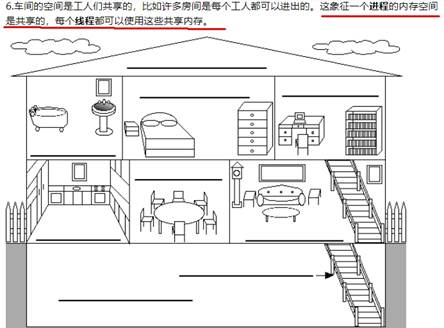

·     Subtopic

 

·     Subtopic

 

·     Subtopic

 

·     Subtopic

 

·     Subtopic

 

2.5.4.    管程

·     Monitor(监视器)，也就是我们平时所说的锁

 

Monitor其实是一种同步机制，他的义务是保证（同一时间）只有一个线程可以访问被保护的数据和代码。

 

JVM中同步是基于进入和退出监视器对象(Monitor,管程对象)来实现的，每个对象实例都会有一个Monitor对象，

 Object o = **new** Object();
 
 **new** Thread(() -> {
   **synchronized** (o)
   {
 
   }
 },**"t1"**).start();

 

Monitor对象会和Java对象一同创建并销毁，它底层是由C++语言来实现的。

 

 

 

 

·     JVM第3版

2.6.    用户线程和守护线程

2.6.1.    Java线程分为用户线程和守护线程， 线程的daemon属性为true表示是守护线程，false表示是用户线程

2.6.2.    守护线程

·     是一种特殊的线程，在后台默默地完成一些系统性的服务，比如垃圾回收线程

2.6.3.    用户线程

·     是系统的工作线程，它会完成这个程序需要完成的业务操作

2.6.4.    code

**package** com.atguigu.itdachang;
 
 */**
 \* **@auther** zzyy
 \* **@create** 2020-07-07 15:39
 \*/
\* **public class** DaemonDemo
 {
 **public static void** main(String[] args)
 {
   Thread t1 = **new** Thread(() -> {
     System.***out\***.println(Thread.*currentThread*().getName()+**"****\t** **开始运行，****"**+(Thread.*currentThread*().isDaemon() ? **"****守护线程****"**:**"****用户线程****"**));
     **while** (**true**) {
 
     }
   }, **"t1"**);
   *//**线程的**daemon**属性为**true**表示是守护线程，**false**表示是用户线程**
\*   t1.setDaemon(**true**);
   t1.start();
   *//3**秒钟后主线程再运行**
\*   **try** { TimeUnit.***SECONDS\***.sleep(3); } **catch** (InterruptedException e) { e.printStackTrace(); }
 
   System.***out\***.println(**"----------main****线程运行完毕****"**);
 }

 }
 

 

2.6.5.    重点

·     当程序中所有用户线程执行完毕之后，不管守护线程是否结束，系统都会自动退出

·     如果用户线程全部结束了，意味着程序需要完成的业务操作已经结束了，系统可以退出 了。所以当系统只剩下守护进程的时候，java虚拟机会自动退出

·     设置守护线程，需要在start()方法之前进行

\3.    CompletableFuture

3.1.    Future和Callable接口

Future接口定义了操作异步任务执行一些方法，如获取异步任务的执行结果、取消任务的执行、判断任务是否被取消、判断任务执行是否完毕等。

 

Callable接口中定义了需要有返回的任务需要实现的方法。

 

比如主线程让一个子线程去执行任务，子线程可能比较耗时，启动子线程开始执行任务后，

主线程就去做其他事情了，过了一会才去获取子任务的执行结果。

3.2.    从之前的FutureTask说开去

3.2.1.    本源的Future接口相关架构

3.2.2.    Code

**package** com.zzyy.study.test;
 
 **import** java.util.concurrent.*;
 
 */**
 \* **@auther** zzyy
 \* **@create** 2020-06-14 17:02
 \*/
\* **public class** CompletableFutureDemo
 {
   **public static void** main(String[] args) **throws** ExecutionException, InterruptedException, TimeoutException
   {
     FutureTask<String> futureTask = **new** FutureTask<>(() -> {
       System.***out\***.println(**"-----come in FutureTask"**);
       **try** { TimeUnit.***SECONDS\***.sleep(3); } **catch** (InterruptedException e) { e.printStackTrace(); }
       **return** **""**+ThreadLocalRandom.*current*().nextInt(100);
     });
 
     Thread t1 = **new** Thread(futureTask,**"t1"**);
     t1.start();
 
     *//3**秒钟后才出来结果，还没有计算你提前来拿**(**只要一调用**get**方法，对于结果就是不见不散，会导致阻塞**)
     //System.out.println(Thread.currentThread().getName()+"\t"+futureTask.get());
 
\*     *//3**秒钟后才出来结果，我只想等待**1**秒钟，过时不候**
\*     System.***out\***.println(Thread.*currentThread*().getName()+**"\t"**+futureTask.get(1L,TimeUnit.***SECONDS\***));
 
     System.***out\***.println(Thread.*currentThread*().getName()+**"****\t****"**+**" run... here"**);
 
   }
 }
 

 

·     get()阻塞

·     一旦调用get()方法，不管是否计算完成都会导致阻塞，o(╥﹏╥)o

3.2.3.    Code2

**package** com.zzyy.study.test;
 
 **import** java.util.concurrent.ExecutionException;
 **import** java.util.concurrent.FutureTask;
 **import** java.util.concurrent.ThreadLocalRandom;
 **import** java.util.concurrent.TimeUnit;
 
 */**
 \* **@auther** zzyy
 \* **@create** 2020-06-16 20:16
 \*/
\* **public class** CompletableFutureDemo2
 {
   **public static void** main(String[] args) **throws** ExecutionException, InterruptedException
   {
     FutureTask<String> futureTask = **new** FutureTask<>(() -> {
       System.***out\***.println(**"-----come in FutureTask"**);
       **try** { TimeUnit.***SECONDS\***.sleep(3); } **catch** (InterruptedException e) { e.printStackTrace(); }
       **return** **""**+ThreadLocalRandom.*current*().nextInt(100);
     });
 
     **new** Thread(futureTask,**"t1"**).start();
 
     System.***out\***.println(Thread.*currentThread*().getName()+**"****\t****"**+**"****线程完成任务****"**);
 
     */**
     ** *用于阻塞式获取结果**,**如果想要异步获取结果**,**通常都会以轮询的方式去获取结果**
\*     **/
\*     **while**(**true**)
     {
       **if** (futureTask.isDone())
       {
         System.***out\***.println(futureTask.get());
         **break**;
       }
     }
 
   }
 }
 

 

·     isDone()轮询

·     轮询的方式会耗费无谓的CPU资源，而且也不见得能及时地得到计算结果.

·     如果想要异步获取结果,通常都会以轮询的方式去获取结果 尽量不要阻塞

3.2.4.    小总结

·     不见不散

·     过时不候

·     轮询

3.2.5.    想完成一些复杂的任务

·     应对Future的完成时间，完成了可以告诉我，也就是我们的回调通知

·     将两个异步计算合成一个异步计算，这两个异步计算互相独立，同时第二个又依赖第一个的结果。

·     当Future集合中某个任务最快结束时，返回结果。

·     等待Future结合中的所有任务都完成。

·     。。。。。。

3.3.    对Future的改进

3.3.1.    CompletableFuture和CompletionStage源码分别介绍

·     类架构说明

 

 

 

 

·     接口CompletionStage

·     是什么

代表异步计算过程中的某一个阶段，一个阶段完成以后可能会触发另外一个阶段，有些类似Linux系统的管道分隔符传参数。

 

 

·     类CompletableFuture

·     是什么

 

 

 

3.3.2.    核心的四个静态方法，来创建一个异步操作

·     runAsync 无 返回值

·     public static CompletableFuture<Void> runAsync(Runnable runnable)

·     public static CompletableFuture<Void> runAsync(Runnable runnable,Executor executor)

·     supplyAsync 有 返回值

·     public static <U> CompletableFuture<U> supplyAsync(Supplier<U> supplier)

·     public static <U> CompletableFuture<U> supplyAsync(Supplier<U> supplier,Executor executor)

·     上述Executor executor参数说明

·     没有指定Executor的方法，直接使用默认的ForkJoinPool.commonPool() 作为它的线程池执行异步代码。

·     如果指定线程池，则使用我们自定义的或者特别指定的线程池执行异步代码

·     Code

·     无 返回值

**package** com.zzyy.study.test;
 
 **import** java.util.concurrent.CompletableFuture;
 **import** java.util.concurrent.ExecutionException;
 **import** java.util.concurrent.TimeUnit;
 
 */**
 \* **@auther** zzyy
 \* **@create** 2020-06-16 20:16
 \*/
\* **public class** CompletableFutureDemo2
 {
   **public static void** main(String[] args) **throws** ExecutionException, InterruptedException
   {
     CompletableFuture<Void> future = CompletableFuture.*runAsync*(() -> {
       System.***out\***.println(Thread.*currentThread*().getName()+**"****\t****"**+**"-----come in"**);
       *//**暂停几秒钟线程**
\*       **try** { TimeUnit.***SECONDS\***.sleep(1); } **catch** (InterruptedException e) { e.printStackTrace(); }
       System.***out\***.println(**"-----task is over"**);
     });
     System.***out\***.println(future.get());
   }
 }

 

 

 

·     有 返回值

**package** com.zzyy.study.test;
 
 **import** java.util.concurrent.CompletableFuture;
 **import** java.util.concurrent.ExecutionException;
 **import** java.util.concurrent.ThreadLocalRandom;
 **import** java.util.concurrent.TimeUnit;
 
 */**
 \* **@auther** zzyy
 \* **@create** 2020-06-16 20:16
 \*/
\* **public class** CompletableFutureDemo2
 {
   **public static void** main(String[] args) **throws** ExecutionException, InterruptedException
   {
     CompletableFuture<Integer> completableFuture = CompletableFuture.*supplyAsync*(() -> {
       System.***out\***.println(Thread.*currentThread*().getName() + **"****\t****"** + **"-----come in"**);
       *//**暂停几秒钟线程**
\*       **try** {
         TimeUnit.***SECONDS\***.sleep(1);
       } **catch** (InterruptedException e) {
         e.printStackTrace();
       }
       **return** ThreadLocalRandom.*current*().nextInt(100);
     });
 
     System.***out\***.println(completableFuture.get());
   }
 }
 

 

·     Code之通用演示，减少阻塞和轮询

·     从Java8开始引入了CompletableFuture，它是Future的功能增强版， 可以传入回调对象，当异步任务完成或者发生异常时，自动调用回调对象的回调方法

·     code

**package** com.atguigu.juc.senior.inner.completablefuture;
 
 **import** java.util.concurrent.CompletableFuture;
 **import** java.util.concurrent.ThreadLocalRandom;
 **import** java.util.concurrent.TimeUnit;
 
 */**
 \* **@auther** zzyy
 \* **@create** 2020-06-23 12:59
 \*/
\* **public class** cfuture4
 {
   **public static void** main(String[] args) **throws** Exception
   {
     CompletableFuture<Integer> completableFuture = CompletableFuture.*supplyAsync*(() -> {
       System.***out\***.println(Thread.*currentThread*().getName() + **"****\t****"** + **"-----come in"**);
       **int** result = ThreadLocalRandom.*current*().nextInt(10);
       *//**暂停几秒钟线程**
\*       **try** { TimeUnit.***SECONDS\***.sleep(1); } **catch** (InterruptedException e) { e.printStackTrace(); }
       System.***out\***.println(**"-----****计算结束耗时****1****秒钟，****result****：** **"**+result);
       **if**(result > 6)
       {
         **int** age = 10/0;
       }
       **return** result;
     }).whenComplete((v,e) ->{
       **if**(e == **null**)
       {
         System.***out\***.println(**"-----result: "**+v);
       }
     }).exceptionally(e -> {
       System.***out\***.println(**"-----exception: "**+e.getCause()+**"****\t****"**+e.getMessage());
       **return** -44;
     });
 
     *//**主线程不要立刻结束，否则**CompletableFuture**默认使用的线程池会立刻关闭**:**暂停**3**秒钟线程**
\*     **try** { TimeUnit.***SECONDS\***.sleep(3); } **catch** (InterruptedException e) { e.printStackTrace(); }
   }
 }

 

·     解释下为什么默认线程池关闭，自定义线程池记得关闭

·     CompletableFuture的优点

·     异步任务结束时，会自动回调某个对象的方法；

·     异步任务出错时，会自动回调某个对象的方法；

·     主线程设置好回调后，不再关心异步任务的执行，异步任务之间可以顺序执行

3.4.    案例精讲-从电商网站的比价需求说开去

3.4.1.    函数式编程已经主流

·     大厂面试题看看

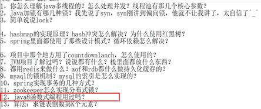

·     Lambda +Stream+链式调用+Java8函数式编程带走

·     Runnable

 

·     Function

 

·     Consumer

 

·     Supplier

 

·     BiConsumer

 

·     小总结

 

3.4.2.    先说说join和get对比

3.4.3.    说说你过去工作中的项目亮点？

3.4.4.    大厂业务需求说明

·     切记，功能→性能

·     对内微服务多系统调用

·     对外网站比价

 

 

经常出现在等待某条 SQL 执行完成后，再继续执行下一条 SQL ，而这两条 SQL 本身是并无关系的，可以同时进行执行的。

 

我们希望能够两条 SQL 同时进行处理，而不是等待其中的某一条 SQL 完成后，再继续下一条。同理，

对于分布式微服务的调用，按照实际业务，如果是无关联step by step的业务，可以尝试是否可以多箭齐发，同时调用。

 

我们去比同一个商品在各个平台上的价格，要求获得一个清单列表，

1 step by step，查完京东查淘宝，查完淘宝查天猫......

 

2 all  一口气同时查询。。。。。

3.4.5.    一波流Java8函数式编程带走

**package** com.zzyy.study.day628;
 
 **import** lombok.Getter;
 
 **import** java.util.Arrays;
 **import** java.util.List;
 **import** java.util.concurrent.CompletableFuture;
 **import** java.util.concurrent.ThreadLocalRandom;
 **import** java.util.concurrent.TimeUnit;
 **import** java.util.stream.Collectors;
 
 */**
 \* **@auther** zzyy
 \* **@create** 2020-06-28 10:07
 \*/
\* **public class** T1
 {
   **static** List<NetMall> *list* = Arrays.*asList*(
       **new** NetMall(**"jd"**),
       **new** NetMall(**"tmall"**),
       **new** NetMall(**"pdd"**),
       **new** NetMall(**"mi"**)
   );
 
   **public static** List<String> findPriceSync(List<NetMall> list,String productName)
   {
     **return** list.stream().map(mall -> String.*format*(productName+**" %s price is %.2f"**,mall.getNetMallName(),mall.getPriceByName(productName))).collect(Collectors.*toList*());
   }
 
   **public static** List<String> findPriceASync(List<NetMall> list,String productName)
   {
     **return** list.stream().map(mall -> CompletableFuture.*supplyAsync*(() -> String.*format*(productName + **" %s price is %.2f"**, mall.getNetMallName(), mall.getPriceByName(productName)))).collect(Collectors.*toList*()).stream().map(CompletableFuture::join).collect(Collectors.*toList*());
   }
 
 
   **public static void** main(String[] args)
   {
     **long** startTime = System.*currentTimeMillis*();
     List<String> list1 = *findPriceSync*(*list*, **"thinking in java"**);
     **for** (String element : list1) {
       System.***out\***.println(element);
     }
     **long** endTime = System.*currentTimeMillis*();
     System.***out\***.println(**"----costTime: "**+(endTime - startTime) +**"** **毫秒****"**);
 
     **long** startTime2 = System.*currentTimeMillis*();
     List<String> list2 = *findPriceASync*(*list*, **"thinking in java"**);
     **for** (String element : list2) {
       System.***out\***.println(element);
     }
     **long** endTime2 = System.*currentTimeMillis*();
     System.***out\***.println(**"----costTime: "**+(endTime2 - startTime2) +**"** **毫秒****"**);
   }
 }
 
 **class** NetMall
 {
   @Getter
   **private** String **netMallName**;
 
   **public** NetMall(String netMallName)
   {
     **this**.**netMallName** = netMallName;
   }
 
   **public double** getPriceByName(String productName)
   {
     **return** calcPrice(productName);
   }
 
   **private double** calcPrice(String productName)
   {
     **try** { TimeUnit.***SECONDS\***.sleep(1); } **catch** (InterruptedException e) { e.printStackTrace(); }
     **return** ThreadLocalRandom.*current*().nextDouble() + productName.charAt(0);
   }
 }

 

3.5.    CompletableFuture常用方法

3.5.1.    获得结果和触发计算

·     获取结果

·     public T  get()

·     不见不散

·     public T  get(long timeout, TimeUnit unit)

·     过时不候

·     public T  getNow(T valueIfAbsent)

·     没有计算完成的情况下，给我一个替代结果

·     **立即获取结果不阻塞**

·     计算完，返回计算完成后的结果

·     没算完，返回设定的valueIfAbsent值

·     Code

 

**package** com.zzyy.study.test;
 
 **import** java.util.concurrent.CompletableFuture;
 **import** java.util.concurrent.ExecutionException;
 **import** java.util.concurrent.TimeUnit;
 
 */**
 \* **@auther** zzyy
 \* **@create** 2020-06-16 20:16
 \*/
\* **public class** CompletableFutureDemo2
 {
   **public static void** main(String[] args) **throws** ExecutionException, InterruptedException
   {
     CompletableFuture<Integer> completableFuture = CompletableFuture.*supplyAsync*(() -> {
       **try** { TimeUnit.***SECONDS\***.sleep(1); } **catch** (InterruptedException e) { e.printStackTrace(); }
       **return** 533;
     });
 
     *//**去掉注释上面计算没有完成，返回**444
     //**开启注释上满计算完成，返回计算结果**
\*     **try** { TimeUnit.***SECONDS\***.sleep(2); } **catch** (InterruptedException e) { e.printStackTrace(); }
 
     System.***out\***.println(completableFuture.getNow(444));
 
 
   }
 }
 

 

·     public T  join()

 

**package** com.zzyy.study.test;
 
 **import** java.util.concurrent.CompletableFuture;
 **import** java.util.concurrent.ExecutionException;
 
 */**
 \* **@auther** zzyy
 \* **@create** 2020-06-16 20:16
 \*/
\* **public class** CompletableFutureDemo2
 {
   **public static void** main(String[] args) **throws** ExecutionException, InterruptedException
   {
     System.***out\***.println(CompletableFuture.*supplyAsync*(() -> **"abc"**).thenApply(r -> r + **"123"**).join());
   }
 }
 

 

·     主动触发计算

·     **public boolean** complete(T value)

·     是否打断get方法立即返回括号值

·     code

 

**package** com.zzyy.study.test;
 
 **import** java.util.concurrent.CompletableFuture;
 **import** java.util.concurrent.ExecutionException;
 **import** java.util.concurrent.TimeUnit;
 
 */**
 \* **@auther** zzyy
 \* **@create** 2020-06-16 20:16
 \*/
\* **public class** CompletableFutureDemo2
 {
   **public static void** main(String[] args) **throws** ExecutionException, InterruptedException
   {
     CompletableFuture<Integer> completableFuture = CompletableFuture.*supplyAsync*(() -> {
       **try** { TimeUnit.***SECONDS\***.sleep(1); } **catch** (InterruptedException e) { e.printStackTrace(); }
       **return** 533;
     });
 
     *//**注释掉暂停线程，**get**还没有算完只能返回**complete**方法设置的**444**；暂停**2**秒钟线程，异步线程能够计算完成返回**get
\*     **try** { TimeUnit.***SECONDS\***.sleep(2); } **catch** (InterruptedException e) { e.printStackTrace(); }
 
     *//**当调用**CompletableFuture.get()**被阻塞的时候**,complete**方法就是结束阻塞并**get()**获取设置的**complete**里面的值**.
\*     System.***out\***.println(completableFuture.complete(444)+**"****\t****"**+completableFuture.get());
 
 
   }
 }
 

 

3.5.2.    对计算结果进行处理

·     thenApply

·     计算结果存在依赖关系，这两个线程串行化

·     code

**package** com.zzyy.study.test;
 
 **import** java.util.concurrent.*;
 
 */**
 \* **@auther** zzyy
 \* **@create** 2020-06-16 20:16
 \*/
\* **public class** CompletableFutureDemo2
 {
 **public static void** main(String[] args) **throws** ExecutionException, InterruptedException
 {
   *//**当一个线程依赖另一个线程时用* *thenApply* *方法来把这两个线程串行化**,
\*   CompletableFuture.*supplyAsync*(() -> {
     *//**暂停几秒钟线程**
\*     **try** { TimeUnit.***SECONDS\***.sleep(1); } **catch** (InterruptedException e) { e.printStackTrace(); }
     System.***out\***.println(**"111"**);
     **return** 1024;
   }).thenApply(f -> {
     System.***out\***.println(**"222"**);
     **return** f + 1;
   }).thenApply(f -> {
     *//int age = 10/0;* *//* *异常情况：那步出错就停在那步。**
\*     System.***out\***.println(**"333"**);
     **return** f + 1;
   }).whenCompleteAsync((v,e) -> {
     System.***out\***.println(**"\**\**\*v: "**+v);
   }).exceptionally(e -> {
     e.printStackTrace();
     **return null**;
   });
 
   System.***out\***.println(**"-----****主线程结束，****END"**);
 
   *//* *主线程不要立刻结束，否则**CompletableFuture**默认使用的线程池会立刻关闭**:
\*   **try** { TimeUnit.***SECONDS\***.sleep(2); } **catch** (InterruptedException e) { e.printStackTrace(); }
 }

  
 }
 

 

·     由于存在依赖关系(当前步错，不走下一步)，当前步骤有异常的话就叫停。

·     handle

·     code

**package** com.zzyy.study.test;
 
 **import** lombok.Getter;
 **import** lombok.Setter;
 
 **import** java.util.concurrent.CompletableFuture;
 **import** java.util.concurrent.ExecutionException;
 **import** java.util.concurrent.TimeUnit;
 
 */**
 \* **@auther** zzyy
 \* **@create** 2020-06-16 20:16
 \*/
\* **public class** CompletableFutureDemo2
 {
 
   **public static void** main(String[] args) **throws** ExecutionException, InterruptedException
   {
     *//**当一个线程依赖另一个线程时用* *handle* *方法来把这两个线程串行化**,
     //* *异常情况：有异常也可以往下一步走，根据带的异常参数可以进一步处理**
\*     CompletableFuture.*supplyAsync*(() -> {
       *//**暂停几秒钟线程**
\*       **try** { TimeUnit.***SECONDS\***.sleep(1); } **catch** (InterruptedException e) { e.printStackTrace(); }
       System.***out\***.println(**"111"**);
       **return** 1024;
     }).handle((f,e) -> {
       **int** age = 10/0;
       System.***out\***.println(**"222"**);
       **return** f + 1;
     }).handle((f,e) -> {
       System.***out\***.println(**"333"**);
       **return** f + 1;
     }).whenCompleteAsync((v,e) -> {
       System.***out\***.println(**"\**\**\*v: "**+v);
     }).exceptionally(e -> {
       e.printStackTrace();
       **return null**;
     });
 
     System.***out\***.println(**"-----****主线程结束，****END"**);
 
     *//* *主线程不要立刻结束，否则**CompletableFuture**默认使用的线程池会立刻关闭**:
\*     **try** { TimeUnit.***SECONDS\***.sleep(2); } **catch** (InterruptedException e) { e.printStackTrace(); }
   }
 

 }

 

·     有异常也可以往下一步走，根据带的异常参数可以进一步处理

·     总结

 

 

3.5.3.    对计算结果进行消费

·     接收任务的处理结果，并消费处理，无返回结果

·     thenAccept

**public static void** main(String[] args) **throws** ExecutionException, InterruptedException
 {
   CompletableFuture.*supplyAsync*(() -> {
     **return** 1;
   }).thenApply(f -> {
     **return** f + 2;
   }).thenApply(f -> {
     **return** f + 3;
   }).thenApply(f -> {
     **return** f + 4;
   }).thenAccept(r -> System.***out\***.println(r));
 }

 

·     补充

·     Code之任务之间的顺序执行

·     thenRun

·     thenRun(Runnable runnable)

·     任务 A 执行完执行 B，并且 B 不需要 A 的结果

·     thenAccept

·     thenAccept(Consumer action)

·     任务 A 执行完执行 B，B 需要 A 的结果，但是任务 B 无返回值

·     thenApply

·     thenApply(Function fn)

·     任务 A 执行完执行 B，B 需要 A 的结果，同时任务 B 有返回值

·     code

 

 

System.***out\***.println(CompletableFuture.*supplyAsync*(() -> **"resultA"**).thenRun(() -> {}).join());
 

 System.***out\***.println(CompletableFuture.*supplyAsync*(() -> **"resultA"**).thenAccept(resultA -> {}).join());
 
 
 System.***out\***.println(CompletableFuture.*supplyAsync*(() -> **"resultA"**).thenApply(resultA -> resultA + **" resultB"**).join());

 

3.5.4.    对计算速度进行选用

·     谁快用谁

·     applyToEither

·     code

**package** com.zzyy.study.test;
 
 **import** java.util.concurrent.CompletableFuture;
 **import** java.util.concurrent.ExecutionException;
 **import** java.util.concurrent.TimeUnit;
 
 */**
 \* **@auther** zzyy
 \* **@create** 2020-06-16 20:16
 \*/
\* **public class** CompletableFutureDemo2
 {
   **public static void** main(String[] args) **throws** ExecutionException, InterruptedException
   {
     CompletableFuture<Integer> completableFuture1 = CompletableFuture.*supplyAsync*(() -> {
       System.***out\***.println(Thread.*currentThread*().getName() + **"****\t****"** + **"---come in "**);
       *//**暂停几秒钟线程**
\*       **try** { TimeUnit.***SECONDS\***.sleep(2); } **catch** (InterruptedException e) { e.printStackTrace(); }
       **return** 10;
     });
 
     CompletableFuture<Integer> completableFuture2 = CompletableFuture.*supplyAsync*(() -> {
       System.***out\***.println(Thread.*currentThread*().getName() + **"****\t****"** + **"---come in "**);
       **try** { TimeUnit.***SECONDS\***.sleep(1); } **catch** (InterruptedException e) { e.printStackTrace(); }
       **return** 20;
     });
 
     CompletableFuture<Integer> thenCombineResult = completableFuture1.applyToEither(completableFuture2,f -> {
       System.***out\***.println(Thread.*currentThread*().getName() + **"****\t****"** + **"---come in "**);
       **return** f + 1;
     });
 
     System.***out\***.println(Thread.*currentThread*().getName() + **"****\t****"** + thenCombineResult.get());
   }
 }

 

3.5.5.    对计算结果进行合并

·     两个CompletionStage任务都完成后，最终能把两个任务的结果一起交给thenCombine 来处理

·     先完成的先等着，等待其它分支任务

·     thenCombine

·     code标准版，好理解先拆分

**package** com.zzyy.study.test;
 
 **import** java.util.concurrent.CompletableFuture;
 **import** java.util.concurrent.ExecutionException;
 
 */**
 \* **@auther** zzyy
 \* **@create** 2020-06-16 20:16
 \*/
\* **public class** CompletableFutureDemo2
 {
   **public static void** main(String[] args) **throws** ExecutionException, InterruptedException
   {
     CompletableFuture<Integer> completableFuture1 = CompletableFuture.*supplyAsync*(() -> {
       System.***out\***.println(Thread.*currentThread*().getName() + **"****\t****"** + **"---come in "**);
       **return** 10;
     });
 
     CompletableFuture<Integer> completableFuture2 = CompletableFuture.*supplyAsync*(() -> {
       System.***out\***.println(Thread.*currentThread*().getName() + **"****\t****"** + **"---come in "**);
       **return** 20;
     });
 
     CompletableFuture<Integer> thenCombineResult = completableFuture1.thenCombine(completableFuture2, (x, y) -> {
       System.***out\***.println(Thread.*currentThread*().getName() + **"****\t****"** + **"---come in "**);
       **return** x + y;
     });
     
     System.***out\***.println(thenCombineResult.get());
   }
 }

 

·     code表达式

**package** com.zzyy.study.test;
 
 **import** java.util.concurrent.CompletableFuture;
 **import** java.util.concurrent.ExecutionException;
 
 */**
 \* **@auther** zzyy
 \* **@create** 2020-06-16 20:16
 \*/
\* **public class** CompletableFutureDemo2
 {
   **public static void** main(String[] args) **throws** ExecutionException, InterruptedException
   {
     CompletableFuture<Integer> thenCombineResult = CompletableFuture.*supplyAsync*(() -> {
       System.***out\***.println(Thread.*currentThread*().getName() + **"****\t****"** + **"---come in 1"**);
       **return** 10;
     }).thenCombine(CompletableFuture.*supplyAsync*(() -> {
       System.***out\***.println(Thread.*currentThread*().getName() + **"****\t****"** + **"---come in 2"**);
       **return** 20;
     }), (x,y) -> {
       System.***out\***.println(Thread.*currentThread*().getName() + **"****\t****"** + **"---come in 3"**);
       **return** x + y;
     }).thenCombine(CompletableFuture.*supplyAsync*(() -> {
       System.***out\***.println(Thread.*currentThread*().getName() + **"****\t****"** + **"---come in 4"**);
       **return** 30;
     }),(a,b) -> {
       System.***out\***.println(Thread.*currentThread*().getName() + **"****\t****"** + **"---come in 5"**);
       **return** a + b;
     });
     System.***out\***.println(**"-----****主线程结束，****END"**);
     System.***out\***.println(thenCombineResult.get());

 
     *//* *主线程不要立刻结束，否则**CompletableFuture**默认使用的线程池会立刻关闭**:
\*     **try** { TimeUnit.***SECONDS\***.sleep(10); } **catch** (InterruptedException e) { e.printStackTrace(); }
   }
 }

 

\4.    说说Java“锁”事

4.1.    大厂面试题复盘

4.2.    从轻松的乐观锁和悲观锁开讲

4.2.1.    悲观锁

 

 

认为自己在使用数据的时候一定有别的线程来修改数据，因此在获取数据的时候会先加锁，确保数据不会被别的线程修改。

 

 

synchronized关键字和Lock的实现类都是悲观锁

 

·     适合写操作多的场景，先加锁可以保证写操作时数据正确。

·     显式的锁定之后再操作同步资源

4.2.2.    伪代码说明

 

*//=============**悲观锁的调用方式**
\* **public synchronized void** m1()
 {
   *//**加锁后的业务逻辑**......
\* }
 
 *//* *保证多个线程使用的是同一个**lock**对象的前提下**
\* ReentrantLock **lock** = **new** ReentrantLock();
 **public void** m2() {
   **lock**.lock();
   **try** {
     *//* *操作同步资源**
\*   }**finally** {
     **lock**.unlock();
   }
 }
 
 *//=============**乐观锁的调用方式**
\* *//* *保证多个线程使用的是同一个**AtomicInteger
\* **private** AtomicInteger **atomicInteger** = **new** AtomicInteger();
 **atomicInteger**.incrementAndGet();

 

4.2.3.    乐观锁

 

乐观锁认为自己在使用数据时不会有别的线程修改数据，所以不会添加锁，只是在更新数据的时候去判断之前有没有别的线程更新了这个数据。

 

如果这个数据没有被更新，当前线程将自己修改的数据成功写入。如果数据已经被其他线程更新，则根据不同的实现方式执行不同的操作

 

乐观锁在Java中是通过使用无锁编程来实现，最常采用的是CAS算法，Java原子类中的递增操作就通过CAS自旋实现的。

·     适合读操作多的场景，不加锁的特点能够使其读操作的性能大幅提升。

·     乐观锁则直接去操作同步资源，是一种无锁算法，得之我幸不得我命，再抢

·     乐观锁一般有两种实现方式：

·     采用版本号机制

·     CAS（Compare-and-Swap，即比较并替换）算法实现

4.3.    通过8种情况演示锁运行案例，看看我们到底锁的是什么

4.3.1.    承前启后的复习一下

·     锁相关的8种案例演示

·     看看JVM中对应的锁在哪里？

4.3.2.     synchronized有三种应用方式

·     JDK源码(notify方法)说明举例

·     8种锁的案例实际体现在3个地方

·     作用于实例方法，当前实例加锁，进入同步代码前要获得当前实例的锁；

·     作用于代码块，对括号里配置的对象加锁。

·     作用于静态方法，当前类加锁，进去同步代码前要获得当前类对象的锁；

4.3.3.    从字节码角度分析synchronized实现

·     javap -c ***.class文件反编译

·      -c            对代码进行反汇编

·     假如你需要更多信息

·     javap -v ***.class文件反编译

·      -v -verbose       输出附加信息（包括行号、本地变量表，反汇编等详细信息）

·     synchronized同步代码块

·     javap -c ***.class文件反编译

·     反编译

 

 

 

·     synchronized同步代码块

·     实现使用的是monitorenter和monitorexit指令

·     一定是一个enter两个exit吗？

·     m1方法里面自己添加一个异常试试

·     synchronized普通同步方法

·     javap -v ***.class文件反编译

·     反编译

·     synchronized普通同步方法

·     调用指令将会检查方法的ACC_SYNCHRONIZED访问标志是否被设置。 如果设置了，执行线程会将先持有monitor然后再执行方法， 最后在方法完成(无论是正常完成还是非正常完成)时释放 monitor

·     synchronized静态同步方法

·     javap -v ***.class文件反编译

·     反编译

·     synchronized静态同步方法

·     ACC_STATIC, ACC_SYNCHRONIZED访问标志区分该方法是否静态同步方法

4.3.4.    反编译**synchronized**锁的是什么

·     **什么是管程****monitor**

| 关系 | 补刀回杀 - 指向 [Synchronized的重入的实现机理](#JosTIB91kk2HUfNLGa6Wvg==) |
| ---- | ------------------------------------------------------------ |
|      |                                                              |

·     大厂面试题讲解

·     为什么任何一个对象都可以成为一个锁

·     **管程**

 

管程 (英语：Monitors，也称为监视器) 是一种程序结构，结构内的多个子程序（对象或模块）形成的多个工作线程互斥访问共享资源。

这些共享资源一般是硬件设备或一群变量。对共享变量能够进行的所有操作集中在一个模块中。（把信号量及其操作原语“封装”在一个对象内部）管程实现了在一个时间点，最多只有一个线程在执行管程的某个子程序。管程提供了一种机制，管程可以看做一个软件模块，它是将共享的变量和对于这些共享变量的操作封装起来，形成一个具有一定接口的功能模块，进程可以调用管程来实现进程级别的并发控制。

 

 

·     在HotSpot虚拟机中，monitor采用ObjectMonitor实现

·     上述C++源码解读

·     ObjectMonitor.java→ObjectMonitor.cpp→objectMonitor.hpp

·     objectMonitor.hpp

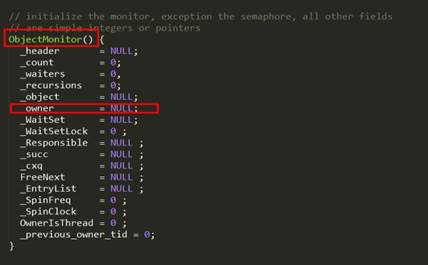

 

ObjectMonitor中有几个关键属性

| _owner      | 指向持有ObjectMonitor对象的线程   |
| ----------- | --------------------------------- |
| _WaitSet    | 存放处于wait状态的线程队列        |
| _EntryList  | 存放处于等待锁block状态的线程队列 |
| _recursions | 锁的重入次数                      |
| _count      | 用来记录该线程获取锁的次数        |

 

·     每个对象天生都带着一个对象监视器

4.3.5.    对于**synchronized关键字**， 我们在《**Synchronized****与锁升级**》 章节还会再深度讲解

·     提前剧透，混个眼熟

 synchronized必须作用于某个对象中，所以Java在对象的头文件存储了锁的相关信息。锁升级功能主要依赖于 MarkWord 中的锁标志位和释放偏向锁标志位，后续讲解锁升级时候我们再加深，目前为了承前启后的学习，对下图先混个眼熟即可，O(∩_∩)O

4.4.    公平锁和非公平锁

4.4.1.    从ReentrantLock卖票编码演示公平和非公平现象

**package** com.atguigu.juc.senior.test;
 
 **import** java.util.concurrent.locks.ReentrantLock;
 
 **class** Ticket
 {
   **private int** **number** = 30;
   ReentrantLock **lock** = **new** ReentrantLock();
 
   **public void** sale()
   {
     **lock**.lock();
     **try
**     {
       **if**(**number** > 0)
       {
         System.***out\***.println(Thread.*currentThread*().getName()+**"****卖出第：****\t****"**+(**number**--)+**"****\t** **还剩下****:"**+**number**);
       }
     }**catch** (Exception e){
       e.printStackTrace();
     }**finally** {
       **lock**.unlock();
     }
   }
 }
 
 
 */**
 \* **@auther** zzyy
 \* **@create** 2020-05-14 17:26
 \*/
\* **public class** SaleTicketDemo
 {
   **public static void** main(String[] args)
   {
     Ticket ticket = **new** Ticket();
 
     **new** Thread(() -> { **for** (**int** i = 0; i <35; i++)  ticket.sale(); },**"a"**).start();
     **new** Thread(() -> { **for** (**int** i = 0; i <35; i++)  ticket.sale(); },**"b"**).start();
     **new** Thread(() -> { **for** (**int** i = 0; i <35; i++)  ticket.sale(); },**"c"**).start();
   }
 }
 

 

4.4.2.    何为公平锁/非公平锁?

 

 

⽣活中，排队讲求先来后到视为公平。程序中的公平性也是符合请求锁的绝对时间的，其实就是 FIFO，否则视为不公平

·     源码解读

 

  按序排队公平锁，就是判断同步队列是否还有先驱节点的存在(我前面还有人吗?)，如果没有先驱节点才能获取锁；  先占先得非公平锁，是不管这个事的，只要能抢获到同步状态就可以  

 

·     面试题

·     为什么会有公平锁/非公平锁的设计为什么默认非公平？

 

1

恢复挂起的线程到真正锁的获取还是有时间差的，从开发人员来看这个时间微乎其微，但是从CPU的角度来看，这个时间差存在的还是很明显的。所以非公平锁能更充分的利用CPU 的时间片，尽量减少 CPU 空闲状态时间。

 

2

使用多线程很重要的考量点是线程切换的开销，当采用非公平锁时，当1个线程请求锁获取同步状态，然后释放同步状态，因为不需要考虑是否还有前驱节点，所以刚释放锁的线程在此刻再次获取同步状态的概率就变得非常大，所以就减少了线程的开销。

·     使⽤公平锁会有什么问题

 

 

 

公平锁保证了排队的公平性，非公平锁霸气的忽视这个规则，所以就有可能导致排队的长时间在排队，也没有机会获取到锁，

这就是传说中的 “锁饥饿”

·     什么时候用公平？什么时候用非公平？

 

 

如果为了更高的吞吐量，很显然非公平锁是比较合适的，因为节省很多线程切换时间，吞吐量自然就上去了；

否则那就用公平锁，大家公平使用。

4.4.3.    预埋伏AQS

 

·     更进一步的源码深度分析见后续第13章

4.5.    可重入锁(又名递归锁)

4.5.1.    说明

 

可重入锁又名递归锁

 

是指在同一个线程在外层方法获取锁的时候，再进入该线程的内层方法会自动获取锁(前提，锁对象得是同一个对象)，不会因为之前已经获取过还没释放而阻塞。

 

如果是1个有 synchronized 修饰的递归调用方法，程序第2次进入被自己阻塞了岂不是天大的笑话，出现了作茧自缚。

所以Java中ReentrantLock和synchronized都是可重入锁，可重入锁的一个优点是可一定程度避免死锁。

4.5.2.    “可重入锁”这四个字分开来解释：

·     可：可以。

·     重：再次。

·     入：进入。

·     锁：同步锁。

·     进入什么

·     进入同步域（即同步代码块/方法或显式锁锁定的代码）

·     一句话

·     一个线程中的多个流程可以获取同一把锁，持有这把同步锁可以再次进入。

·     自己可以获取自己的内部锁

4.5.3.    可重入锁种类

·     隐式锁（即synchronized关键字使用的锁）默认是可重入锁

 

 

指的是可重复可递归调用的锁，在外层使用锁之后，在内层仍然可以使用，并且不发生死锁，这样的锁就叫做可重入锁。

简单的来说就是：在一个synchronized修饰的方法或代码块的内部调用本类的其他synchronized修饰的方法或代码块时，是永远可以得到锁的

 

 

与可重入锁相反，不可重入锁不可递归调用，递归调用就发生死锁。

 

·     同步块

**package** com.atguigu.juc.senior.prepare;
 
 */**
 \* **@auther** zzyy
 \* **@create** 2020-05-14 11:59
 \*/
\* **public class** ReEntryLockDemo
 {
   **public static void** main(String[] args)
   {
     **final** Object objectLockA = **new** Object();
 
     **new** Thread(() -> {
       **synchronized** (objectLockA)
       {
         System.***out\***.println(**"-----****外层调用****"**);
         **synchronized** (objectLockA)
         {
           System.***out\***.println(**"-----****中层调用****"**);
           **synchronized** (objectLockA)
           {
             System.***out\***.println(**"-----****内层调用****"**);
           }
         }
       }
     },**"a"**).start();
   }
 }
 

 

·     同步方法

**package** com.atguigu.juc.senior.prepare;
 
 */**
 \* **@auther** zzyy
 \* **@create** 2020-05-14 11:59
 ** *在一个**Synchronized**修饰的方法或代码块的内部调用本类的其他**Synchronized**修饰的方法或代码块时，是永远可以得到锁的**
\* **/
\* **public class** ReEntryLockDemo
 {
   **public synchronized void** m1()
   {
     System.***out\***.println(**"-----m1"**);
     m2();
   }
   **public synchronized void** m2()
   {
     System.***out\***.println(**"-----m2"**);
     m3();
   }
   **public synchronized void** m3()
   {
     System.***out\***.println(**"-----m3"**);
   }
 
   **public static void** main(String[] args)
   {
     ReEntryLockDemo reEntryLockDemo = **new** ReEntryLockDemo();
 
     reEntryLockDemo.m1();
   }
 }
 

 

·     Synchronized的重入的实现机理

| 关系 | 补刀回杀 - 开始 [什么是管程monitor](#QN0yHx3pskqvNIppLKM/yQ==) |
| ---- | ------------------------------------------------------------ |
|      |                                                              |

 

每个锁对象拥有一个锁计数器和一个指向持有该锁的线程的指针。

 

当执行monitorenter时，如果目标锁对象的计数器为零，那么说明它没有被其他线程所持有，Java虚拟机会将该锁对象的持有线程设置为当前线程，并且将其计数器加1。

 

在目标锁对象的计数器不为零的情况下，如果锁对象的持有线程是当前线程，那么 Java 虚拟机可以将其计数器加1，否则需要等待，直至持有线程释放该锁。

 

当执行monitorexit时，Java虚拟机则需将锁对象的计数器减1。计数器为零代表锁已被释放。

·     为什么任何一个对象都可以成为一个锁

·     显式锁（即Lock）也有ReentrantLock这样的可重入锁。

**package** com.atguigu.juc.senior.prepare;
 
 **import** java.util.concurrent.locks.Lock;
 **import** java.util.concurrent.locks.ReentrantLock;
 
 */**
 \* **@auther** zzyy
 \* **@create** 2020-05-14 11:59
 ** *在一个**Synchronized**修饰的方法或代码块的内部调用本类的其他**Synchronized**修饰的方法或代码块时，是永远可以得到锁的**
\* **/
\* **public class** ReEntryLockDemo
 {
   **static** Lock *lock* = **new** ReentrantLock();
 
   **public static void** main(String[] args)
   {
     **new** Thread(() -> {
       *lock*.lock();
       **try
**       {
         System.***out\***.println(**"----****外层调用****lock"**);
         *lock*.lock();
         **try
**         {
           System.***out\***.println(**"----****内层调用****lock"**);
         }**finally** {
           *//* *这里故意注释，实现加锁次数和释放次数不一样**
\*           *//* *由于加锁次数和释放次数不一样，第二个线程始终无法获取到锁，导致一直在等待。**
\*           *lock*.unlock(); *//* *正常情况，加锁几次就要解锁几次**
\*         }
       }**finally** {
         *lock*.unlock();
       }
     },**"a"**).start();
 
     **new** Thread(() -> {
       *lock*.lock();
       **try
**       {
         System.***out\***.println(**"b thread----****外层调用****lock"**);
       }**finally** {
         *lock*.unlock();
       }
     },**"b"**).start();
 
   }
 }
 

 

4.6.    死锁及排查

4.6.1.    是什么

 

死锁是指两个或两个以上的线程在执行过程中,因争夺资源而造成的一种互相等待的现象,若无外力干涉那它们都将无法推进下去，如果系统资源充足，进程的资源请求都能够得到满足，死锁出现的可能性就很低，否则就会因争夺有限的资源而陷入死锁。

 

 

·     产生死锁主要原因

·     系统资源不足

·     进程运行推进的顺序不合适

·     资源分配不当

4.6.2.    请写一个死锁代码case

**package** com.atguigu.juc.senior.prepare;
 
 **import** java.util.concurrent.TimeUnit;
 
 */**
 \* **@auther** zzyy
 \* **@create** 2020-05-14 10:56
 \*/
\* **public class** DeadLockDemo
 {
   **public static void** main(String[] args)
   {
     **final** Object objectLockA = **new** Object();
     **final** Object objectLockB = **new** Object();
 
     **new** Thread(() -> {
       **synchronized** (objectLockA)
       {
         System.***out\***.println(Thread.*currentThread*().getName()+**"****\t****"**+**"****自己持有****A****，希望获得****B"**);
         *//**暂停几秒钟线程**
\*         **try** { TimeUnit.***SECONDS\***.sleep(1); } **catch** (InterruptedException e) { e.printStackTrace(); }
         **synchronized** (objectLockB)
         {
           System.***out\***.println(Thread.*currentThread*().getName()+**"****\t****"**+**"A-------****已经获得****B"**);
         }
       }
     },**"A"**).start();
 
     **new** Thread(() -> {
       **synchronized** (objectLockB)
       {
         System.***out\***.println(Thread.*currentThread*().getName()+**"****\t****"**+**"****自己持有****B****，希望获得****A"**);
         *//**暂停几秒钟线程**
\*         **try** { TimeUnit.***SECONDS\***.sleep(1); } **catch** (InterruptedException e) { e.printStackTrace(); }
         **synchronized** (objectLockA)
         {
           System.***out\***.println(Thread.*currentThread*().getName()+**"****\t****"**+**"B-------****已经获得****A"**);
         }
       }
     },**"B"**).start();
 
   }
 }
 

 

4.6.3.    如何排查死锁

·     纯命令

·     jps -l

·     jstack 进程编号

·     图形化

·     jconsole

4.7.    写锁(独占锁)/读锁(共享锁)

4.7.1.    源码深度分析见后续第14章

4.8.    自旋锁SpinLock

4.8.1.    源码深度分析见后续第8章

4.9.    无锁→独占锁→读写锁→邮戳锁

4.9.1.    有没有比读写锁更快的锁？

·     StampedLock

4.9.2.    源码深度分析见后续第14章

4.10.   无锁→偏向锁→轻量锁→重量锁

4.10.1.   源码深度分析见后续第12章

4.11.   其它细节

4.11.1.   不可以String同一把锁

·     严禁这么做

\5.    LockSupport与线程中断

5.1.    线程中断机制

5.1.1.    从阿里蚂蚁金服面试题讲起

 

如何停止、中断一个运行中的线程？？

5.1.2.    什么是中断？

首先

一个线程不应该由其他线程来强制中断或停止，而是应该由线程自己自行停止。

所以，Thread.stop, Thread.suspend, Thread.resume 都已经被废弃了。

 

其次

在Java中没有办法立即停止一条线程，然而停止线程却显得尤为重要，如取消一个耗时操作。

因此，Java提供了一种用于停止线程的机制——中断。

 

中断只是一种协作机制，Java没有给中断增加任何语法，中断的过程完全需要程序员自己实现。

若要中断一个线程，你需要手动调用该线程的interrupt方法，该方法也仅仅是将线程对象的中断标识设成true；

接着你需要自己写代码不断地检测当前线程的标识位，如果为true，表示别的线程要求这条线程中断，

此时究竟该做什么需要你自己写代码实现。

 

每个线程对象中都有一个标识，用于表示线程是否被中断；该标识位为true表示中断，为false表示未中断；

通过调用线程对象的interrupt方法将该线程的标识位设为true；可以在别的线程中调用，也可以在自己的线程中调用。

5.1.3.    中断的相关API方法

 

| public void interrupt()              | 实例方法，  实例方法interrupt()仅仅是设置线程的中断状态为true，不会停止线程 |
| ------------------------------------ | ------------------------------------------------------------ |
| public static  boolean interrupted() | 静态方法，Thread.interrupted();     判断线程是否被中断，并清除当前中断状态  这个方法做了两件事：  1 返回当前线程的中断状态  2 将当前线程的中断状态设为false     这个方法有点不好理解，因为连续调用两次的结果可能不一样。 |
| public boolean  isInterrupted()      | 实例方法，  判断当前线程是否被中断（通过检查中断标志位）     |

 

5.1.4.    面试题：如何使用中断标识停止线程？

·     在需要中断的线程中不断监听中断状态， 一旦发生中断，就执行相应的中断处理业务逻辑。

·     修改状态

·     停止程序的运行

·     。。。。。。

·     方法

·     通过一个volatile变量实现

**package** com.atguigu.juc.senior.test;
 
 **import** java.util.concurrent.TimeUnit;
 
 */**
 \* **@auther** zzyy
 \* **@create** 2020-05-12 14:19
 \*/
\* **public class** InterruptDemo
 {
 **private static volatile boolean** *isStop* = **false**;
 
 **public static void** main(String[] args)
 {
   **new** Thread(() -> {
     **while**(**true**)
     {
       **if**(*isStop*)
       {
         System.***out\***.println(Thread.*currentThread*().getName()+**"****线程****------isStop = true,****自己退出了****"**);
         **break**;
       }
       System.***out\***.println(**"-------hello interrupt"**);
     }
   },**"t1"**).start();
 
   *//**暂停几秒钟线程**
\*   **try** { TimeUnit.***SECONDS\***.sleep(1); } **catch** (InterruptedException e) { e.printStackTrace(); }
   *isStop* = **true**;
 }

 }
 

 

·     通过AtomicBoolean

**package** com.zzyy.study.test;
 
 **import** java.util.concurrent.TimeUnit;
 **import** java.util.concurrent.atomic.AtomicBoolean;
 
 */**
 \* **@auther** zzyy
 \* **@create** 2020-05-26 23:24
 \*/
\* **public class** StopThreadDemo
 {
   **private final static** AtomicBoolean ***atomicBoolean\*** = **new** AtomicBoolean(**true**);
 
   **public static void** main(String[] args)
   {
     Thread t1 = **new** Thread(() -> {
       **while**(***atomicBoolean\***.get())
       {
         **try** { TimeUnit.***MILLISECONDS\***.sleep(500); } **catch** (InterruptedException e) { e.printStackTrace(); }
         System.***out\***.println(**"-----hello"**);
       }
     }, **"t1"**);
     t1.start();
 
     **try** { TimeUnit.***SECONDS\***.sleep(3); } **catch** (InterruptedException e) { e.printStackTrace(); }
 
     ***atomicBoolean\***.set(**false**);
   }
 }
 

 

·     通过Thread类自带的中断api方法实现

·     API

 

| public void interrupt()              | 实例方法，  实例方法interrupt()仅仅是设置线程的中断状态为true，不会停止线程 |
| ------------------------------------ | ------------------------------------------------------------ |
| public static  boolean interrupted() | 静态方法，Thread.interrupted();    判断线程是否被中断，并清除当前中断状态  这个方法做了两件事：  1 返回当前线程的中断状态  2 将当前线程的中断状态设为false     这个方法有点不好理解，因为连续调用两次的结果可能不一样。 |
| public boolean  isInterrupted()      | 实例方法，  判断当前线程是否被中断（通过检查中断标志位）     |

 

·     实例方法interrupt()，没有返回值

| public void interrupt() | 实例方法，  调用interrupt()方法仅仅是在当前线程中打了一个停止的标记，并不是真正立刻停止线程。 |
| ----------------------- | ------------------------------------------------------------ |
|                         |                                                              |

 

·     源码分析

 

·     实例方法isInterrupted，返回布尔值

| public boolean  isInterrupted() | 实例方法，  获取中断标志位的当前值是什么，  判断当前线程是否被中断（通过检查中断标志位），默认是false |
| ------------------------------- | ------------------------------------------------------------ |
|                                 |                                                              |

 

·     源码分析

 

·     code

| 关系 | 进一步加深 - 指向 [code02后手案例(重要，面试就是它，操蛋)](#m5+OmnHARki+uV6kGlfwfA==) |
| ---- | ------------------------------------------------------------ |
|      |                                                              |

**package** com.atguigu.itdachang;
 
 **import** java.util.concurrent.TimeUnit;
 
 */**
 \* **@auther** zzyy
 \* **@create** 2020-07-10 17:33
 \*/
\* **public class** InterruptDemo
 {
   **public static void** main(String[] args)
   {
     Thread t1 = **new** Thread(() -> {
       **while**(**true**)
       {
         **if**(Thread.*currentThread*().isInterrupted())
         {
           System.***out\***.println(**"-----t1** **线程被中断了，****break****，程序结束****"**);
           **break**;
         }
         System.***out\***.println(**"-----hello"**);
       }
     }, **"t1"**);
     t1.start();
 
     System.***out\***.println(**"\**\**\**\**\**\**\**"**+t1.isInterrupted());
     *//**暂停**5**毫秒**
\*     **try** { TimeUnit.***MILLISECONDS\***.sleep(5); } **catch** (InterruptedException e) { e.printStackTrace(); }
     t1.interrupt();
     System.***out\***.println(**"\**\**\**\**\**\**\**"**+t1.isInterrupted());
   }
 }
 

 

·     **当前线程的****中断标识为****true，是不是就立刻停止？**

·     说明

 

 

具体来说，当对一个线程，调用 interrupt() 时：

 

① 如果线程处于正常活动状态，那么会将该线程的中断标志设置为 true，仅此而已。

被设置中断标志的线程将继续正常运行，不受影响。所以， interrupt() 并不能真正的中断线程，需要被调用的线程自己进行配合才行。

 

 

② 如果线程处于被阻塞状态（例如处于sleep, wait, join 等状态），在别的线程中调用当前线程对象的interrupt方法，

那么线程将立即退出被阻塞状态，并抛出一个InterruptedException异常。

 

 

·     code02

**package** com.atguigu.juc.senior.test;
 
 **import** java.util.concurrent.TimeUnit;
 
 */**
 \* **@auther** zzyy
 \* **@create** 2020-05-13 10:25
 \*/
\* **public class** InterruptDemo2
 {
   **public static void** main(String[] args) **throws** InterruptedException
   {
     Thread t1 = **new** Thread(() -> {
       **for** (**int** i=0;i<300;i++) {
         System.***out\***.println(**"-------"**+i);
       }
       System.***out\***.println(**"after t1.interrupt()--****第****2****次****---: "**+Thread.*currentThread*().isInterrupted());
     },**"t1"**);
     t1.start();
 
     System.***out\***.println(**"before t1.interrupt()----: "**+t1.isInterrupted());
     *//**实例方法**interrupt()**仅仅是设置线程的中断状态位设置为**true，不会停止线程
\*     t1.interrupt();
     *//**活动状态**,t1**线程还在执行中**
\*     **try** { TimeUnit.***MILLISECONDS\***.sleep(3); } **catch** (InterruptedException e) { e.printStackTrace(); }
     System.***out\***.println(**"after t1.interrupt()--****第****1****次****---: "**+t1.isInterrupted());
     *//**非活动状态**,t1**线程不在执行中，已经结束执行了。**
\*     **try** { TimeUnit.***MILLISECONDS\***.sleep(3000); } **catch** (InterruptedException e) { e.printStackTrace(); }
     System.***out\***.println(**"after t1.interrupt()--****第****3****次****---: "**+t1.isInterrupted());
   }
 }

 

·     **code02后手案例(重要，面试就是它，操蛋)**

| 关系 | 进一步加深 - 开始 [code](#lLK0qHbih0qfsd6wqFjfOg==) |
| ---- | --------------------------------------------------- |
|      |                                                     |

 

·     结论

、

·     小总结

·     中断只是一种协同机制，修改中断标识位仅此而已，不是立刻stop打断

·     静态方法Thread.interrupted()

·     静态方法Thread.interrupted()

·     code

**package** com.atguigu.juc.senior.test;
 
 */**
 \* **@auther** zzyy
 \* **@create** 2020-05-12 14:19
 ** *作用是测试当前线程是否被中断（检查中断标志），返回一个**boolean**并清除中断状态，**
\* *** *第二次再调用时中断状态已经被清除，将返回一个**false**。**
\* **/
\* **public class** InterruptDemo
 {
 
   **public static void** main(String[] args) **throws** InterruptedException
   {
     System.***out\***.println(Thread.*currentThread*().getName()+**"---"**+Thread.*interrupted*());
     System.***out\***.println(Thread.*currentThread*().getName()+**"---"**+Thread.*interrupted*());
     System.***out\***.println(**"111111"**);
     Thread.*currentThread*().interrupt();
     System.***out\***.println(**"222222"**);
     System.***out\***.println(Thread.*currentThread*().getName()+**"---"**+Thread.*interrupted*());
     System.***out\***.println(Thread.*currentThread*().getName()+**"---"**+Thread.*interrupted*());
   }
 }
 
 
 
 

 

·     说明

 

 

| public static  boolean interrupted() | 静态方法，Thread.interrupted();     判断线程是否被中断，并清除当前中断状态，类似i++  这个方法做了两件事：  1 返回当前线程的中断状态  2 将当前线程的中断状态设为false     这个方法有点不好理解，因为连续调用两次的结果可能不一样。 |
| ------------------------------------ | ------------------------------------------------------------ |
|                                      |                                                              |

 

·     都会返回中断状态，两者对比

 

·     

 

|      |                                         |
| ---- | --------------------------------------- |
|      |  |

·     

 

|      |                                         |
| ---- | --------------------------------------- |
|      |  |

5.1.5.    总结

 

线程中断相关的方法：

 

interrupt()方法是一个实例方法

它通知目标线程中断，也就是设置目标线程的中断标志位为true，中断标志位表示当前线程已经被中断了。

 

isInterrupted()方法也是一个实例方法

它判断当前线程是否被中断（通过检查中断标志位）并获取中断标志

 

Thread类的静态方法interrupted()

返回当前线程的中断状态(boolean类型)且将当前线程的中断状态设为false，此方法调用之后会清除当前线程的中断标志位的状态（将中断标志置为false了），返回当前值并清零置false

5.2.    LockSupport是什么

 

 

 

 

 

5.2.1.    是什么

 

LockSupport是用来创建锁和其他同步类的基本线程阻塞原语。

 

下面这句话，后面详细说

LockSupport中的park() 和 unpark() 的作用分别是阻塞线程和解除阻塞线程

5.3.    线程等待唤醒机制

5.3.1.    3种让线程等待和唤醒的方法

·     方式1：使用Object中的wait()方法让线程等待，使用Object中的notify()方法唤醒线程

·     方式2：使用JUC包中Condition的await()方法让线程等待，使用signal()方法唤醒线程

·     方式3：LockSupport类可以阻塞当前线程以及唤醒指定被阻塞的线程

5.3.2.    Object类中的wait和notify方法实现线程等待和唤醒

·     代码

**package** com.atguigu.juc.prepare;
 
 **import** java.util.concurrent.TimeUnit;
 
 */**
 \* **@auther** zzyy
 \* **@create** 2020-04-13 17:12
 \*
 ** *要求：**t1**线程等待**3**秒钟，**3**秒钟后**t2**线程唤醒**t1**线程继续工作**
\* **
 \* 1* *正常程序演示**
\* **
 ** *以下异常情况：**
\* ** 2 wait**方法和**notify**方法，两个都去掉同步代码块后看运行效果**
\* **  2.1* *异常情况**
\* **  Exception in thread "t1" java.lang.IllegalMonitorStateException at java.lang.Object.wait(Native Method)
 \*  Exception in thread "t2" java.lang.IllegalMonitorStateException at java.lang.Object.notify(Native Method)
 \*  2.2* *结论**
\* **  Object**类中的**wait**、**notify**、**notifyAll**用于线程等待和唤醒的方法，都必须在**synchronized**内部执行（必须用到关键字**synchronized**）。**
\* **
 \* 3* *将**notify**放在**wait**方法前面**
\* **  3.1* *程序一直无法结束**
\* **  3.2* *结论**
\* ***  *先**wait**后**notify**、**notifyall**方法，等待中的线程才会被唤醒，否则无法唤醒**
\* **/
\* **public class** LockSupportDemo
 {
 
   **public static void** main(String[] args)*//main**方法，主线程一切程序入口**
\*   {
     Object objectLock = **new** Object(); *//**同一把锁，类似资源类**
 
\*     **new** Thread(() -> {
       **synchronized** (objectLock) {
         **try** {
           objectLock.wait();
         } **catch** (InterruptedException e) {
           e.printStackTrace();
         }
       }
       System.***out\***.println(Thread.*currentThread*().getName()+**"****\t****"**+**"****被唤醒了****"**);
     },**"t1"**).start();
 
     *//**暂停几秒钟线程**
\*     **try** { TimeUnit.***SECONDS\***.sleep(3L); } **catch** (InterruptedException e) { e.printStackTrace(); }
 
     **new** Thread(() -> {
       **synchronized** (objectLock) {
         objectLock.notify();
       }
 
       *//objectLock.notify();
 
       /\*synchronized (objectLock) {
         try {
           objectLock.wait();
         } catch (InterruptedException e) {
           e.printStackTrace();
         }
       }\*/
\*     },**"t2"**).start();
 
 
 
   }
 }
 
 

 

·     正常

**package** com.atguigu.juc.prepare;
 
 **import** java.util.concurrent.TimeUnit;
 
 */**
 \* **@auther** zzyy
 \* **@create** 2020-04-13 17:12
 \*
 ** *要求：**t1**线程等待**3**秒钟，**3**秒钟后**t2**线程唤醒**t1**线程继续工作**
\* **
 \* 1* *正常程序演示**
\* **
\* **/
\* **public class** LockSupportDemo
 {
   **public static void** main(String[] args)*//main**方法，主线程一切程序入口**
\*   {
     Object objectLock = **new** Object(); *//**同一把锁，类似资源类**
 
\*     **new** Thread(() -> {
       **synchronized** (objectLock) {
         **try** {
           objectLock.wait();
         } **catch** (InterruptedException e) {
           e.printStackTrace();
         }
       }
       System.***out\***.println(Thread.*currentThread*().getName()+**"****\t****"**+**"****被唤醒了****"**);
     },**"t1"**).start();
 
     *//**暂停几秒钟线程**
\*     **try** { TimeUnit.***SECONDS\***.sleep(3L); } **catch** (InterruptedException e) { e.printStackTrace(); }
 
     **new** Thread(() -> {
       **synchronized** (objectLock) {
         objectLock.notify();
       }
     },**"t2"**).start();
   }
 }
 
 

 

·     异常1

**package** com.atguigu.juc.prepare;
 
 **import** java.util.concurrent.TimeUnit;
 
 */**
 \* **@auther** zzyy
 \* **@create** 2020-04-13 17:12
 \*
 ** *要求：**t1**线程等待**3**秒钟，**3**秒钟后**t2**线程唤醒**t1**线程继续工作**
\* *** *以下异常情况：**
\* ** 2 wait**方法和**notify**方法，两个都去掉同步代码块后看运行效果**
\* **  2.1* *异常情况**
\* **  Exception in thread "t1" java.lang.IllegalMonitorStateException at java.lang.Object.wait(Native Method)
 \*  Exception in thread "t2" java.lang.IllegalMonitorStateException at java.lang.Object.notify(Native Method)
 \*  2.2* *结论**
\* **  Object**类中的**wait**、**notify**、**notifyAll**用于线程等待和唤醒的方法，都必须在**synchronized**内部执行（必须用到关键字**synchronized**）。**
\* **/
\* **public class** LockSupportDemo
 {
 
   **public static void** main(String[] args)*//main**方法，主线程一切程序入口**
\*   {
     Object objectLock = **new** Object(); *//**同一把锁，类似资源类**
 
\*     **new** Thread(() -> {
         **try** {
           objectLock.wait();
         } **catch** (InterruptedException e) {
           e.printStackTrace();
         }
       System.***out\***.println(Thread.*currentThread*().getName()+**"****\t****"**+**"****被唤醒了****"**);
     },**"t1"**).start();
 
     *//**暂停几秒钟线程**
\*     **try** { TimeUnit.***SECONDS\***.sleep(3L); } **catch** (InterruptedException e) { e.printStackTrace(); }
 
     **new** Thread(() -> {
       objectLock.notify();
     },**"t2"**).start();
   }
 }
 
 

 

·     wait方法和notify方法，两个都去掉同步代码块

·     异常情况

 

·     异常2

 

**package** com.atguigu.juc.prepare;
 
 **import** java.util.concurrent.TimeUnit;
 
 */**
 \* **@auther** zzyy
 \* **@create** 2020-04-13 17:12
 \*
 ** *要求：**t1**线程等待**3**秒钟，**3**秒钟后**t2**线程唤醒**t1**线程继续工作**
\* **
 \* 3* *将**notify**放在**wait**方法前先执行，**t1**先**notify**了，**3**秒钟后**t2**线程再执行**wait**方法**
\* **  3.1* *程序一直无法结束**
\* **  3.2* *结论**
\* ***  *先**wait**后**notify**、**notifyall**方法，等待中的线程才会被唤醒，否则无法唤醒**
\* **/
\* **public class** LockSupportDemo
 {
 
   **public static void** main(String[] args)*//main**方法，主线程一切程序入口**
\*   {
     Object objectLock = **new** Object(); *//**同一把锁，类似资源类**
 
\*     **new** Thread(() -> {
       **synchronized** (objectLock) {
         objectLock.notify();
       }
       System.***out\***.println(Thread.*currentThread*().getName()+**"****\t****"**+**"****通知了****"**);
     },**"t1"**).start();
 
     *//t1**先**notify**了，**3**秒钟后**t2**线程再执行**wait**方法**
\*     **try** { TimeUnit.***SECONDS\***.sleep(3L); } **catch** (InterruptedException e) { e.printStackTrace(); }
 
     **new** Thread(() -> {
       **synchronized** (objectLock) {
         **try** {
           objectLock.wait();
         } **catch** (InterruptedException e) {
           e.printStackTrace();
         }
       }
       System.***out\***.println(Thread.*currentThread*().getName()+**"****\t****"**+**"****被唤醒了****"**);
     },**"t2"**).start();
   }
 }
 
 

 

·     将notify放在wait方法前面

·     程序无法执行，无法唤醒

·     小总结

·     wait和notify方法必须要在同步块或者方法里面，且成对出现使用

·     先wait后notify才OK

5.3.3.    Condition接口中的await后signal方法实现线程的等待和唤醒

·     代码

·     正常

**package** com.atguigu.juc.prepare;
 
 **import** java.util.concurrent.TimeUnit;
 **import** java.util.concurrent.locks.Condition;
 **import** java.util.concurrent.locks.Lock;
 **import** java.util.concurrent.locks.ReentrantLock;
 
 */**
 \* **@auther** zzyy
 \* **@create** 2020-04-13 17:55
 \*/
\* **public class** LockSupportDemo2
 {
   **public static void** main(String[] args)
   {
     Lock lock = **new** ReentrantLock();
     Condition condition = lock.newCondition();
 
     **new** Thread(() -> {
       lock.lock();
       **try
**       {
         System.***out\***.println(Thread.*currentThread*().getName()+**"****\t****"**+**"start"**);
         condition.await();
         System.***out\***.println(Thread.*currentThread*().getName()+**"****\t****"**+**"****被唤醒****"**);
       } **catch** (InterruptedException e) {
         e.printStackTrace();
       } **finally** {
         lock.unlock();
       }
     },**"t1"**).start();
 
     *//**暂停几秒钟线程**
\*     **try** { TimeUnit.***SECONDS\***.sleep(3L); } **catch** (InterruptedException e) { e.printStackTrace(); }
 
     **new** Thread(() -> {
       lock.lock();
       **try
**       {
         condition.signal();
       } **catch** (Exception e) {
         e.printStackTrace();
       } **finally** {
         lock.unlock();
       }
       System.***out\***.println(Thread.*currentThread*().getName()+**"****\t****"**+**"****通知了****"**);
     },**"t2"**).start();
 
   }
 }
 

 

·     异常1

**package** com.atguigu.juc.prepare;
 
 **import** java.util.concurrent.TimeUnit;
 **import** java.util.concurrent.locks.Condition;
 **import** java.util.concurrent.locks.Lock;
 **import** java.util.concurrent.locks.ReentrantLock;
 
 */**
 \* **@auther** zzyy
 \* **@create** 2020-04-13 17:55
 ** *异常：**
\* ** condition.await();**和**condition.signal();**都触发了**IllegalMonitorStateException**异常**
\* **
 ** *原因：调用**condition**中线程等待和唤醒的方法的前提是，要在**lock**和**unlock**方法中**,**要有锁才能调用**
\* **/
\* **public class** LockSupportDemo2
 {
   **public static void** main(String[] args)
   {
     Lock lock = **new** ReentrantLock();
     Condition condition = lock.newCondition();
 
     **new** Thread(() -> {
       **try
**       {
         System.***out\***.println(Thread.*currentThread*().getName()+**"****\t****"**+**"start"**);
         condition.await();
         System.***out\***.println(Thread.*currentThread*().getName()+**"****\t****"**+**"****被唤醒****"**);
       } **catch** (InterruptedException e) {
         e.printStackTrace();
       }
     },**"t1"**).start();
 
     *//**暂停几秒钟线程**
\*     **try** { TimeUnit.***SECONDS\***.sleep(3L); } **catch** (InterruptedException e) { e.printStackTrace(); }
 
     **new** Thread(() -> {
       **try
**       {
         condition.signal();
       } **catch** (Exception e) {
         e.printStackTrace();
       }
       System.***out\***.println(Thread.*currentThread*().getName()+**"****\t****"**+**"****通知了****"**);
     },**"t2"**).start();
 
   }
 }
 

 

·     去掉lock/unlock

 

 

condition.await();和 condition.signal();都触发了 IllegalMonitorStateException异常。

 

结论：

lock、unlock对里面才能正确调用调用condition中线程等待和唤醒的方法

·     异常2

**package** com.atguigu.juc.prepare;
 
 **import** java.util.concurrent.TimeUnit;
 **import** java.util.concurrent.locks.Condition;
 **import** java.util.concurrent.locks.Lock;
 **import** java.util.concurrent.locks.ReentrantLock;
 
 */**
 \* **@auther** zzyy
 \* **@create** 2020-04-13 17:55
 ** *异常：**
\* *** *程序无法运行**
\* **
 ** *原因：先**await()**后**signal**才**OK**，否则线程无法被唤醒**
\* **/
\* **public class** LockSupportDemo2
 {
   **public static void** main(String[] args)
   {
     Lock lock = **new** ReentrantLock();
     Condition condition = lock.newCondition();
 
     **new** Thread(() -> {
       lock.lock();
       **try
**       {
         condition.signal();
         System.***out\***.println(Thread.*currentThread*().getName()+**"****\t****"**+**"signal"**);
       } **catch** (Exception e) {
         e.printStackTrace();
       }**finally** {
         lock.unlock();
       }
     },**"t1"**).start();
 
     *//**暂停几秒钟线程**
\*     **try** { TimeUnit.***SECONDS\***.sleep(3L); } **catch** (InterruptedException e) { e.printStackTrace(); }
 
     **new** Thread(() -> {
       lock.lock();
       **try
**       {
         System.***out\***.println(Thread.*currentThread*().getName()+**"****\t****"**+**"****等待被唤醒****"**);
         condition.await();
         System.***out\***.println(Thread.*currentThread*().getName()+**"****\t****"**+**"****被唤醒****"**);
       } **catch** (Exception e) {
         e.printStackTrace();
       }**finally** {
         lock.unlock();
       }
     },**"t2"**).start();
 
   }
 }
 

 

·     先signal后await

·     小总结

·     Condtion中的线程等待和唤醒方法之前，需要先获取锁

·     一定要先await后signal，不要反了

5.3.4.    Object和Condition使用的限制条件

·     线程先要获得并持有锁，必须在锁块(synchronized或lock)中

·     必须要先等待后唤醒，线程才能够被唤醒

5.3.5.    LockSupport类中的park等待和unpark唤醒

·     是什么

·     通过park()和unpark(thread)方法来实现阻塞和唤醒线程的操作

·     官网解释

 

LockSupport是用来创建锁和其他同步类的基本线程阻塞原语。

 

LockSupport类使用了一种名为Permit（许可）的概念来做到阻塞和唤醒线程的功能， 每个线程都有一个许可(permit)，

permit只有两个值1和零，默认是零。

可以把许可看成是一种(0,1)信号量（Semaphore），但与 Semaphore 不同的是，许可的累加上限是1。

 

 

 

 

 

·     主要方法

·     API

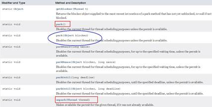

·     阻塞

·     park() /park(Object blocker)

 

**调用****LockSupport.\*park\*()****时**

 

 

permit默认是零，所以一开始调用park()方法，当前线程就会阻塞，直到别的线程将当前线程的permit设置为1时，park方法会被唤醒，

然后会将permit再次设置为零并返回。

·     阻塞当前线程/阻塞传入的具体线程

·     唤醒

·     unpark(Thread thread)

**LockSupport.\*unpark\*(thread);**

调用unpark(thread)方法后，就会将thread线程的许可permit设置成1(注意多次调用unpark方法，不会累加，permit值还是1)会自动唤醒thread线程，即之前阻塞中的LockSupport.park()方法会立即返回。

·     唤醒处于阻塞状态的指定线程

·     代码

·     正常+无锁块要求

**package** com.atguigu.juc.prepare;
 
 **import** java.util.concurrent.TimeUnit;
 **import** java.util.concurrent.locks.LockSupport;
 
 */**
 \* **@auther** zzyy
 \* **@create** 2020-04-13 20:30
 \*/
\* **public class** LockSupportDemo3
 {
   **public static void** main(String[] args)
   {
     *//**正常使用**+**不需要锁块**
\* Thread t1 = **new** Thread(() -> {
   System.***out\***.println(Thread.*currentThread*().getName()+**" "**+**"1111111111111"**);
   LockSupport.*park*();
   System.***out\***.println(Thread.*currentThread*().getName()+**" "**+**"2222222222222------end****被唤醒****"**);
 },**"t1"**);
 t1.start();
 
 *//**暂停几秒钟线程**
\* **try** { TimeUnit.***SECONDS\***.sleep(3); } **catch** (InterruptedException e) { e.printStackTrace(); }
 
 LockSupport.*unpark*(t1);
 System.***out\***.println(Thread.*currentThread*().getName()+**"  -----LockSupport.unparrk() invoked over"**);

*
\*   }
 }
 

 

·     之前错误的先唤醒后等待，LockSupport照样支持

**package** com.zzyy.study.test;
 
 **import** java.util.concurrent.TimeUnit;
 **import** java.util.concurrent.locks.LockSupport;
 
 */**
 \* **@auther** zzyy
 \* **@create** 2020-05-06 17:07
 \*/
\* **public class** T1
 {
   **public static void** main(String[] args)
   {
     Thread t1 = **new** Thread(() -> {
       **try** { TimeUnit.***SECONDS\***.sleep(3); } **catch** (InterruptedException e) { e.printStackTrace(); }
       System.***out\***.println(Thread.*currentThread*().getName()+**"****\t****"**+System.*currentTimeMillis*());
       LockSupport.*park*();
       System.***out\***.println(Thread.*currentThread*().getName()+**"****\t****"**+System.*currentTimeMillis*()+**"---****被叫醒****"**);
     },**"t1"**);
     t1.start();
 
     **try** { TimeUnit.***SECONDS\***.sleep(1); } **catch** (InterruptedException e) { e.printStackTrace(); }
 
     LockSupport.*unpark*(t1);
     System.***out\***.println(Thread.*currentThread*().getName()+**"****\t****"**+System.*currentTimeMillis*()+**"---unpark over"**);
   }
 }
 

 

·     解释

·     成双成对要牢记

\6.    Java内存模型之JMM

6.1.    先从大厂面试题开始

6.1.1.    你知道什么是Java内存模型JMM吗？

6.1.2.    JMM与volatile它们两个之间的关系？(下一章详细讲解)

6.1.3.    JMM有哪些特性or它的三大特性是什么？

6.1.4.    为什么要有JMM，它为什么出现？作用和功能是什么？

6.1.5.    happens-before先行发生原则你有了解过吗？

6.2.    计算机硬件存储体系

 计算机存储结构，从本地磁盘到主存到CPU缓存，也就是从硬盘到内存，到CPU。

一般对应的程序的操作就是从数据库查数据到内存然后到CPU进行计算

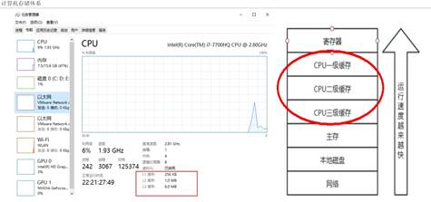

6.2.1.    问题？和推导出我们需要知道JMM

 

因为有这么多级的缓存(cpu和物理主内存的速度不一致的)，

CPU的运行并不是直接操作内存而是先把内存里边的数据读到缓存，而内存的读和写操作的时候就会造成不一致的问题

 

Java虚拟机规范中试图定义一种Java内存模型（java Memory Model，简称JMM) 来屏蔽掉各种硬件和操作系统的内存访问差异，

以实现让Java程序在各种平台下都能达到一致的内存访问效果。推导出我们需要知道JMM

6.3.    Java内存模型Java Memory Model

 

JMM(Java内存模型Java Memory Model，简称JMM)本身是一种抽象的概念并不真实存在它仅仅描述的是一组约定或规范，通过这组规范定义了程序中(尤其是多线程)各个变量的读写访问方式并决定一个线程对共享变量的写入何时以及如何变成对另一个线程可见，关键技术点都是围绕多线程的原子性、可见性和有序性展开的。

 

 原则：

 JMM的关键技术点都是围绕多线程的原子性、可见性和有序性展开的

 

能干嘛？

1 通过JMM来实现线程和主内存之间的抽象关系。

2 屏蔽各个**硬件平台**和**操作系统**的内存访问差异以实现让Java程序在各种平台下都能达到一致的内存访问效果。

 

 

 

 

 

 

6.4.    JMM规范下，三大特性

6.4.1.    可见性

 

***可见性\***

是指当一个线程修改了某一个共享变量的值，其他线程是否能够立即知道该变更 ，JMM规定了所有的变量都存储在***主内存\***中。

 

Java中普通的共享变量不保证可见性，因为数据修改被写入内存的时机是不确定的，多线程并发下很可能出现"脏读"，所以每个线程都有自己的***工作内存\***，线程自己的工作内存中保存了该线程使用到的变量的主内存副本拷贝，线程对变量的所有操作（读取，赋值等 ）都必需在线程自己的工作内存中进行，而不能够直接读写主内存中的变量。不同线程之间也无法直接访问对方工作内存中的变量，线程间变量值的传递均需要通过主内存来完成

 

 **线程脏读：如果没有可见性保证**

| 主内存中有变量 x，初始值为 0                                 |
| ------------------------------------------------------------ |
| 线程 A 要将 x 加  1，先将 x=0 拷贝到自己的私有内存中，然后更新 x 的值 |
| 线程 A 将更新后的 x 值回刷到主内存的时间是不固定的           |
| 刚好在线程 A 没有回刷 x 到主内存时，线程 B 同样从主内存中读取 x，此时为 0，和线程 A 一样的操作，最后期盼的 x=2 就会变成 x=1 |

 

 

 

 

6.4.2.    原子性

·     指一个操作是不可中断的，即多线程环境下，操作不能被其他线程干扰

6.4.3.    有序性

对于一个线程的执行代码而言，我们总是习惯性认为代码的执行总是从上到下，有序执行。

但为了提供性能，编译器和处理器通常会对指令序列进行重新排序。

指令重排可以保证串行语义一致，但没有义务保证多线程间的语义也一致，即可能产生"脏读"，简单说，

两行以上不相干的代码在执行的时候有可能先执行的不是第一条，不见得是从上到下顺序执行，执行顺序会被优化。

 

单线程环境里面确保程序最终执行结果和代码顺序执行的结果一致。

处理器在进行重排序时必须要考虑指令之间的***数据依赖性\***

多线程环境中线程交替执行,由于编译器优化重排的存在，两个线程中使用的变量能否保证一致性是无法确定的,结果无法预测

 

·     简单案例先过个眼熟

 

**public void** mySort()
 {
   **int** x = 11; *//**语句**1
\*   **int** y = 12; *//**语句**2
\*   x = x + 5;  *//**语句**3
\*   y = x * x;  *//**语句**4
\* }

 

 1234

 2134

 1324

 

问题：请问语句4可以重排后变成第一个条吗？

 

6.5.    JMM规范下，多线程对变量的读写过程

6.5.1.    读取过程

**读取过程：**

由于JVM运行程序的实体是线程，而每个线程创建时JVM都会为其创建一个工作内存(有些地方称为栈空间)，工作内存是每个线程的私有数据区域，而Java内存模型中规定所有变量都存储在主内存，主内存是共享内存区域，所有线程都可以访问，但线程对变量的操作(读取赋值等)必须在工作内存中进行，首先要将变量从主内存拷贝到的线程自己的工作内存空间，然后对变量进行操作，操作完成后再将变量写回主内存，不能直接操作主内存中的变量，各个线程中的工作内存中存储着主内存中的**变量副本拷贝**，因此不同的线程间无法访问对方的工作内存，线程间的通信(传值)必须通过主内存来完成，其简要访问过程如下图:

**JMM****定义了线程和主内存之间的抽象关系**

1 线程之间的共享变量存储在主内存中(从硬件角度来说就是内存条)

2 每个线程都有一个私有的本地工作内存，本地工作内存中存储了该线程用来读/写共享变量的副本(从硬件角度来说就是CPU的缓存，比如寄存器、L1、L2、L3缓存等)

 

6.5.2.    小总结

·     我们定义的所有共享变量都储存在物理主内存中

·     每个线程都有自己独立的工作内存，里面保存该线程使用到的变量的副本(主内存中该变量的一份拷贝)

·     线程对共享变量所有的操作都必须先在线程自己的工作内存中进行后写回主内存，不能直接从主内存中读写(不能越级)

·     不同线程之间也无法直接访问其他线程的工作内存中的变量，线程间变量值的传递需要通过主内存来进行(同级不能相互访问)

6.6.    JMM规范下，多线程先行发生原则之happens-before

6.6.1.    在JMM中， 如果一个操作执行的结果需要对另一个操作可见性 或者 代码重排序，那么这两个操作之间必须存在happens-before关系。

6.6.2.    x 、y案例说明

 

 

| x = 5              | 线程A执行 |
| ------------------ | --------- |
| y = x              | 线程B执行 |
| 上述称之为：写后读 |           |

 

 问题?

 

  y是否等于5呢？     如果线程A的操作（x= 5）happens-before(先行发生)线程B的操作（y = x）,那么可以确定线程B执行后y = 5 一定成立;     如果他们不存在happens-before原则，那么y = 5 不一定成立。     这就是happens-before原则的威力。-------------------》**包含可见性和有序性的约束**  

 

6.6.3.    先行发生原则说明

如果Java内存模型中所有的有序性都仅靠volatile和synchronized来完成，那么有很多操作都将会变得非常啰嗦，

但是我们在编写Java并发代码的时候并没有察觉到这一点。

 

我们没有时时、处处、次次，添加volatile和synchronized来完成程序，这是因为Java语言中JMM原则下

有一个“先行发生”(Happens-Before)的原则限制和规矩

 

这个原则非常重要： 

它是判断数据是否存在竞争，线程是否安全的非常有用的手段。依赖这个原则，我们可以通过几条简单规则一揽子解决并发环境下两个操

作之间是否可能存在冲突的所有问题，而不需要陷入Java内存模型苦涩难懂的底层编译原理之中。

6.6.4.    happens-before总原则

·     如果一个操作happens-before另一个操作，那么第一个操作的执行结果将对第二个操作可见， 而且第一个操作的执行顺序排在第二个操作之前。

·     两个操作之间存在happens-before关系，并不意味着一定要按照happens-before原则制定的顺序来执行。 如果重排序之后的执行结果与按照happens-before关系来执行的结果一致，那么这种重排序并不非法。

·     值日

·     周一张三周二李四，假如有事情调换班可以的

·     1+2+3 = 3+2+1

6.6.5.    happens-before之8条

·     次序规则：

·     一个线程内，按照代码顺序，写在前面的操作先行发生于写在后面的操作；

·     加深说明

·     前一个操作的结果可以被后续的操作获取。 讲白点就是前面一个操作把变量X赋值为1，那后面一个操作肯定能知道X已经变成了1。

·     锁定规则：

·     一个unLock操作先行发生于后面((这里的“后面”是指时间上的先后))对同一个锁的lock操作；

 

**package** com.zzyy.study.test;
 
 */**
 \* **@auther** zzyy
 \* **@create** 2020-06-11 16:01
 \*/
\* **public class** HappenBeforeDemo
 {
   **static** Object *objectLock* = **new** Object();
 
   **public static void** main(String[] args) **throws** InterruptedException
   {
     *//**对于同一把锁**objectLock**，**threadA**一定先**unlock**同一把锁后**B**才能获得该锁，*  *A* *先行发生于**B
\*     **synchronized** (*objectLock*)
     {
 
     }
   }
 }

 

·     volatile变量规则：

·     对一个volatile变量的写操作先行发生于后面对这个变量的读操作， 前面的写对后面的读是可见的，这里的“后面”同样是指时间上的先后。

·     传递规则：

·     如果操作A先行发生于操作B，而操作B又先行发生于操作C，则可以得出操作A先行发生于操作C；

·     线程启动规则(Thread Start Rule)：

·     Thread对象的start()方法先行发生于此线程的每一个动作

·     线程中断规则(Thread Interruption Rule)：

·     对线程interrupt()方法的调用先行发生于被中断线程的代码检测到中断事件的发生；

·     可以通过Thread.interrupted()检测到是否发生中断

·     线程终止规则(Thread Termination Rule)：

·     线程中的所有操作都先行发生于对此线程的终止检 测，我们可以通过Thread::join()方法是否结束、 Thread::isAlive()的返回值等手段检测线程是否已经终止执行。

·     对象终结规则(Finalizer Rule)：

·     一个对象的初始化完成（构造函数执行结束）先行发生于它的finalize()方法的开始

·     说人话

·     对象没有完成初始化之前，是不能调用finalized()方法的

6.6.6.    案例说明

·     code

 

  假设存在线程A和B，     线程A先（时间上的先后）调用了setValue(1)，     然后线程B调用了同一个对象的getValue()，     那么线程B收到的返回值是什么？  

 

 

·     解释

 

  假设存在线程A和B，线程A先（时间上的先后）调用了setValue(1)，然后线程B调用了同一个对象的getValue()，那么线程B收到的返回值  是什么？  

 

  我们就这段简单的代码一次分析happens-before的规则（规则5、6、7、8  可以忽略，因为他们和这段代码毫无关系）：  1 由于两个方法是由不同的线程调用，不在同一个线程中，所以肯定不满足程序次序规则；  2 两个方法都没有使用锁，所以不满足锁定规则；  3 变量不是用volatile修饰的，所以volatile变量规则不满足；  4 传递规则肯定不满足；  

 

  所以我们无法通过happens-before原则推导出线程A happens-before线程B，虽然可以确认在时间上线程A优先于线程B指定，  但就是无法确认线程B获得的**结果是什么**，所以这段代码不是线程安全的。**那么怎么修复这段代码呢？**  

 

·     修复

·     把getter/setter方法都定义为synchronized方法

·     把value定义为volatile变量，由于setter方法对value的修改不依赖value的原值，满足volatile关键字使用场景

\7.    volatile与Java内存模型

7.1.    被volatile修改的变量有2大特点

7.1.1.    特点

·     可见性

·     有序性

·     排序要求

7.1.2.    volatile的内存语义

·     当写一个volatile变量时，JMM会把该线程对应的本地内存中的共享变量值立即刷新回主内存中。

·     当读一个volatile变量时，JMM会把该线程对应的本地内存设置为无效，直接从主内存中读取共享变量

·     所以volatile的写内存语义是直接刷新到主内存中，读的内存语义是直接从主内存中读取。

7.2.    ***内存屏障\******(面试重点必须拿下)\***

7.2.1.    先说生活case

·     没有管控，顺序难保

 

·     设定规则，禁止乱序

·     上海南京路步行街武警“人墙”当红灯

7.2.2.    是什么

 内存屏障（也称内存栅栏，内存栅障，屏障指令等，是一类同步屏障指令，是CPU或编译器在对内存随机访问的操作中的一个同步点，使得此点之前的所有读写操作都执行后才可以开始执行此点之后的操作），避免代码重排序。内存屏障其实就是一种JVM指令，Java内存模型的重排规则会要求Java编译器在生成JVM指令时插入特定的内存屏障指令，通过这些内存屏障指令，volatile实现了Java内存模型中的可见性和有序性，但volatile无法保证原子性。

 

内存屏障之前的所有写操作都要回写到主内存，

内存屏障之后的所有读操作都能获得内存屏障之前的所有写操作的最新结果(实现了可见性)。

因此重排序时，不允许把内存屏障之后的指令重排序到内存屏障之前。

一句话：对一个 volatile 域的写, happens-before 于任意后续对这个 volatile 域的读，也叫写后读。

7.2.3.    volatile凭什么可以保证可见性和有序性？？？

·     内存屏障 (Memory Barriers / Fences)

7.2.4.    JVM中提供了四类内存屏障指令

·     一句话

·     上一章讲解过happens-before先行发生原则，类似接口规范，落地？

·     落地靠什么？

·     你凭什么可以保证？你管用吗？

·     C++源码分析

·     IDEA工具里面找Unsafe.class

 

·     Unsafe.java

 

·     Unsafe.cpp

 

·     OrderAccess.hpp

 

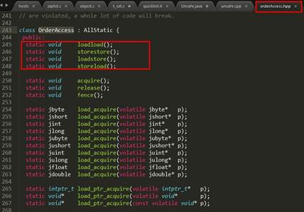

·     orderAccess_linux_x86.inline.hpp

·     四大屏障分别是什么意思

·     orderAccess_linux_x86.inline.hpp

7.2.5.    **如下内容困难，可能会导致学生懵逼，课堂要讲解细致 分****2次讲解+复习**

·     

 

|      |                                         |
| ---- | --------------------------------------- |
|      |  |

·     happens-before 之 volatile 变量规则

 

| 当第一个操作为volatile读时，不论第二个操作是什么，都不能重排序。这个操作保证了volatile读之后的操作不会被重排到volatile读之前。 |
| ------------------------------------------------------------ |
| 当第二个操作为volatile写时，不论第一个操作是什么，都不能重排序。这个操作保证了volatile写之前的操作不会被重排到volatile写之后。 |
| 当第一个操作为volatile写时，第二个操作为volatile读时，不能重排。 |

 

·     JMM 就将内存屏障插⼊策略分为 4 种

| 关系 | 加强++，第2次说明见下 - 指向 [四大屏障的插入情况](#yViCnUBzTUylcvEyOIz7tQ==) |
| ---- | ------------------------------------------------------------ |
|      |                                                              |

·     写

·     1. 在每个 volatile 写操作的前⾯插⼊⼀个 StoreStore 屏障

·     2. 在每个 volatile 写操作的后⾯插⼊⼀个 StoreLoad 屏障

·     对比图

·     

 

|      |                                         |
| ---- | --------------------------------------- |
|      |  |

·     读

·     3. 在每个 volatile 读操作的后⾯插⼊⼀个 LoadLoad 屏障

·     4. 在每个 volatile 读操作的后⾯插⼊⼀个 LoadStore 屏障

7.3.    volatile特性

7.3.1.    保证可见性

·     说明

·     保证不同线程对这个变量进行操作时的可见性，即变量一旦改变所有线程立即可见

·     Code

**package** com.zzyy.study.juc;
 
 **import** java.util.concurrent.TimeUnit;
 
 */**
 \* **@auther** zzyy
 \* **@create** 2020-06-30 11:29
 \*/
\* **public class** VolatileSeeDemo
 {
   **static      boolean** *flag* = **true**;    *//**不加**volatile**，没有可见性**
\*   *//static volatile boolean flag = true;    //**加了**volatile**，保证可见性**
 
\*   **public static void** main(String[] args)
   {
     **new** Thread(() -> {
       System.***out\***.println(Thread.*currentThread*().getName()+**"****\t** **come in"**);
       **while** (*flag*)
       {
 
       }
       System.***out\***.println(Thread.*currentThread*().getName()+**"****\t** **flag****被修改为****false,****退出****....."**);
     },**"t1"**).start();
 
     *//**暂停**2**秒钟后让**main**线程修改**flag**值**
\*     **try** { TimeUnit.***SECONDS\***.sleep(2); } **catch** (InterruptedException e) { e.printStackTrace(); }
 
     *flag* = **false**;
 
     System.***out\***.println(**"main****线程修改完成****"**);
   }
 }
 
 

 

·     不加volatile，没有可见性，程序无法停止

·     加了volatile，保证可见性，程序可以停止

·     上述代码原理解释

线程t1中为何看不到被主线程main修改为false的flag的值？

 

问题可能:

\1. 主线程修改了flag之后没有将其刷新到主内存，所以t1线程看不到。

\2. 主线程将flag刷新到了主内存，但是t1一直读取的是自己工作内存中flag的值，没有去主内存中更新获取flag最新的值。

 

我们的诉求：

1.线程中修改了工作内存中的副本之后，立即将其刷新到主内存；

2.工作内存中每次读取共享变量时，都去主内存中重新读取，然后拷贝到工作内存。

 

解决：

使用volatile修饰共享变量，就可以达到上面的效果，被volatile修改的变量有以下特点：

\1. 线程中读取的时候，每次读取都会去主内存中读取共享变量最新的值，然后将其复制到工作内存

\2. 线程中修改了工作内存中变量的副本，修改之后会立即刷新到主内存

·     volatile变量的读写过程

Java内存模型中定义的8种工作内存与主内存之间的原子操作

read(读取)→load(加载)→use(使用)→assign(赋值)→store(存储)→write(写入)→lock(锁定)→unlock(解锁)

 

 

read: 作用于主内存，将变量的值从主内存传输到工作内存，主内存到工作内存

load: 作用于工作内存，将read从主内存传输的变量值放入工作内存变量副本中，即数据加载

use: 作用于工作内存，将工作内存变量副本的值传递给执行引擎，每当JVM遇到需要该变量的字节码指令时会执行该操作

assign: 作用于工作内存，将从执行引擎接收到的值赋值给工作内存变量，每当JVM遇到一个给变量赋值字节码指令时会执行该操作

store: 作用于工作内存，将赋值完毕的工作变量的值写回给主内存

write: 作用于主内存，将store传输过来的变量值赋值给主内存中的变量

由于上述只能保证单条指令的原子性，针对多条指令的组合性原子保证，没有大面积加锁，所以，JVM提供了另外两个原子指令：

lock: 作用于主内存，将一个变量标记为一个线程独占的状态，只是写时候加锁，就只是锁了写变量的过程。

unlock: 作用于主内存，把一个处于锁定状态的变量释放，然后才能被其他线程占用

7.3.2.    没有原子性

·     volatile变量的复合操作(如i++)不具有原子性

·     Code

**package** com.zzyy.study.juc;
 
 **import** java.util.concurrent.TimeUnit;
 
 **class** MyNumber
 {
   **volatile int** **number** = 0;
 
   **public void** addPlusPlus()
   {
     **number**++;
   }
 }
 
 **public class** VolatileNoAtomicDemo
 {
   **public static void** main(String[] args) **throws** InterruptedException
   {
     MyNumber myNumber = **new** MyNumber();
 
     **for** (**int** i = 1; i <=10; i++) {
       **new** Thread(() -> {
         **for** (**int** j = 1; j <= 1000; j++) {
           myNumber.addPlusPlus();
         }
       },String.*valueOf*(i)).start();
     }
     
     *//**暂停几秒钟线程**
\*     **try** { TimeUnit.***SECONDS\***.sleep(3); } **catch** (InterruptedException e) { e.printStackTrace(); }
     System.***out\***.println(Thread.*currentThread*().getName() + **"****\t****"** + myNumber.**number**);
   }
 }
 

 

·     从i++的字节码角度说明

 

原子性指的是一个操作是不可中断的，即使是在多线程环境下，一个操作一旦开始就不会被其他线程影响。

public void add()

{

​    i++; //不具备原子性，该操作是先读取值，然后写回一个新值，相当于原来的值加上1，分3步完成

 }

如果第二个线程在第一个线程读取旧值和写回新值期间读取i的域值，那么第二个线程就会与第一个线程一起看到同一个值，

并执行相同值的加1操作，这也就造成了线程安全失败，因此对于add方法必须使用synchronized修饰，以便保证线程安全.

·     不保证原子性

多线程环境下，"数据计算"和"数据赋值"操作可能多次出现，即操作非原子。若数据在加载之后，若主内存count变量发生修改之后，由于线程工作内存中的值在此前已经加载，从而不会对变更操作做出相应变化，即私有内存和公共内存中变量不同步，进而导致数据不一致

对于volatile变量，JVM只是保证从主内存加载到线程工作内存的值是最新的，也就是数据加载时是最新的。

由此可见volatile解决的是变量读时的可见性问题，但无法保证原子性，对于多线程修改共享变量的场景必须使用加锁同步

·     读取赋值一个普通变量的情况

当线程1对主内存对象发起read操作到write操作第一套流程的时间里，线程2随时都有可能对这个主内存对象发起第二套操作

 

·     既然一修改就是可见，为什么还不能保证原子性？

·     volatile主要是对其中部分指令做了处理

| 关系 | 补刀回杀 - 指向 [读取赋值一个volatile变量的情况](#edEIwe4YtUqFvWp1ecbpCg==) |
| ---- | ------------------------------------------------------------ |
|      |                                                              |

 

  要use(使用)一个变量的时候必需load(载入），要载入的时候必需从主内存read(读取）这样就解决了读的可见性。      写操作是把assign和store做了关联(在assign(赋值)后必需store(存储))。store(存储)后write(写入)。  也就是做到了给一个变量赋值的时候一串关联指令直接把变量值写到主内存。     就这样通过用的时候直接从主内存取，在赋值到直接写回主内存做到了内存可见性。注意蓝色框框的间隙。。。。。。o(╥﹏╥)o  

 

                  

·     结论

·     读取赋值一个volatile变量的情况

| 关系 | 补刀回杀 - 开始 [volatile主要是对其中部分指令做了处理](#D/uhmQM3ukqmsDf3Z2dXkA==) |
| ---- | ------------------------------------------------------------ |
|      |                                                              |

   read-load-use 和 assign-store-write 成为了两个不可分割的原子操作，但是在use和assign之间依然有极小的一段真空期，有可能变量会被其他线程读取，导致写丢失一次...o(╥﹏╥)o  但是无论在哪一个时间点主内存的变量和任一工作内存的变量的值都是相等的。这个特性就导致了volatile变量不适合参与到依赖当前值的运算，如i = i + 1; i++;之类的那么依靠可见性的特点volatile可以用在哪些地方呢？ 通常volatile用做保存某个状态的boolean值or int值。  《深入理解Java虚拟机》提到：  

 

·     面试回答

·     JVM的字节码，i++分成三步，间隙期不同步非原子操作(i++)

7.3.3.    指令禁重排

·     说明与案例

 

重排序

重排序是指编译器和处理器为了优化程序性能而对指令序列进行重新排序的一种手段，有时候会改变程序语句的先后顺序

不存在数据依赖关系，可以重排序；

  存在数据依赖关系，禁止重排序

但重排后的指令绝对不能改变原有的串行语义！这点在并发设计中必须要重点考虑！

 

重排序的分类和执行流程

编译器优化的重排序： 编译器在不改变单线程串行语义的前提下，可以重新调整指令的执行顺序

指令级并行的重排序： 处理器使用指令级并行技术来讲多条指令重叠执行，若不存在数据依赖性，处理器可以改变语句对应机器指令的执行顺序

内存系统的重排序： 由于处理器使用缓存和读/写缓冲区，这使得加载和存储操作看上去可能是乱序执行

 

**数据依赖性**：若两个操作访问同一变量，且这两个操作中有一个为写操作，此时两操作间就存在数据依赖性。

 

案例 ：

**不存在**数据依赖关系，可以重排序===> 重排序OK 。

| 重排前                                                   | 重排后                                              |
| -------------------------------------------------------- | --------------------------------------------------- |
| int a = 1; //1  int b = 20; //2  int c = a + b; //3      | int b = 20; //1  int a = 1; //2  int c = a + b; //3 |
| 结论：编译器调整了语句的顺序，但是不影响程序的最终结果。 | 重排序OK                                            |

 

**存在**数据依赖关系，禁止重排序===> 重排序发生，会导致程序运行结果不同。

 编译器和处理器在重排序时，会遵守数据依赖性，不会改变存在依赖关系的两个操作的执行,但不同处理器和不同线程之间的数据性不会被编译器和处理器考虑，其只会作用于单处理器和单线程环境，下面三种情况，只要重排序两个操作的执行顺序，程序的执行结果就会被改变。

 

·     **volatile的底层实现是通过内存屏障，2次复习**

·     volatile有关的禁止指令重排的行为

| 当第一个操作为volatile读时，不论第二个操作是什么，都不能重排序。这个操作保证了volatile读之后的操作不会被重排到volatile读之前。 |
| ------------------------------------------------------------ |
| 当第二个操作为volatile写时，不论第一个操作是什么，都不能重排序。这个操作保证了volatile写之前的操作不会被重排到volatile写之后。 |
| 当第一个操作为volatile写时，第二个操作为volatile读时，不能重排。 |

 

·     四大屏障的插入情况

| 关系 | 加强++，第2次说明见下 - 开始 [JMM 就将内存屏障插⼊策略分为 4 种](#Wb4FkLRJ7k6fT7u0zL6DVA==) |
| ---- | ------------------------------------------------------------ |
|      |                                                              |

·     在每一个volatile写操作前面插入一个StoreStore屏障

·     StoreStore屏障可以保证在volatile写之前，其前面的所有普通写操作都已经刷新到主内存中。

·     在每一个volatile写操作后面插入一个StoreLoad屏障

·     StoreLoad屏障的作用是避免volatile写与后面可能有的volatile读/写操作重排序

·     在每一个volatile读操作后面插入一个LoadLoad屏障

·     LoadLoad屏障用来禁止处理器把上面的volatile读与下面的普通读重排序。

·     在每一个volatile读操作后面插入一个LoadStore屏障

·     LoadStore屏障用来禁止处理器把上面的volatile读与下面的普通写重排序。

·     Code说明

 

  //模拟一个单线程，什么顺序读？什么顺序写？  **public  class** VolatileTest  {     **int** **i**  = 0;     **volatile boolean** **flag** = **false**;     **public void** write(){       **i** = 2;       **flag** = **true**;     }     **public void** read(){       **if**(**flag**){         System.***out\***.println(**"---i = "** + **i**);       }     }   }  

                                                                     

7.4.    如何正确使用volatile

7.4.1.    单一赋值可以，but含复合运算赋值不可以(i++之类)

·     **volatile int** **a** = 10

·     **volatile boolean** **flag** = **false**

7.4.2.    状态标志，判断业务是否结束

**package** com.atguigu.juc.prepare;
 
 **import** java.util.concurrent.TimeUnit;
 
 */**
 \* **@auther** zzyy
 \* **@create** 2020-04-14 18:11
 \*
 ** *使用：作为一个布尔状态标志，用于指示发生了一个重要的一次性事件，例如完成初始化或任务结束**
\* *** *理由：状态标志并不依赖于程序内任何其他状态，且通常只有一种状态转换**
\* *** *例子：判断业务是否结束**
\* **/
\* **public class** UseVolatileDemo
 {
   **private volatile static boolean** *flag* = **true**;
 
   **public static void** main(String[] args)
   {
     **new** Thread(() -> {
       **while**(*flag*) {
         *//do something......
\*       }
     },**"t1"**).start();
 
     *//**暂停几秒钟线程**
\*     **try** { TimeUnit.***SECONDS\***.sleep(2L); } **catch** (InterruptedException e) { e.printStackTrace(); }
 
     **new** Thread(() -> {
       *flag* = **false**;
     },**"t2"**).start();
   }
 }
 

 

7.4.3.    开销较低的读，写锁策略

 

**public class** UseVolatileDemo
 {
   */**
   ** *使用：当读远多于写，结合使用内部锁和* *volatile* *变量来减少同步的开销**
\*   *** *理由：利用**volatile**保证读取操作的可见性；利用**synchronized**保证复合操作的原子性**
\*   **/
\*   **public class** Counter
   {
     **private volatile int** **value**;
 
     **public int** getValue()
     {
       **return** **value**;  *//**利用**volatile**保证读取操作的可见性**
\*        }
     **public synchronized int** increment()
     {
       **return** **value**++; *//**利用**synchronized**保证复合操作的原子性**
\*        }
   }
 }

 

7.4.4.    DCL双端锁的发布

·     问题

**package** com.atguigu.itdachang;
 
 */**
 \* **@auther** zzyy
 \* **@create** 2020-07-13 15:14
 \*/
\* **public class** SafeDoubleCheckSingleton
 {
   **private static** SafeDoubleCheckSingleton *singleton*;
   *//**私有化构造方法**
\*   **private** SafeDoubleCheckSingleton(){
   }
   *//**双重锁设计**
\*   **public static** SafeDoubleCheckSingleton getInstance(){
     **if** (*singleton* == **null**){
       *//1.**多线程并发创建对象时，会通过加锁保证只有一个线程能创建对象**
\*       **synchronized** (SafeDoubleCheckSingleton.**class**){
         **if** (*singleton* == **null**){
           *//**隐患：多线程环境下，由于重排序，该对象可能还未完成初始化就被其他线程读取**
\*           *singleton* = **new** SafeDoubleCheckSingleton();
         }
       }
     }
     *//2.**对象创建完毕，执行**getInstance()**将不需要获取锁，直接返回创建对象**
\*     **return** *singleton*;
   }
 }
 

 

·     单线程看问题代码

 

单线程环境下(或者说正常情况下)，在"问题代码处"，会执行如下操作，保证能获取到已完成初始化的实例

 

·     由于存在指令重排序......

·     多线程看问题代码

隐患：多线程环境下，在"问题代码处"，会执行如下操作，由于重排序导致2,3乱序，后果就是其他线程得到的是null而不是完成初始化的对象

right

 

 

 problem

·     解决01

**package** com.atguigu.itdachang;
 
 */**
 \* **@auther** zzyy
 \* **@create** 2020-07-13 15:14
 \*/
\* **public class** SafeDoubleCheckSingleton
 {
   *//**通过**volatile**声明，实现线程安全的延迟初始化。**
\*   **private** **volatile** **static** SafeDoubleCheckSingleton *singleton*;
   *//**私有化构造方法**
\*   **private** SafeDoubleCheckSingleton(){
   }
   *//**双重锁设计**
\*   **public static** SafeDoubleCheckSingleton getInstance(){
     **if** (*singleton* == **null**){
       *//1.**多线程并发创建对象时，会通过加锁保证只有一个线程能创建对象**
\*       **synchronized** (SafeDoubleCheckSingleton.**class**){
         **if** (*singleton* == **null**){
           *//**隐患：多线程环境下，由于重排序，该对象可能还未完成初始化就被其他线程读取*

​                   *//**原理**:**利用**volatile**，禁止* *"**初始化对象**"(2)* *和* *"**设置**singleton**指向内存空间**"(3)* *的重排序**
\*           *singleton* = **new** SafeDoubleCheckSingleton();
​         }
​       }
​     }
​     *//2.**对象创建完毕，执行**getInstance()**将不需要获取锁，直接返回创建对象**
\*     **return** *singleton*;
   }
 }
 

 

·     加volatile修饰

·     面试题，反周志明老师的案例，你还有不加volatile的方法吗

·     解决02

 

 

//现在比较好的做法就是采用静态内部内的方式实现

 

**public class** SingletonDemo
 {
   **private** SingletonDemo() { }
 
   **private static class** SingletonDemoHandler
   {
     **private static** SingletonDemo *instance* = **new** SingletonDemo();
   }
 
   **public static** SingletonDemo getInstance()
   {
     **return** SingletonDemoHandler.*instance*;
   }
 }

 

·     采用静态内部类的方式实现

7.5.    最后的小总结

7.5.1.    内存屏障是什么

 

 

7.5.2.    内存屏障能干嘛

·     阻止屏障两边的指令重排序

·     写数据时加入屏障，强制将线程私有工作内存的数据刷回主物理内存

·     读数据时加入屏障，线程私有工作内存的数据失效，重新到主物理内存中获取最新数据

7.5.3.    内存屏障四大指令

·     在每一个volatile写操作前面插入一个StoreStore屏障

 

 

·     在每一个volatile写操作后面插入一个StoreLoad屏障

 

·     在每一个volatile读操作后面插入一个LoadLoad屏障

 

·     在每一个volatile读操作后面插入一个LoadStore屏障

 

7.5.4.    Subtopic

7.5.5.    凭什么我们java写了一个volatile关键字 系统底层加入内存屏障？两者关系怎么勾搭上的?

·     字节码层面

 

·     关键字

 

7.5.6.    volatile可见性

 

7.5.7.    volatile禁重排

·     写指令

·     读指令

 

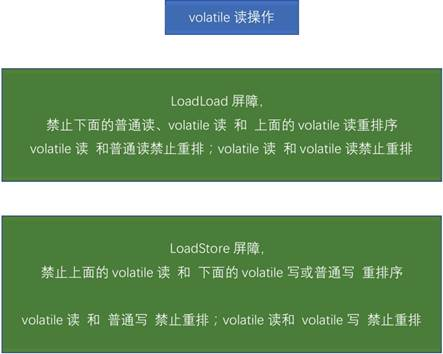

7.5.8.    对比java.util.concurrent.locks.Lock来理解

 

7.5.9.    一句话总结

·     

 

|      |                                         |
| ---- | --------------------------------------- |
|      |  |

\8.    CAS

8.1.    没有CAS之前

8.1.1.    多线程环境不使用原子类保证线程安全（基本数据类型）

 

**package** com.atguigu.juc.prepare;
 
 **import** java.util.concurrent.atomic.AtomicInteger;
 
 */**
 \* **@auther** zzyy
 \* **@create** 2020-04-15 10:41
 \*/
\* **public class** T3
 {
   **volatile int** **number** = 0;
   *//**读取**
\*   **public int** getNumber()
   {
     **return** **number**;
   }
   *//**写入加锁保证原子性**
\*   **public** **synchronized** **void** setNumber()
   {
     **number**++;
   }
 }
 

 

8.1.2.    多线程环境  使用原子类保证线程安全（基本数据类型）

 

**package** com.atguigu.juc.prepare;
 
 **import** java.util.concurrent.atomic.AtomicInteger;
 
 */**
 \* **@auther** zzyy
 \* **@create** 2020-04-15 10:41
 \*/
\* **public class** T3
 {
   **volatile int** **number** = 0;
   *//**读取**
\*   **public int** getNumber()
   {
     **return** **number**;
   }
   *//**写入加锁保证原子性**
\*   **public** **synchronized** **void** setNumber()
   {
     **number**++;
   }
   *//=================================
\*   AtomicInteger **atomicInteger** = **new** AtomicInteger();
 
   **public int** getAtomicInteger()
   {
     **return** **atomicInteger**.get();
   }
 
   **public void** setAtomicInteger()
   {
     **atomicInteger**.getAndIncrement();
   }
 
 
 }
 

 

8.2.    是什么

8.2.1.    说明

 

CAS

compare and swap的缩写，中文翻译成比较并交换,实现并发算法时常用到的一种技术。它包含三个操作数——内存位置、预期原值及更新值。

执行CAS操作的时候，将内存位置的值与预期原值比较：

如果相匹配，那么处理器会自动将该位置值更新为新值，

如果不匹配，处理器不做任何操作，多个线程同时执行CAS操作只有一个会成功。 

 

 

  

·     原理

 

CAS （CompareAndSwap） 

CAS有3个操作数，位置内存值V，旧的预期值A，要修改的更新值B。

当且仅当旧的预期值A和内存值V相同时，将内存值V修改为B，否则什么都不做或重来

 

8.2.2.    硬件级别保证

 

CAS是JDK提供的非阻塞原子性操作，它通过硬件保证了比较-更新的原子性。

它是非阻塞的且自身原子性，也就是说这玩意效率更高且通过硬件保证，说明这玩意更可靠。

 

CAS是一条CPU的原子指令（cmpxchg指令），不会造成所谓的数据不一致问题，Unsafe提供的CAS方法（如compareAndSwapXXX）底层实现即为CPU指令cmpxchg。

执行cmpxchg指令的时候，会判断当前系统是否为多核系统，如果是就给总线加锁，只有一个线程会对总线加锁成功，加锁成功之后会执行cas操作，也就是说CAS的原子性实际上是CPU实现的， 其实在这一点上还是有排他锁的，只是比起用synchronized， 这里的排他时间要短的多， 所以在多线程情况下性能会比较好

8.2.3.    CASDemo代码

**package** com.atguigu.juc.prepare;
 
 **import** java.util.concurrent.atomic.AtomicInteger;
 
 */**
 \* **@auther** zzyy
 \* **@create** 2020-04-15 7:51
 \*/
\* **public class** CASDemo
 {
   **public static void** main(String[] args) **throws** InterruptedException
   {
     AtomicInteger atomicInteger = **new** AtomicInteger(5);
 
     System.***out\***.println(atomicInteger.compareAndSet(5, 2020)+**"****\t****"**+atomicInteger.get());
     System.***out\***.println(atomicInteger.compareAndSet(5, 1024)+**"****\t****"**+atomicInteger.get());
   }
 }
 

 

8.2.4.    2019年回答到上面即可，但2020年受到疫情影响，o(╥﹏╥)o

·     源码分析compareAndSet(int expect,int update)

 

compareAndSet()方法的源代码：

 

上面三个方法都是类似的，主要对4个参数做一下说明。

var1：表示要操作的对象

var2：表示要操作对象中属性地址的偏移量

var4：表示需要修改数据的期望的值

var5/var6：表示需要修改为的新值

 

 

 

引出来一个问题：UnSafe类是什么？

 

 

 

8.3.    CAS底层原理？如果知道，谈谈你对UnSafe的理解

8.3.1.    UnSafe

 

1 Unsafe

  是CAS的核心类，由于Java方法无法直接访问底层系统，需要通过本地（native）方法来访问，Unsafe相当于一个后门，基于该类可以直接操作特定内存的数据。Unsafe类存在于sun.misc包中，其内部方法操作可以像C的**指针**一样直接操作内存，因为Java中CAS操作的执行依赖于Unsafe类的方法。

***注意\******Unsafe\******类中的所有方法都是\******native\******修饰的，也就是说\******Unsafe\******类中的方法都直接调用操作系统底层资源执行相应任务\*** 

 

 2 变量valueOffset，表示该变量值在内存中的偏移地址，因为Unsafe就是根据内存偏移地址获取数据的。

 

3 变量value用volatile修饰，保证了多线程之间的内存可见性。

8.3.2.    我们知道i++线程不安全的，那atomicInteger.getAndIncrement()

 

CAS的全称为Compare-And-Swap，它是一条CPU并发原语。

它的功能是判断内存某个位置的值是否为预期值，如果是则更改为新的值，这个过程是原子的。

AtomicInteger 类主要利用 CAS (compare and swap) + volatile 和 native 方法来保证原子操作，从而避免 synchronized 的高开销，执行效率大为提升。

 

CAS并发原语体现在JAVA语言中就是sun.misc.Unsafe类中的各个方法。调用UnSafe类中的CAS方法，JVM会帮我们实现出CAS汇编指令。这是一种完全依赖于硬件的功能，通过它实现了原子操作。再次强调，由于CAS是一种系统原语，原语属于操作系统用语范畴，是由若干条指令组成的，用于完成某个功能的一个过程，并且原语的执行必须是连续的，在执行过程中不允许被中断，也就是说CAS是一条CPU的原子指令，不会造成所谓的数据不一致问题。

8.3.3.    源码分析

·     **new** AtomicInteger().getAndIncrement();

 

  OpenJDK源码里面查看下Unsafe.java  

 

​     假设线程A和线程B两个线程同时执行getAndAddInt操作（分别跑在不同CPU上）：     1 AtomicInteger里面的value原始值为3，即主内存中AtomicInteger的value为3，根据JMM模型，线程A和线程B各自持有一份值为3的value的副本分别到各自的工作内存。     2 线程A通过getIntVolatile(var1,  var2)拿到value值3，这时线程A被挂起。     3 线程B也通过getIntVolatile(var1, var2)方法获取到value值3，此时刚好线程B没有被挂起并执行compareAndSwapInt方法比较内存值也为3，成功修改内存值为4，线程B打完收工，一切OK。     4 这时线程A恢复，执行compareAndSwapInt方法比较，发现自己手里的值数字3和主内存的值数字4不一致，说明该值已经被其它线程抢先一步修改过了，那A线程本次修改失败，只能重新读取重新来一遍了。     5 线程A重新获取value值，因为变量value被volatile修饰，所以其它线程对它的修改，线程A总是能够看到，线程A继续执行compareAndSwapInt进行比较替换，直到成功。  

 

8.3.4.    底层汇编

·     native修饰的方法代表是底层方法

 

***（非计算机专业的，不要求懂，可以不听，需要汇编知识）\***

Unsafe类中的compareAndSwapInt，是一个本地方法，该方法的实现位于unsafe.cpp中

 

  UNSAFE_ENTRY(jboolean,  Unsafe_CompareAndSwapInt(JNIEnv *env, jobject unsafe, jobject obj, jlong  offset, jint e, jint x))   UnsafeWrapper("Unsafe_CompareAndSwapInt");   oop p =  JNIHandles::resolve(obj);  // 先想办法拿到变量value在内存中的地址，根据偏移量valueOffset，计算 value 的地址   jint* addr =  (jint *) index_oop_from_field_offset_long(p, offset);  // 调用 Atomic 中的函数  cmpxchg来进行比较交换，其中参数x是即将更新的值，参数e是原内存的值   return (jint)(Atomic::cmpxchg(x, addr, e)) == e;  UNSAFE_END  

 

(Atomic::cmpxchg(x, addr, e)) == e;

 

·     cmpxchg

 

// 调用 Atomic 中的函数 cmpxchg来进行比较交换，其中参数x是即将更新的值，参数e是原内存的值

 return (jint)(Atomic::cmpxchg(x, addr, e)) == e;

 

 

  unsigned Atomic::cmpxchg(unsigned  int exchange_value,volatile unsigned int* dest, unsigned int compare_value) {      assert(sizeof(unsigned int) == sizeof(jint), "more work to do");   /*    * 根据操作系统类型调用不同平台下的重载函数，这个在预编译期间编译器会决定调用哪个平台下的重载函数*/    return  (unsigned int)Atomic::cmpxchg((jint)exchange_value, (volatile jint*)dest,  (jint)compare_value);  }  

 

·     在不同的操作系统下会调用不同的cmpxchg重载函数， 阳哥本次用的是win10系统

 

  inline jint Atomic::cmpxchg  (jint exchange_value, volatile jint* dest, jint compare_value) {   //判断是否是多核CPU   int mp = os::is_MP();   __asm {      //三个move指令表示的是将后面的值移动到前面的寄存器上    mov edx,  dest    mov ecx,  exchange_value    mov eax,  compare_value      //CPU原语级别，CPU触发      LOCK_IF_MP(mp)      //比较并交换指令      //cmpxchg: 即“比较并交换”指令      //dword: 全称是 double word 表示两个字，一共四个字节      //ptr: 全称是 pointer，与前面的 dword 连起来使用，表明访问的内存单元是一个双字单元       //将 eax 寄存器中的值（compare_value）与 [edx] 双字内存单元中的值进行对比，      //如果相同，则将  ecx 寄存器中的值（exchange_value）存入 [edx] 内存单元中    cmpxchg  dword ptr [edx], ecx   }  }  

到这里同学们应该理解了CAS真正实现的机制了，它最终是由操作系统的汇编指令完成的。

·     总结

 

 

你只需要记住：CAS是靠硬件实现的从而在硬件层面提升效率，最底层还是交给硬件来保证原子性和可见性

实现方式是基于硬件平台的汇编指令，在intel的CPU中(X86机器上)，使用的是汇编指令cmpxchg指令。 

 

核心思想就是：比较要更新变量的值V和预期值E（compare），相等才会将V的值设为新值N（swap）如果不相等自旋再来。

8.4.    原子引用

8.4.1.    AtomicInteger原子整型，可否有其它原子类型？

·     AtomicBook

·     AtomicOrder

8.4.2.    AtomicReferenceDemo

**package** com.atguigu.Interview.study.thread;
 
 **import** lombok.AllArgsConstructor;
 **import** lombok.Getter;
 **import** lombok.ToString;
 
 **import** java.util.concurrent.atomic.AtomicReference;
 
 @Getter
 @ToString
 @AllArgsConstructor
 **class** User
 {
   String **userName**;
   **int**   **age**;
 }
 
 */**
 \* **@auther** zzyy
 \* **@create** 2018-12-31 17:22
 \*/
\* **public class** AtomicReferenceDemo
 {
   **public static void** main(String[] args)
   {
     User z3 = **new** User(**"z3"**,24);
     User li4 = **new** User(**"li4"**,26);
 
     AtomicReference<User> atomicReferenceUser = **new** AtomicReference<>();
 
     atomicReferenceUser.set(z3);
     System.***out\***.println(atomicReferenceUser.compareAndSet(z3,li4)+**"****\t****"**+atomicReferenceUser.get().toString());
     System.***out\***.println(atomicReferenceUser.compareAndSet(z3,li4)+**"****\t****"**+atomicReferenceUser.get().toString());
   }
 }

8.5.    自旋锁，借鉴CAS思想

8.5.1.    是什么

 

自旋锁（spinlock）

 

是指尝试获取锁的线程不会立即阻塞，而是采用**循环的方式**去尝试获取锁，

当线程发现锁被占用时，会不断循环判断锁的状态，直到获取。这样的好处是减少线程上下文切换的消耗，缺点是循环会消耗CPU

  OpenJDK源码里面查看下Unsafe.java  

 

8.5.2.    自己实现一个自旋锁SpinLockDemo

**package** com.atguigu.Interview.study.thread;
 
 **import** java.util.concurrent.TimeUnit;
 **import** java.util.concurrent.atomic.AtomicReference;
 
 */**
 \* **@auther** zzyy
 \* **@create** 2018-12-28 17:57
 ** *题目：实现一个自旋锁**
\* *** *自旋锁好处：循环比较获取没有类似**wait**的阻塞。**
\* **
 ** *通过**CAS**操作完成自旋锁，**A**线程先进来调用**myLock**方法自己持有锁**5**秒钟，**B**随后进来后发现**
\* *** *当前有线程持有锁，不是**null**，所以只能通过自旋等待，直到**A**释放锁后**B**随后抢到。**
\* **/
\* **public class** SpinLockDemo
 {
   AtomicReference<Thread> **atomicReference** = **new** AtomicReference<>();
 
   **public void** myLock()
   {
     Thread thread = Thread.*currentThread*();
     System.***out\***.println(Thread.*currentThread*().getName()+**"****\t** **come in"**);
     **while**(!**atomicReference**.compareAndSet(**null**,thread))
     {
 
     }
   }
 
   **public void** myUnLock()
   {
     Thread thread = Thread.*currentThread*();
     **atomicReference**.compareAndSet(thread,**null**);
     System.***out\***.println(Thread.*currentThread*().getName()+**"****\t** **myUnLock over"**);
   }
 
   **public static void** main(String[] args)
   {
     SpinLockDemo spinLockDemo = **new** SpinLockDemo();
 
     **new** Thread(() -> {
       spinLockDemo.myLock();
       **try** { TimeUnit.***SECONDS\***.sleep( 5 ); } **catch** (InterruptedException e) { e.printStackTrace(); }
       spinLockDemo.myUnLock();
     },**"A"**).start();

     *//**暂停一会儿线程，保证**A**线程先于**B**线程启动并完成**
\*     **try** { TimeUnit.***SECONDS\***.sleep( 1 ); } **catch** (InterruptedException e) { e.printStackTrace(); }
 
     **new** Thread(() -> {
       spinLockDemo.myLock();
       spinLockDemo.myUnLock();
     },**"B"**).start();
 
   }
 }
 
 

 

8.6.    CAS缺点

8.6.1.    循环时间长开销很大。

 

我们可以看到getAndAddInt方法执行时，有个do while

 

如果CAS失败，会一直进行尝试。如果CAS长时间一直不成功，可能会给CPU带来很大的开销。

8.6.2.    引出来ABA问题？？？

·     ABA问题怎么产生的

 

 CAS会导致“ABA问题”。

 

CAS算法实现一个重要前提需要取出内存中某时刻的数据并在当下时刻比较并替换，那么在这个时间差类会导致数据的变化。

 

比如说一个线程one从内存位置V中取出A，这时候另一个线程two也从内存中取出A，并且线程two进行了一些操作将值变成了B，

然后线程two又将V位置的数据变成A，这时候线程one进行CAS操作发现内存中仍然是A，然后线程one操作成功。

 

尽管线程one的CAS操作成功，但是不代表这个过程就是没有问题的。

·     版本号时间戳原子引用

·     AtomicStampedReference

·     ABADemo

**package** com.atguigu.Interview.study.thread;
 
 **import** java.util.concurrent.atomic.AtomicInteger;
 **import** java.util.concurrent.atomic.AtomicStampedReference;
 
 */**
 \* **@auther** zzyy
 \* **@create** 2018-11-20 17:14
 \*/
\* **public class** ABADemo
 {
   **static** AtomicInteger *atomicInteger* = **new** AtomicInteger(100);
   **static** AtomicStampedReference *atomicStampedReference* = **new** AtomicStampedReference(100,1);
 
   **public static void** main(String[] args)
   {
     **new** Thread(() -> {
       *atomicInteger*.compareAndSet(100,101);
       *atomicInteger*.compareAndSet(101,100);
     },**"t1"**).start();
 
     **new** Thread(() -> {
       *//**暂停一会儿线程**
\*       **try** { Thread.*sleep*( 500 ); } **catch** (InterruptedException e) { e.printStackTrace(); };      System.***out\***.println(*atomicInteger*.compareAndSet(100, 2019)+**"****\t****"**+*atomicInteger*.get());
     },**"t2"**).start();
 
     *//**暂停一会儿线程**,main**彻底等待上面的**ABA**出现演示完成。**
\*     **try** { Thread.*sleep*( 2000 ); } **catch** (InterruptedException e) { e.printStackTrace(); }
 
     System.***out\***.println(**"============****以下是****ABA****问题的解决****============================="**);
 
     **new** Thread(() -> {
       **int** stamp = *atomicStampedReference*.getStamp();
       System.***out\***.println(Thread.*currentThread*().getName()+**"****\t** **首次版本号****:"**+stamp);*//1
       //**暂停一会儿线程**,
\*       **try** { Thread.*sleep*( 1000 ); } **catch** (InterruptedException e) { e.printStackTrace(); }
       *atomicStampedReference*.compareAndSet(100,101,*atomicStampedReference*.getStamp(),*atomicStampedReference*.getStamp()+1);
       System.***out\***.println(Thread.*currentThread*().getName()+**"****\t** **2****次版本号****:"**+*atomicStampedReference*.getStamp());
       *atomicStampedReference*.compareAndSet(101,100,*atomicStampedReference*.getStamp(),*atomicStampedReference*.getStamp()+1);
       System.***out\***.println(Thread.*currentThread*().getName()+**"****\t** **3****次版本号****:"**+*atomicStampedReference*.getStamp());
     },**"t3"**).start();
 
     **new** Thread(() -> {
       **int** stamp = *atomicStampedReference*.getStamp();
       System.***out\***.println(Thread.*currentThread*().getName()+**"****\t** **首次版本号****:"**+stamp);*//1
       //**暂停一会儿线程，获得初始值**100**和初始版本号**1**，故意暂停**3**秒钟让**t3**线程完成一次**ABA**操作产生问题**
\*       **try** { Thread.*sleep*( 3000 ); } **catch** (InterruptedException e) { e.printStackTrace(); }
       **boolean** result = *atomicStampedReference*.compareAndSet(100,2019,stamp,stamp+1);
       System.***out\***.println(Thread.*currentThread*().getName()+**"****\t****"**+result+**"****\t****"**+*atomicStampedReference*.getReference());
     },**"t4"**).start();
   }
 }
 

 

·     下一章介绍AtomicMarkableReference

\9.    原子操作类之18罗汉增强

9.1.    是什么

 红框、蓝框说明

 

9.1.1.    atomic

·     AtomicBoolean

 

|      |                                         |
| ---- | --------------------------------------- |
|      |  |

·     AtomicInteger

 

|      |                                         |
| ---- | --------------------------------------- |
|      |  |

·     AtomicIntegerArray

 

|      |                                         |
| ---- | --------------------------------------- |
|      |  |

·     AtomicIntegerFieldUpdater

 

|      |                                         |
| ---- | --------------------------------------- |
|      |  |

·     AtomicLong

 

|      |                                         |
| ---- | --------------------------------------- |
|      |  |

·     AtomicLongArray

 

|      |                                         |
| ---- | --------------------------------------- |
|      |  |

·     AtomicLongFieldUpdater

 

|      |                                         |
| ---- | --------------------------------------- |
|      |  |

·     AtomicMarkableReference

 

|      |                                         |
| ---- | --------------------------------------- |
|      |  |

·     AtomicReference

 

|      |                                         |
| ---- | --------------------------------------- |
|      |  |

·     AtomicReferenceArray

 

|      |                                         |
| ---- | --------------------------------------- |
|      |  |

·     AtomicReferenceFieldUpdater

 

|      |                                         |
| ---- | --------------------------------------- |
|      |  |

·     AtomicStampedReference

 

|      |                                         |
| ---- | --------------------------------------- |
|      |  |

·     DoubleAccumulator

 

|      |                                         |
| ---- | --------------------------------------- |
|      |  |

·     DoubleAdder

 

|      |                                         |
| ---- | --------------------------------------- |
|      |  |

·     LongAccumulator

 

|      |                                         |
| ---- | --------------------------------------- |
|      |  |

·     LongAdder

 

|      |                                         |
| ---- | --------------------------------------- |
|      |  |

9.2.    再分类

9.2.1.    基本类型原子类

·     AtomicInteger

 

|      |                                         |
| ---- | --------------------------------------- |
|      |  |

·     AtomicBoolean

 

|      |                                         |
| ---- | --------------------------------------- |
|      |  |

·     AtomicLong

 

|      |                                         |
| ---- | --------------------------------------- |
|      |  |

·     常用API简介

·     public final int get() //获取当前的值

·     public final int getAndSet(int newValue)//获取当前的值，并设置新的值

·     public final int getAndIncrement()//获取当前的值，并自增

·     public final int getAndDecrement() //获取当前的值，并自减

·     public final int getAndAdd(int delta) //获取当前的值，并加上预期的值

·     boolean compareAndSet(int expect, int update) //如果输入的数值等于预期值，则以原子方式将该值设置为输入值（update）

·     Case

**package** com.atguigu.juc.senior.test2;
 
 **import** lombok.Getter;
 
 **import** java.util.concurrent.CountDownLatch;
 **import** java.util.concurrent.atomic.AtomicInteger;
 
 **class** MyNumber
 {
   @Getter
   **private** AtomicInteger **atomicInteger** = **new** AtomicInteger();
   **public void** addPlusPlus()
   {
     **atomicInteger**.incrementAndGet();
   }
 }
 
 */**
 \* **@auther** zzyy
 \* **@create** 2020-07-03 17:16
 \*/
\* **public class** AtomicIntegerDemo
 {
   **public static void** main(String[] args) **throws** InterruptedException
   {
     MyNumber myNumber = **new** MyNumber();
     CountDownLatch countDownLatch = **new** CountDownLatch(100);
 
     **for** (**int** i = 1; i <=100; i++) {
       **new** Thread(() -> {
         **try
**         {
           **for** (**int** j = 1; j <=5000; j++)
           {
             myNumber.addPlusPlus();
           }
         }**finally** {
           countDownLatch.countDown();
         }
       },String.*valueOf*(i)).start();
     }
 
     countDownLatch.await();
 
     System.***out\***.println(myNumber.getAtomicInteger().get());
   }
 }
 

 

·     tsleep→countDownLatch

9.2.2.    数组类型原子类

·     AtomicIntegerArray

 

|      |                                         |
| ---- | --------------------------------------- |
|      |  |

·     AtomicLongArray

 

|      |                                         |
| ---- | --------------------------------------- |
|      |  |

·     AtomicReferenceArray

 

|      |                                         |
| ---- | --------------------------------------- |
|      |  |

·     Case

·     基本使用

**package** com.atguigu.juc.prepare;
 
 **import** java.util.concurrent.atomic.AtomicIntegerArray;
 
 */**
 \* **@auther** zzyy
 \* **@create** 2020-04-16 14:59
 \*/
\* **public class** AtomicIntegerArrayDemo
 {
   **public static void** main(String[] args)
   {
     AtomicIntegerArray atomicIntegerArray = **new** AtomicIntegerArray(**new int**[5]);
     *//AtomicIntegerArray atomicIntegerArray = new AtomicIntegerArray(5);
     //AtomicIntegerArray atomicIntegerArray = new AtomicIntegerArray(new int[]{1,2,3,4,5});
 
\*     **for** (**int** i = 0; i <atomicIntegerArray.length(); i++) {
       System.***out\***.println(atomicIntegerArray.get(i));
     }
     System.***out\***.println();
     System.***out\***.println();
     System.***out\***.println();
     **int** tmpInt = 0;
 
     tmpInt = atomicIntegerArray.getAndSet(0,1122);
     System.***out\***.println(tmpInt+**"****\t****"**+atomicIntegerArray.get(0));
     atomicIntegerArray.getAndIncrement(1);
     atomicIntegerArray.getAndIncrement(1);
     tmpInt = atomicIntegerArray.getAndIncrement(1);
     System.***out\***.println(tmpInt+**"****\t****"**+atomicIntegerArray.get(1));
   }
 }
 

 

·     要求学生自学

9.2.3.    引用类型原子类

·     AtomicReference

 

|      |                                         |
| ---- | --------------------------------------- |
|      |  |

**package** com.atguigu.Interview.study.thread;
 
 **import** lombok.AllArgsConstructor;
 **import** lombok.Getter;
 **import** lombok.ToString;
 
 **import** java.util.concurrent.atomic.AtomicReference;
 
 @Getter
 @ToString
 @AllArgsConstructor
 **class** User
 {
   String **userName**;
   **int**   **age**;
 }
 
 */**
 \* **@auther** zzyy
 \* **@create** 2018-12-31 17:22
 \*/
\* **public class** AtomicReferenceDemo
 {
   **public static void** main(String[] args)
   {
     User z3 = **new** User(**"z3"**,24);
     User li4 = **new** User(**"li4"**,26);
 
     AtomicReference<User> atomicReferenceUser = **new** AtomicReference<>();
 
     atomicReferenceUser.set(z3);
     System.***out\***.println(atomicReferenceUser.compareAndSet(z3,li4)+**"****\t****"**+atomicReferenceUser.get().toString());
     System.***out\***.println(atomicReferenceUser.compareAndSet(z3,li4)+**"****\t****"**+atomicReferenceUser.get().toString());
   }
 }

 

·     自旋锁SpinLockDemo

**package** com.atguigu.Interview.study.thread;
 
 **import** java.util.concurrent.TimeUnit;
 **import** java.util.concurrent.atomic.AtomicReference;
 
 */**
 \* **@auther** zzyy
 \* **@create** 2018-12-28 17:57
 ** *题目：实现一个自旋锁**
\* *** *自旋锁好处：循环比较获取没有类似**wait**的阻塞。**
\* **
 ** *通过**CAS**操作完成自旋锁，**A**线程先进来调用**myLock**方法自己持有锁**5**秒钟，**B**随后进来后发现**
\* *** *当前有线程持有锁，不是**null**，所以只能通过自旋等待，直到**A**释放锁后**B**随后抢到。**
\* **/
\* **public class** SpinLockDemo
 {
   AtomicReference<Thread> **atomicReference** = **new** AtomicReference<>();
 
   **public void** myLock()
   {
     Thread thread = Thread.*currentThread*();
     System.***out\***.println(Thread.*currentThread*().getName()+**"****\t** **come in"**);
     **while**(!**atomicReference**.compareAndSet(**null**,thread))
     {
 
     }
   }
 
   **public void** myUnLock()
   {
     Thread thread = Thread.*currentThread*();
     **atomicReference**.compareAndSet(thread,**null**);
     System.***out\***.println(Thread.*currentThread*().getName()+**"****\t** **myUnLock over"**);
   }
 
   **public static void** main(String[] args)
   {
     SpinLockDemo spinLockDemo = **new** SpinLockDemo();
 
     **new** Thread(() -> {
       spinLockDemo.myLock();
       *//**暂停一会儿线程**
\*       **try** { TimeUnit.***SECONDS\***.sleep( 5 ); } **catch** (InterruptedException e) { e.printStackTrace(); }
       spinLockDemo.myUnLock();
     },**"A"**).start();
     *//**暂停一会儿线程，保证**A**线程先于**B**线程启动并完成**
\*     **try** { TimeUnit.***SECONDS\***.sleep( 1 ); } **catch** (InterruptedException e) { e.printStackTrace(); }
 
     **new** Thread(() -> {
       spinLockDemo.myLock();
       spinLockDemo.myUnLock();
     },**"B"**).start();
 
   }
 }
 
 

 

·     AtomicStampedReference

 

|      |                                         |
| ---- | --------------------------------------- |
|      |  |

·     携带版本号的引用类型原子类，可以解决ABA问题

·     解决修改过几次

·     状态戳原子引用

·     ABADemo

**package** com.atguigu.juc.cas;
 
 **import** java.util.concurrent.TimeUnit;
 **import** java.util.concurrent.atomic.AtomicInteger;
 **import** java.util.concurrent.atomic.AtomicStampedReference;
 
 */**
 \* **@auther** zzyy
 \* **@create** 2021-03-18 15:34
 \*/
\* **public class** ABADemo
 {
   **static** AtomicInteger *atomicInteger* = **new** AtomicInteger(100);
   **static** AtomicStampedReference *atomicStampedReference* = **new** AtomicStampedReference(100,1);
 
   **public static void** main(String[] args)
   {
     *abaProblem*();
     *abaResolve*();
   }
 
   **public static void** abaResolve()
   {
     **new** Thread(() -> {
       **int** stamp = *atomicStampedReference*.getStamp();
       System.***out\***.println(**"t3 ----****第****1****次****stamp "**+stamp);
       **try** { TimeUnit.***SECONDS\***.sleep(1); } **catch** (InterruptedException e) { e.printStackTrace(); }
       *atomicStampedReference*.compareAndSet(100,101,stamp,stamp+1);
       System.***out\***.println(**"t3 ----****第****2****次****stamp "**+*atomicStampedReference*.getStamp());
       *atomicStampedReference*.compareAndSet(101,100,*atomicStampedReference*.getStamp(),*atomicStampedReference*.getStamp()+1);
       System.***out\***.println(**"t3 ----****第****3****次****stamp "**+*atomicStampedReference*.getStamp());
     },**"t3"**).start();
 
     **new** Thread(() -> {
       **int** stamp = *atomicStampedReference*.getStamp();
       System.***out\***.println(**"t4 ----****第****1****次****stamp "**+stamp);
       *//**暂停几秒钟线程**
\*       **try** { TimeUnit.***SECONDS\***.sleep(3); } **catch** (InterruptedException e) { e.printStackTrace(); }
       **boolean** result = *atomicStampedReference*.compareAndSet(100, 20210308, stamp, stamp + 1);
       System.***out\***.println(Thread.*currentThread*().getName()+**"****\t****"**+result+**"****\t****"**+*atomicStampedReference*.getReference());
     },**"t4"**).start();
   }
 
   **public static void** abaProblem()
   {
     **new** Thread(() -> {
       *atomicInteger*.compareAndSet(100,101);
       *atomicInteger*.compareAndSet(101,100);
     },**"t1"**).start();
 
     **try** { TimeUnit.***MILLISECONDS\***.sleep(200); } **catch** (InterruptedException e) { e.printStackTrace(); }
 
     **new** Thread(() -> {
       *atomicInteger*.compareAndSet(100,20210308);
       System.***out\***.println(*atomicInteger*.get());
     },**"t2"**).start();
   }
 }
 

 

·     AtomicMarkableReference

 

|      |                                         |
| ---- | --------------------------------------- |
|      |  |

·     原子更新带有标记位的引用类型对象

·     解决是否修改过

·     它的定义就是将状态戳简化为true|false

·     类似一次性筷子

·     状态戳(true/false)原子引用

**package** com.atguigu.juc.senior.inner.atomic;
 
 **import** java.util.concurrent.TimeUnit;
 **import** java.util.concurrent.atomic.AtomicInteger;
 **import** java.util.concurrent.atomic.AtomicMarkableReference;
 **import** java.util.concurrent.atomic.AtomicStampedReference;
 
 */**
 \* **@auther** zzyy
 \* **@create** 2020-05-23 10:56
 \*/
\* **public class** ABADemo
 {
   **static** AtomicInteger *atomicInteger* = **new** AtomicInteger(100);
   **static** AtomicStampedReference<Integer> *stampedReference* = **new** AtomicStampedReference<>(100,1);
   **static** AtomicMarkableReference<Integer> *markableReference* = **new** AtomicMarkableReference<>(100,**false**);
 
   **public static void** main(String[] args)
   {
     **new** Thread(() -> {
       *atomicInteger*.compareAndSet(100,101);
       *atomicInteger*.compareAndSet(101,100);
       System.***out\***.println(Thread.*currentThread*().getName()+**"****\t****"**+**"update ok"**);
     },**"t1"**).start();
 
     **new** Thread(() -> {
       *//**暂停几秒钟线程**
\*       **try** { TimeUnit.***SECONDS\***.sleep(1); } **catch** (InterruptedException e) { e.printStackTrace(); }
       *atomicInteger*.compareAndSet(100,2020);
     },**"t2"**).start();
 
     *//**暂停几秒钟线程**
\*     **try** { TimeUnit.***SECONDS\***.sleep(2); } **catch** (InterruptedException e) { e.printStackTrace(); }
 
     System.***out\***.println(*atomicInteger*.get());
 
     System.***out\***.println();
     System.***out\***.println();
     System.***out\***.println();
 
     System.***out\***.println(**"============****以下是****ABA****问题的解决****,****让我们知道引用变量中途被更改了几次****========================="**);
     **new** Thread(() -> {
       System.***out\***.println(Thread.*currentThread*().getName()+**"****\t** **1****次版本号****"**+*stampedReference*.getStamp());
       *//**故意暂停**200**毫秒，让后面的**t4**线程拿到和**t3**一样的版本号**
\*       **try** { TimeUnit.***MILLISECONDS\***.sleep(200); } **catch** (InterruptedException e) { e.printStackTrace(); }
 
       *stampedReference*.compareAndSet(100,101,*stampedReference*.getStamp(),*stampedReference*.getStamp()+1);
       System.***out\***.println(Thread.*currentThread*().getName()+**"****\t** **2****次版本号****"**+*stampedReference*.getStamp());
       *stampedReference*.compareAndSet(101,100,*stampedReference*.getStamp(),*stampedReference*.getStamp()+1);
       System.***out\***.println(Thread.*currentThread*().getName()+**"****\t** **3****次版本号****"**+*stampedReference*.getStamp());
     },**"t3"**).start();
 
     **new** Thread(() -> {
       **int** stamp = *stampedReference*.getStamp();
       System.***out\***.println(Thread.*currentThread*().getName()+**"****\t** **=======1****次版本号****"**+stamp);
       *//**暂停**2**秒钟**,**让**t3**先完成**ABA**操作了，看看自己还能否修改**
\*       **try** { TimeUnit.***SECONDS\***.sleep(2); } **catch** (InterruptedException e) { e.printStackTrace(); }
       **boolean** b = *stampedReference*.compareAndSet(100, 2020, stamp, stamp + 1);
       System.***out\***.println(Thread.*currentThread*().getName()+**"****\t****=======2****次版本号****"**+*stampedReference*.getStamp()+**"****\t****"**+*stampedReference*.getReference());
     },**"t4"**).start();
 
     System.***out\***.println();
     System.***out\***.println();
     System.***out\***.println();
 
     System.***out\***.println(**"============AtomicMarkableReference****不关心引用变量更改过几次，只关心是否更改过****======================"**);
 
     **new** Thread(() -> {
       **boolean** marked = *markableReference*.isMarked();
       System.***out\***.println(Thread.*currentThread*().getName()+**"****\t** **1****次版本号****"**+marked);
       **try** { TimeUnit.***MILLISECONDS\***.sleep(100); } **catch** (InterruptedException e) { e.printStackTrace(); }
       *markableReference*.compareAndSet(100,101,marked,!marked);
       System.***out\***.println(Thread.*currentThread*().getName()+**"****\t** **2****次版本号****"**+*markableReference*.isMarked());
       *markableReference*.compareAndSet(101,100,*markableReference*.isMarked(),!*markableReference*.isMarked());
       System.***out\***.println(Thread.*currentThread*().getName()+**"****\t** **3****次版本号****"**+*markableReference*.isMarked());
     },**"t5"**).start();
 
     **new** Thread(() -> {
       **boolean** marked = *markableReference*.isMarked();
       System.***out\***.println(Thread.*currentThread*().getName()+**"****\t** **1****次版本号****"**+marked);
       *//**暂停几秒钟线程**
\*       **try** { TimeUnit.***MILLISECONDS\***.sleep(100); } **catch** (InterruptedException e) { e.printStackTrace(); }
       *markableReference*.compareAndSet(100,2020,marked,!marked);
       System.***out\***.println(Thread.*currentThread*().getName()+**"****\t****"**+*markableReference*.getReference()+**"****\t****"**+*markableReference*.isMarked());
     },**"t6"**).start();
   }
 }
 

 

9.2.4.    对象的属性修改原子类

·     AtomicIntegerFieldUpdater

 

|      |                                         |
| ---- | --------------------------------------- |
|      |  |

·     原子更新对象中int类型字段的值

·     AtomicLongFieldUpdater

 

|      |                                         |
| ---- | --------------------------------------- |
|      |  |

·     原子更新对象中Long类型字段的值

·     AtomicReferenceFieldUpdater

 

|      |                                         |
| ---- | --------------------------------------- |
|      |  |

·     原子更新引用类型字段的值

·     使用目的

·     以一种线程安全的方式操作非线程安全对象内的某些字段

·     使用要求

·     更新的对象属性必须使用 public volatile 修饰符。

·     因为对象的属性修改类型原子类都是抽象类，所以每次使用都必须 使用静态方法newUpdater()创建一个更新器，并且需要设置想要更新的类和属性。

·     Case

·     AtomicIntegerFieldUpdaterDemo

**package** com.atguigu.itdachang;
 
 **import** java.util.concurrent.TimeUnit;
 **import** java.util.concurrent.atomic.AtomicIntegerFieldUpdater;
 
 
 **class** BankAccount
 {
   **private** String **bankName** = **"CCB"**;*//**银行**
\*   **public volatile int** **money** = 0;*//**钱数**
\*   AtomicIntegerFieldUpdater<BankAccount> **accountAtomicIntegerFieldUpdater** = AtomicIntegerFieldUpdater.*newUpdater*(BankAccount.**class**,**"money"**);
 
   *//**不加锁**+**性能高，局部微创**
\*   **public void** transferMoney(BankAccount bankAccount)
   {
     **accountAtomicIntegerFieldUpdater**.incrementAndGet(bankAccount);
   }
 }
 
 */**
 \* **@auther** zzyy
 \* **@create** 2020-07-14 18:06
 ** *以一种线程安全的方式操作非线程安全对象的某些字段。**
\* *** *需求：**
\* ** 1000**个人同时向一个账号转账一元钱，那么累计应该增加**1000**元，**
\* *** *除了**synchronized**和**CAS,**还可以使用**AtomicIntegerFieldUpdater**来实现。**
\* **/
\* **public class** AtomicIntegerFieldUpdaterDemo
 {
 
   **public static void** main(String[] args)
   {
     BankAccount bankAccount = **new** BankAccount();
 
     **for** (**int** i = 1; i <=1000; i++) {
       **int** finalI = i;
       **new** Thread(() -> {
         bankAccount.transferMoney(bankAccount);
       },String.*valueOf*(i)).start();
     }
 
     *//**暂停毫秒**
\*     **try** { TimeUnit.***MILLISECONDS\***.sleep(500); } **catch** (InterruptedException e) { e.printStackTrace(); }
 
     System.***out\***.println(bankAccount.**money**);
 
   }
 }
 

 

·     AtomicReferenceFieldUpdater

 

**package** com.atguigu.juc.atomics;
 
 **import** java.util.concurrent.TimeUnit;
 **import** java.util.concurrent.atomic.AtomicReferenceFieldUpdater;
 
 **class** MyVar
 {
   **public volatile** Boolean **isInit** = Boolean.***FALSE\***;
   AtomicReferenceFieldUpdater<MyVar,Boolean> **atomicReferenceFieldUpdater** = AtomicReferenceFieldUpdater.*newUpdater*(MyVar.**class**,Boolean.**class**,**"isInit"**);
 
 
   **public void** init(MyVar myVar)
   {
     **if**(**atomicReferenceFieldUpdater**.compareAndSet(myVar,Boolean.***FALSE\***,Boolean.***TRUE\***))
     {
       System.***out\***.println(Thread.*currentThread*().getName()+**"****\t****"**+**"---init....."**);
       *//**暂停几秒钟线程**
\*       **try** { TimeUnit.***SECONDS\***.sleep(2); } **catch** (InterruptedException e) { e.printStackTrace(); }
       System.***out\***.println(Thread.*currentThread*().getName()+**"****\t****"**+**"---init.....over"**);
     }**else**{
       System.***out\***.println(Thread.*currentThread*().getName()+**"****\t****"**+**"------****其它线程正在初始化****"**);
     }
   }
 
 
 }
 
 
 */**
 \* **@auther** zzyy
 \* **@create** 2021-03-18 17:20
 ** *多线程并发调用一个类的初始化方法，如果未被初始化过，将执行初始化工作，要求只能初始化一次**
\* **/
\* **public class** AtomicIntegerFieldUpdaterDemo
 {
   **public static void** main(String[] args) **throws** InterruptedException
   {
     MyVar myVar = **new** MyVar();
 
     **for** (**int** i = 1; i <=5; i++) {
       **new** Thread(() -> {
         myVar.init(myVar);
       },String.*valueOf*(i)).start();
     }
   }
 }
 

 

·     面试官问你：你在哪里用了volatile

·     AtomicReferenceFieldUpdater

9.2.5.    原子操作增强类原理深度解析

·     DoubleAccumulator

 

|      |                                         |
| ---- | --------------------------------------- |
|      |  |

·     DoubleAdder

 

|      |                                         |
| ---- | --------------------------------------- |
|      |  |

·     LongAccumulator

 

|      |                                         |
| ---- | --------------------------------------- |
|      |  |

·     LongAdder

 

|      |                                         |
| ---- | --------------------------------------- |
|      |  |

·     阿里要命题目

 

** 1*   *热点商品点赞计算器，点赞数加加统计，不要求实时精确*

*
\* ** 2*   *一个很大的**List**，里面都是**int**类型，如何实现加加，说说思路*

 

·     点赞计数器，看看性能

·     常用API

·     入门讲解

·     LongAdder只能用来计算加法，且从零开始计算

·     LongAccumulator提供了自定义的函数操作

 

long类型的聚合器，需要传入一个long类型的二元操作，可以用来计算各种聚合操作，包括加乘等

 

**package** com.atguigu.juc.senior.inner.atomic;
 
 **import** java.util.concurrent.atomic.LongAccumulator;
 **import** java.util.concurrent.atomic.LongAdder;
 **import** java.util.function.LongBinaryOperator;
 
 */**
 \* **@auther** zzyy
 \* **@create** 2020-05-30 13:51
 \*/
\* **public class** LongAccumulatorDemo
 {
 
   LongAdder **longAdder** = **new** LongAdder();
   **public void** add_LongAdder()
   {
     **longAdder**.increment();
   }
 
   *//LongAccumulator longAccumulator = new LongAccumulator((x, y) -> x + y,0);
\*   LongAccumulator **longAccumulator** = **new** LongAccumulator(**new** LongBinaryOperator()
   {
     @Override
     **public long** applyAsLong(**long** left, **long** right)
     {
       **return** left - right;
     }
   },777);
 
   **public void** add_LongAccumulator()
   {
     **longAccumulator**.accumulate(1);
   }
 
   **public static void** main(String[] args)
   {
     LongAccumulatorDemo demo = **new** LongAccumulatorDemo();
 
     demo.add_LongAccumulator();
     demo.add_LongAccumulator();
     System.***out\***.println(demo.**longAccumulator**.longValue());
   }
 }
 

 

·     LongAdderAPIDemo

 

**package** com.atguigu.juc.atomics;
 
 **import** java.util.concurrent.atomic.LongAccumulator;
 **import** java.util.concurrent.atomic.LongAdder;
 
 */**
 \* **@auther** zzyy
 \* **@create** 2021-03-19 15:59
 \*/
\* **public class** LongAdderAPIDemo
 {
   **public static void** main(String[] args)
   {
     LongAdder longAdder = **new** LongAdder();
 
     longAdder.increment();
     longAdder.increment();
     longAdder.increment();
 
     System.***out\***.println(longAdder.longValue());
 
     LongAccumulator longAccumulator = **new** LongAccumulator((x,y) -> x * y,2);
 
     longAccumulator.accumulate(1);
     longAccumulator.accumulate(2);
     longAccumulator.accumulate(3);
 
     System.***out\***.println(longAccumulator.longValue());
 
   }
 }
 

 

·     LongAdder高性能对比Code演示

**package** com.zzyy.study.day524;
 
 **import** java.util.concurrent.CountDownLatch;
 **import** java.util.concurrent.atomic.AtomicLong;
 **import** java.util.concurrent.atomic.LongAccumulator;
 **import** java.util.concurrent.atomic.LongAdder;
 
 **class** ClickNumberNet
 {
   **int** **number** = 0;
   **public synchronized void** clickBySync()
   {
     **number**++;
   }
 
   AtomicLong **atomicLong** = **new** AtomicLong(0);
   **public void** clickByAtomicLong()
   {
     **atomicLong**.incrementAndGet();
   }
 
   LongAdder **longAdder** = **new** LongAdder();
   **public void** clickByLongAdder()
   {
     **longAdder**.increment();
   }
 
   LongAccumulator **longAccumulator** = **new** LongAccumulator((x,y) -> x + y,0);
   **public void** clickByLongAccumulator()
   {
     **longAccumulator**.accumulate(1);
   }
 }
 
 */**
 \* **@auther** zzyy
 \* **@create** 2020-05-21 22:23
 \* 50**个线程，每个线程**100W**次，总点赞数出来**
\* **/
\* **public class** LongAdderDemo2
 {
   **public static void** main(String[] args) **throws** InterruptedException
   {
     ClickNumberNet clickNumberNet = **new** ClickNumberNet();
 
     **long** startTime;
     **long** endTime;
     CountDownLatch countDownLatch = **new** CountDownLatch(50);
     CountDownLatch countDownLatch2 = **new** CountDownLatch(50);
     CountDownLatch countDownLatch3 = **new** CountDownLatch(50);
     CountDownLatch countDownLatch4 = **new** CountDownLatch(50);
 
 
     startTime = System.*currentTimeMillis*();
     **for** (**int** i = 1; i <=50; i++) {
       **new** Thread(() -> {
         **try
**         {
           **for** (**int** j = 1; j <=100 * 10000; j++) {
             clickNumberNet.clickBySync();
           }
         }**finally** {
           countDownLatch.countDown();
         }
       },String.*valueOf*(i)).start();
     }
     countDownLatch.await();
     endTime = System.*currentTimeMillis*();
     System.***out\***.println(**"----costTime: "**+(endTime - startTime) +**"** **毫秒****"**+**"****\t** **clickBySync result: "**+clickNumberNet.**number**);
 
     startTime = System.*currentTimeMillis*();
     **for** (**int** i = 1; i <=50; i++) {
       **new** Thread(() -> {
         **try
**         {
           **for** (**int** j = 1; j <=100 * 10000; j++) {
             clickNumberNet.clickByAtomicLong();
           }
         }**finally** {
           countDownLatch2.countDown();
         }
       },String.*valueOf*(i)).start();
     }
     countDownLatch2.await();
     endTime = System.*currentTimeMillis*();
     System.***out\***.println(**"----costTime: "**+(endTime - startTime) +**"** **毫秒****"**+**"****\t** **clickByAtomicLong result: "**+clickNumberNet.**atomicLong**);
 
     startTime = System.*currentTimeMillis*();
     **for** (**int** i = 1; i <=50; i++) {
       **new** Thread(() -> {
         **try
**         {
           **for** (**int** j = 1; j <=100 * 10000; j++) {
             clickNumberNet.clickByLongAdder();
           }
         }**finally** {
           countDownLatch3.countDown();
         }
       },String.*valueOf*(i)).start();
     }
     countDownLatch3.await();
     endTime = System.*currentTimeMillis*();
     System.***out\***.println(**"----costTime: "**+(endTime - startTime) +**"** **毫秒****"**+**"****\t** **clickByLongAdder result: "**+clickNumberNet.**longAdder**.sum());
 
     startTime = System.*currentTimeMillis*();
     **for** (**int** i = 1; i <=50; i++) {
       **new** Thread(() -> {
         **try
**         {
           **for** (**int** j = 1; j <=100 * 10000; j++) {
             clickNumberNet.clickByLongAccumulator();
           }
         }**finally** {
           countDownLatch4.countDown();
         }
       },String.*valueOf*(i)).start();
     }
     countDownLatch4.await();
     endTime = System.*currentTimeMillis*();
     System.***out\***.println(**"----costTime: "**+(endTime - startTime) +**"** **毫秒****"**+**"****\t** **clickByLongAccumulator result: "**+clickNumberNet.**longAccumulator**.longValue());
 
 
   }
 }
 

 

·     源码、原理分析

·     架构

 

LongAdder是Striped64的子类

 

·     原理(LongAdder为什么这么快)

·     官网说明和阿里要求

·     LongAdder是Striped64的子类

·     Striped64

·     Striped64有几个比较重要的成员函数

 

*/** Number of CPUS, to place bound on table size*    *CPU**数量，即**cells**数组的最大长度* **/
\* **static final int** ***NCPU\*** = Runtime.*getRuntime*().availableProcessors();
 
 */**
 \* Table of cells. When non-null, size is a power of 2.*

*cells**数组，为**2**的幂，**2,4,8,16.....**，方便以后位运算**
 \*/
\* **transient volatile** Cell[] **cells**;
 
 */****基础**value**值，当并发较低时，只累加该值主要用于没有竞争的情况，通过**CAS**更新。**
 \* Base value, used mainly when there is no contention, but also as
 \* a fallback during table initialization races. Updated via CAS.
 \*/
\* **transient volatile long** **base**;
 
 */****创建或者扩容**Cells**数组时使用的自旋锁变量调整单元格大小（扩容），创建单元格时使用的锁。**
 \* Spinlock (locked via CAS) used when resizing and/or creating Cells. 
 \*/
\* **transient volatile int** **cellsBusy**;

 

·     最重要2个

·     Striped64中一些变量或者方法的定义

·     Cell

·     是 java.util.concurrent.atomic 下 Striped64 的一个内部类

·     LongAdder为什么这么快

·     一句话

LongAdder的基本思路就是**分散热点**，将value值分散到一个Cell数组中，不同线程会命中到数组的不同槽中，各个线程只对自己槽中的那个值进行CAS操作，这样热点就被分散了，冲突的概率就小很多。如果要获取真正的long值，只要将各个槽中的变量值累加返回。

 

sum()会将所有Cell数组中的value和base累加作为返回值，核心的思想就是将之前AtomicLong一个value的更新压力分散到多个value中去，

从而降级更新热点。

  Value = Base  +   

 

·     数学表达

·     内部有一个base变量，一个Cell[]数组。

·     base变量：非竞态条件下，直接累加到该变量上

·     Cell[]数组：竞态条件下，累加个各个线程自己的槽Cell[i]中

·     

 

|      |                                         |
| ---- | --------------------------------------- |
|      |  |

·     源码解读深度分析

·     小总结

LongAdder在无竞争的情况，跟AtomicLong一样，对同一个base进行操作，当出现竞争关系时则是采用化整为零的做法，从空间换时间，用一个数组cells，将一个value拆分进这个数组cells。多个线程需要同时对value进行操作时候，可以对线程id进行hash得到hash值，再根据hash值映射到这个数组cells的某个下标，再对该下标所对应的值进行自增操作。当所有线程操作完毕，将数组cells的所有值和无竞争值base都加起来作为最终结果。

 

·     longAdder.increment()

·     add(1L)

 

 

·     条件递增，逐步解析

 

 

·     1.最初无竞争时只更新base；

·     2.如果更新base失败后，首次新建一个Cell[]数组

·     3.当多个线程竞争同一个Cell比较激烈时，可能就要对Cell[]扩容

·     longAccumulate

·     longAccumulate入参说明

 

 

·     Striped64中一些变量或者方法的定义

·     步骤

·     线程hash值：probe

·     总纲

 

  上述代码首先给当前线程分配一个hash值，然后进入一个for(;;)自旋，这个自旋分为三个分支：  CASE1：Cell[]数组已经初始化  CASE2：Cell[]数组未初始化(首次新建)  CASE3：Cell[]数组正在初始化中  

 

·     计算

·     刚刚要初始化Cell[]数组(首次新建)

·     未初始化过Cell[]数组，尝试占有锁并首次初始化cells数组

 

  如果上面条件都执行成功就会执行数组的初始化及赋值操作， Cell[] rs = new Cell[2]表示数组的长度为2，  rs[h & 1] = new Cell(x) 表示创建一个新的Cell元素，value是x值，默认为1。  h & 1类似于我们之前HashMap常用到的计算散列桶index的算法，通常都是hash & (table.len - 1)。同hashmap一个意思。  

 

·     兜底

·     多个线程尝试CAS修改失败的线程会走到这个分支

 

 

 

该分支实现直接操作base基数，将值累加到base上，也即其它线程正在初始化，多个线程正在更新base的值。

·     Cell数组不再为空且可能存在Cell数组扩容

·     多个线程同时命中一个cell的竞争

·     总体代码

·     1

 

  上面代码判断当前线程hash后指向的数据位置元素是否为空，  如果为空则将Cell数据放入数组中，跳出循环。  如果不空则继续循环。  

 

·     2

·     3

 

  说明当前线程对应的数组中有了数据，也重置过hash值，  这时通过CAS操作尝试对当前数中的value值进行累加x操作，x默认为1，如果CAS成功则直接跳出循环。  

 

·     4

 

·     5

·     6

·     上6步骤总结

 

 

·     sum

 

sum()会将所有Cell数组中的value和base累加作为返回值。

核心的思想就是将之前AtomicLong一个value的更新压力分散到多个value中去，从而降级更新热点。

 

 

·     为啥在并发情况下sum的值不精确

 

 

sum执行时，并没有限制对base和cells的更新(一句要命的话)。所以LongAdder不是强一致性的，它是最终一致性的。

 

首先，最终返回的sum局部变量，初始被复制为base，而最终返回时，很可能base已经被更新了，而此时局部变量sum不会更新，造成不一致。

其次，这里对cell的读取也无法保证是最后一次写入的值。所以，sum方法在没有并发的情况下，可以获得正确的结果。

·     使用总结

·     AtomicLong

·     线程安全，可允许一些性能损耗，要求高精度时可使用

·     保证精度，性能代价

·     AtomicLong是多个线程针对单个热点值value进行原子操作

·     LongAdder

·     当需要在高并发下有较好的性能表现，且对值的精确度要求不高时，可以使用

·     保证性能，精度代价

·     LongAdder是每个线程拥有自己的槽，各个线程一般只对自己槽中的那个值进行CAS操作

·     小总结

·     AtomicLong

·     原理

·     CAS+自旋

·     incrementAndGet

·     场景

·     低并发下的全局计算

·     AtomicLong能保证并发情况下计数的准确性，其内部通过CAS来解决并发安全性的问题。

·     缺陷

·     高并发后性能急剧下降

·     why？

·     AtomicLong的自旋会成为瓶颈

 

 N个线程CAS操作修改线程的值，每次只有一个成功过，其它N - 1失败，失败的不停的自旋直到成功，这样大量失败自旋的情况，一下子cpu就打高了。

 

·     LongAdder vs AtomicLong Performance

·     http://blog.palominolabs.com/2014/02/10/java-8-performance-improvements-longadder-vs-atomiclong/

·     LongAdder

·     原理

·     CAS+Base+Cell数组分散

·     空间换时间并分散了热点数据

·     场景

·     高并发下的全局计算

·     缺陷

·     sum求和后还有计算线程修改结果的话，最后结果不够准确

\10.   聊聊ThreadLocal

10.1.   ThreadLocal简介

10.1.1.   恶心的大厂面试题

·     ThreadLocal中ThreadLocalMap的数据结构和关系？

·     ThreadLocal的key是弱引用，这是为什么？

·     ThreadLocal内存泄露问题你知道吗？

·     ThreadLocal中最后为什么要加remove方法？

·     ......

10.1.2.   是什么

 

 

稍微翻译一下：

ThreadLocal提供线程局部变量。这些变量与正常的变量不同，因为每一个线程在访问ThreadLocal实例的时候（通过其get或set方法）都有自己的、独立初始化的变量副本。ThreadLocal实例通常是类中的私有静态字段，使用它的目的是希望将状态（例如，用户ID或事务ID）与线程关联起来。

 

 

 

10.1.3.   能干嘛

 实现每一个线程都有自己专属的本地变量副本(自己用自己的变量不麻烦别人，不和其他人共享，人人有份，人各一份)，

主要解决了让每个线程绑定自己的值，通过使用get()和set()方法，获取默认值或将其值更改为当前线程所存的副本的值从而避免了线程安全问题。

 

 

10.1.4.   api介绍

10.1.5.   永远的helloworld讲起

·     按照总销售额统计，方便集团公司做计划统计

·     群雄逐鹿起纷争

·     Code

**package** com.atguigu.juc.tl;
 
 
 **import** java.util.concurrent.TimeUnit;
 
 **class** MovieTicket
 {
   **int** **number** = 50;
 
   **public synchronized void** saleTicket()
   {
     **if**(**number** > 0)
     {
       System.***out\***.println(Thread.*currentThread*().getName()+**"****\t****"**+**"****号售票员卖出第：** **"**+(**number**--));
     }**else**{
       System.***out\***.println(**"--------****卖完了****"**);
     }
   }
 }
 
 */**
 \* **@auther** zzyy
 \* **@create** 2021-03-23 15:03
 ** *三个售票员卖完**50**张票务，总量完成即可，吃大锅饭，售票员每个月固定月薪**
\* **/
\* **public class** ThreadLocalDemo
 {
   **public static void** main(String[] args)
   {
     MovieTicket movieTicket = **new** MovieTicket();
 
     **for** (**int** i = 1; i <=3; i++) {
       **new** Thread(() -> {
         **for** (**int** j = 0; j <20; j++) {
           movieTicket.saleTicket();
           **try** { TimeUnit.***MILLISECONDS\***.sleep(10); } **catch** (InterruptedException e) { e.printStackTrace(); }
         }
       },String.*valueOf*(i)).start();
     }
   }
 }
 

 

·     上述需求变化了...

·     不参加总和计算，希望各自分灶吃饭， 各凭销售本事提成，按照出单数各自统计

·     比如某找房软件，每个中介销售都有自己的销售额指标，自己专属自己的，不和别人掺和

·     上述需求该如何处理？？？

·     人手一份天下安

·     Code

**package** com.atguigu.juc.tl;
 
 
 **class** MovieTicket
 {
   **int** **number** = 50;
 
   **public synchronized void** saleTicket()
   {
     **if**(**number** > 0)
     {
       System.***out\***.println(Thread.*currentThread*().getName()+**"****\t****"**+**"****号售票员卖出第：** **"**+(**number**--));
     }**else**{
       System.***out\***.println(**"--------****卖完了****"**);
     }
   }
 }
 
 **class** House
 {
   ThreadLocal<Integer> **threadLocal** = ThreadLocal.*withInitial*(() -> 0);
 
   **public void** saleHouse()
   {
     Integer value = **threadLocal**.get();
     value++;
     **threadLocal**.set(value);
   }
 }
 
 */**
 \* **@auther** zzyy
 \* **@create** 2021-03-23 15:03
 \* 1*  *三个售票员卖完**50**张票务，总量完成即可，吃大锅饭，售票员每个月固定月薪**
\* **
 \* 2*  *分灶吃饭，各个销售自己动手，丰衣足食**
\* **/
\* **public class** ThreadLocalDemo
 {
   **public static void** main(String[] args)
   {
     */\*MovieTicket movieTicket = new MovieTicket();
 
     for (int i = 1; i <=3; i++) {
       new Thread(() -> {
         for (int j = 0; j <20; j++) {
           movieTicket.saleTicket();
           try { TimeUnit.MILLISECONDS.sleep(10); } catch (InterruptedException e) { e.printStackTrace(); }
         }
       },String.valueOf(i)).start();
     }\*/
 
     //===========================================
\*     House house = **new** House();
 
     **new** Thread(() -> {
       **try** {
         **for** (**int** i = 1; i <=3; i++) {
           house.saleHouse();
         }
         System.***out\***.println(Thread.*currentThread*().getName()+**"****\t****"**+**"---"**+house.**threadLocal**.get());
       }**finally** {
         house.**threadLocal**.remove();*//**如果不清理自定义的* *ThreadLocal* *变量，可能会影响后续业务逻辑和造成内存泄露等问题**
\*       }
     },**"t1"**).start();
 
     **new** Thread(() -> {
       **try** {
         **for** (**int** i = 1; i <=2; i++) {
           house.saleHouse();
         }
         System.***out\***.println(Thread.*currentThread*().getName()+**"****\t****"**+**"---"**+house.**threadLocal**.get());
       }**finally** {
         house.**threadLocal**.remove();
       }
     },**"t2"**).start();
 
     **new** Thread(() -> {
       **try** {
         **for** (**int** i = 1; i <=5; i++) {
           house.saleHouse();
         }
         System.***out\***.println(Thread.*currentThread*().getName()+**"****\t****"**+**"---"**+house.**threadLocal**.get());
       }**finally** {
         house.**threadLocal**.remove();
       }
     },**"t3"**).start();
 
 
     System.***out\***.println(Thread.*currentThread*().getName()+**"****\t****"**+**"---"**+house.**threadLocal**.get());
   }
 }
 

 

10.1.6.   通过上面代码总结

·     因为每个 Thread 内有自己的实例副本且该副本只由当前线程自己使用

·     既然其它 Thread 不可访问，那就不存在多线程间共享的问题。

·     统一设置初始值，但是每个线程对这个值的修改都是各自线程互相独立的

·     一句话

·     如何才能不争抢

·     1 加入synchronized或者Lock控制资源的访问顺序

·     2 人手一份，大家各自安好，没必要抢夺

10.2.   从阿里ThreadLocal规范开始

10.2.1.   非线程安全的SimpleDateFormat

·     官网文档

上述翻译：SimpleDateFormat中的日期格式不是同步的。推荐（建议）为每个线程创建独立的格式实例。如果多个线程同时访问一个格式，则它必须保持外部同步。

 

 

 

 

 

写时间工具类，一般写成静态的成员变量，不知，此种写法的多线程下的危险性！

课堂上讨论一下SimpleDateFormat线程不安全问题，以及解决方法。

·     Code

**package** com.atguigu.itdachang;
 
 **import** java.text.SimpleDateFormat;
 **import** java.util.Date;
 
 */**
 \* **@auther** zzyy
 \* **@create** 2020-07-17 16:42
 \*/
\* **public class** DateUtils
 {
   **public static final** SimpleDateFormat ***sdf\*** = **new** SimpleDateFormat(**"yyyy-MM-dd HH:mm:ss"**);
   */**
   ** *模拟并发环境下使用**SimpleDateFormat**的**parse**方法将字符串转换成**Date**对象**
\*   ** **@param*** ***stringDate
\***   ** **@return
**   \* **@throws** Exception
   \*/
\*   **public static** Date parseDate(String stringDate)**throws** Exception
   {
     **return** ***sdf\***.parse(stringDate);
   }
   
   **public static void** main(String[] args) **throws** Exception
   {
     **for** (**int** i = 1; i <=30; i++) {
       **new** Thread(() -> {
         **try** {
           System.***out\***.println(DateUtils.*parseDate*(**"2020-11-11 11:11:11"**));
         } **catch** (Exception e) {
           e.printStackTrace();
         }
       },String.*valueOf*(i)).start();
     }
   }
 }
 

 

·     bugs

·     源码分析结论

SimpleDateFormat类内部有一个Calendar对象引用,它用来储存和这个SimpleDateFormat相关的日期信息,例如sdf.parse(dateStr),sdf.format(date) 诸如此类的方法参数传入的日期相关String,Date等等, 都是交由Calendar引用来储存的.这样就会导致一个问题如果你的SimpleDateFormat是个static的, 那么多个thread 之间就会共享这个SimpleDateFormat, 同时也是共享这个Calendar引用。

 

。

 

 

 

10.2.2.   解决1

·     将SimpleDateFormat定义成局部变量。

·     缺点：每调用一次方法就会创建一个SimpleDateFormat对象，方法结束又要作为垃圾回收。

·     code

**package** com.atguigu.itdachang;
 
 **import** java.text.SimpleDateFormat;
 **import** java.util.Date;
 
 */**
 \* **@auther** zzyy
 \* **@create** 2020-07-17 16:42
 \*/
\* **public class** DateUtils
 {
   **public static final** SimpleDateFormat ***sdf\*** = **new** SimpleDateFormat(**"yyyy-MM-dd HH:mm:ss"**);
   */**
   ** *模拟并发环境下使用**SimpleDateFormat**的**parse**方法将字符串转换成**Date**对象**
\*   ** **@param*** ***stringDate
\***   ** **@return
**   \* **@throws** Exception
   \*/
\*   **public static** Date parseDate(String stringDate)**throws** Exception
   {
     **return** ***sdf\***.parse(stringDate);
   }
 
   **public static void** main(String[] args) **throws** Exception
   {
     **for** (**int** i = 1; i <=30; i++) {
       **new** Thread(() -> {
         **try** {
           SimpleDateFormat sdf = **new** SimpleDateFormat(**"yyyy-MM-dd HH:mm:ss"**);
           System.***out\***.println(sdf.parse(**"2020-11-11 11:11:11"**));
           sdf = **null**;
         } **catch** (Exception e) {
           e.printStackTrace();
         }
       },String.*valueOf*(i)).start();
     }
   }
 }

 

10.2.3.   解决2

·     ThreadLocal，也叫做线程本地变量或者线程本地存储

·     code

**package** com.atguigu.itdachang;
 
 **import** java.text.SimpleDateFormat;
 **import** java.util.Date;
 
 */**
 \* **@auther** zzyy
 \* **@create** 2020-07-17 16:42
 \*/
\* **public class** DateUtils
 {
   **private static final** ThreadLocal<SimpleDateFormat> ***sdf_threadLocal\*** =
       ThreadLocal.*withInitial*(()-> **new** SimpleDateFormat(**"yyyy-MM-dd HH:mm:ss"**));
 
   */**
   \* ThreadLocal**可以确保每个线程都可以得到各自单独的一个**SimpleDateFormat**的对象，那么自然也就不存在竞争问题了。**
\*   ** **@param*** ***stringDate
\***   ** **@return
**   \* **@throws** Exception
   \*/
\*   **public static** Date parseDateTL(String stringDate)**throws** Exception
   {
     **return** ***sdf_threadLocal\***.get().parse(stringDate);
   }
 
   **public static void** main(String[] args) **throws** Exception
   {
     **for** (**int** i = 1; i <=30; i++) {
       **new** Thread(() -> {
         **try** {
           System.***out\***.println(DateUtils.*parseDateTL*(**"2020-11-11 11:11:11"**));
         } **catch** (Exception e) {
           e.printStackTrace();
         }
       },String.*valueOf*(i)).start();
     }
   }
 }

 

10.2.4.   其它

·     加锁

·     第3方时间库

10.2.5.   DateUtils

**package** com.atguigu.juc.senior.utils;
 
 **import** java.text.ParseException;
 **import** java.text.SimpleDateFormat;
 **import** java.util.*;
 
 */**
 \* **@auther** zzyy
 \* **@create** 2020-05-03 10:14
 \*/
\* **public class** DateUtils
 {
   */\*
   1  SimpleDateFormat**如果多线程共用是线程不安全的类**
\*   *public static final SimpleDateFormat SIMPLE_DATE_FORMAT = new SimpleDateFormat("yyyy-MM-dd HH:mm:ss");
 
   public static String format(Date date)
   {
     return SIMPLE_DATE_FORMAT.format(date);
   }
 
   public static Date parse(String datetime) throws ParseException
   {
     return SIMPLE_DATE_FORMAT.parse(datetime);
   }\*/
 
   //2  ThreadLocal**可以确保每个线程都可以得到各自单独的一个**SimpleDateFormat**的对象，那么自然也就不存在竞争问题了。**
\*   **public static final** ThreadLocal<SimpleDateFormat> ***SIMPLE_DATE_FORMAT_THREAD_LOCAL\*** = ThreadLocal.*withInitial*(() -> **new** SimpleDateFormat(**"yyyy-MM-dd HH:mm:ss"**));
 
   **public static** String format(Date date)
   {
     **return** ***SIMPLE_DATE_FORMAT_THREAD_LOCAL\***.get().format(date);
   }
 
   **public static** Date parse(String datetime) **throws** ParseException
   {
     **return** ***SIMPLE_DATE_FORMAT_THREAD_LOCAL\***.get().parse(datetime);
   }
 
 
   *//3 DateTimeFormatter* *代替* *SimpleDateFormat
   /\*public static final DateTimeFormatter DATE_TIME_FORMAT = DateTimeFormatter.ofPattern("yyyy-MM-dd HH:mm:ss");
 
   public static String format(LocalDateTime localDateTime)
   {
     return DATE_TIME_FORMAT.format(localDateTime);
   }
 
   public static LocalDateTime parse(String dateString)
   {
 
     return LocalDateTime.parse(dateString,DATE_TIME_FORMAT);
   }\*/
\* }
 

 

·     学习自学给案例，家庭作业

10.3.   ThreadLocal源码分析

10.3.1.   源码解读

10.3.2.   Thread，ThreadLocal，ThreadLocalMap 关系

·     Thread和ThreadLocal

·     再次体会，各自线程，人手一份

·     ThreadLocal和ThreadLocalMap

·     All三者总概括

 

  threadLocalMap实际上就是一个以threadLocal实例为key，任意对象为value的Entry对象。  当我们为threadLocal变量赋值，实际上就是以当前threadLocal实例为key，值为value的Entry往这个threadLocalMap中存放  

 

10.3.3.   小总结

近似的可以理解为:

ThreadLocalMap从字面上就可以看出这是一个保存ThreadLocal对象的map(其实是以ThreadLocal为Key)，不过是经过了两层包装的ThreadLocal对象：

 

JVM内部维护了一个线程版的Map<Thread,T>(通过ThreadLocal对象的set方法，结果把ThreadLocal对象自己当做key，放进了ThreadLoalMap中),每个线程要用到这个T的时候，用当前的线程去Map里面获取，通过这样让每个线程都拥有了自己独立的变量，

人手一份，竞争条件被彻底消除，在并发模式下是绝对安全的变量。

10.4.   ThreadLocal内存泄露问题

10.4.1.   从阿里面试题开始讲起

10.4.2.   什么是内存泄漏

·     不再会被使用的对象或者变量占用的内存不能被回收，就是内存泄露。

10.4.3.   谁惹的祸？

·     why

·     强引用、软引用、弱引用、虚引用分别是什么？

| 单图标 |  CustomIcon--1165951381; ["",  "a/6AugAAAAAAAAAAAAAAAA=="] |
| ------ | ------------------------------------------------------------ |
|        |                                                              |

·     再回首ThreadLocalMap

**ThreadLocalMap****与****WeakReference** 

ThreadLocalMap从字面上就可以看出这是一个保存ThreadLocal对象的map(其实是以它为Key)，不过是经过了两层包装的ThreadLocal对象：

（1）第一层包装是使用 WeakReference<ThreadLocal<?>> 将ThreadLocal对象变成一个弱引用的对象；

（2）第二层包装是定义了一个专门的类 Entry 来扩展 WeakReference<ThreadLocal<?>>：

 

 

·     整体架构

 

 

Java 技术允许使用 finalize() 方法在垃圾收集器将对象从内存中清除出去之前做必要的清理工作。

 

·     新建一个带finalize()方法的对象MyObject

 

**class** MyObject
 {
   *//**一般开发中不用调用这个方法，本次只是为了讲课演示**
\*   @Override
   **protected void** finalize() **throws** Throwable
   {
     System.***out\***.println(Thread.*currentThread*().getName()+**"****\t****"**+**"---finalize method invoked...."**);
   }
 }

 

·     强引用(默认支持模式)

 

\* 当内存不足，JVM开始垃圾回收，对于强引用的对象，就算是出现了OOM也不会对该对象进行回收，死都不收。

 

强引用是我们最常见的普通对象引用，只要还有强引用指向一个对象，就能表明对象还“活着”，垃圾收集器不会碰这种对象。在 Java 中最常见的就是强引用，把一个对象赋给一个引用变量，这个引用变量就是一个强引用。当一个对象被强引用变量引用时，它处于可达状态，它是不可能被垃圾回收机制回收的，即使该对象以后永远都不会被用到JVM也不会回收。因此强引用是造成Java内存泄漏的主要原因之一。

 

对于一个普通的对象，如果没有其他的引用关系，只要超过了引用的作用域或者显式地将相应（强）引用赋值为 null，

一般认为就是可以被垃圾收集的了(当然具体回收时机还是要看垃圾收集策略)。

 

 

·     case

 

**public static void** strongReference()
 {
   MyObject myObject = **new** MyObject();
   System.***out\***.println(**"-----gc before: "**+myObject);
 
   myObject = **null**;
   System.*gc*();
   **try** { TimeUnit.***SECONDS\***.sleep(1); } **catch** (InterruptedException e) { e.printStackTrace(); }
 
   System.***out\***.println(**"-----gc after: "**+myObject);
 }

 

·     软引用

 

 

 

软引用是一种相对强引用弱化了一些的引用，需要用java.lang.ref.SoftReference类来实现，可以让对象豁免一些垃圾收集。

 

对于只有软引用的对象来说，

 

​     当系统内存充足时它   不会   被回收，

 

​     当系统内存不足时它     会   被回收。

软引用通常用在对内存敏感的程序中，比如高速缓存就有用到软引用，内存够用的时候就保留，不够用就回收！

·     case

**package** com.atguigu.juc.tl;
 
 **import** java.lang.ref.SoftReference;
 **import** java.util.concurrent.TimeUnit;
 
 **class** MyObject
 {
   *//**一般开发中不用调用这个方法，本次只是为了讲课演示**
\*   @Override
   **protected void** finalize() **throws** Throwable
   {
     System.***out\***.println(Thread.*currentThread*().getName()+**"****\t****"**+**"---finalize method invoked...."**);
   }
 }
 
 */**
 \* **@auther** zzyy
 \* **@create** 2021-03-24 10:31
 \*/
\* **public class** ReferenceDemo
 {
   **public static void** main(String[] args)
   {
     *//**当我们内存不够用的时候，**soft**会被回收的情况，设置我们的内存大小：**-Xms10m -Xmx10m
\*     SoftReference<MyObject> softReference = **new** SoftReference<>(**new** MyObject());
 
     System.*gc*();
     **try** { TimeUnit.***SECONDS\***.sleep(1); } **catch** (InterruptedException e) { e.printStackTrace(); }
     System.***out\***.println(**"-----gc after****内存够用****: "**+softReference.get());
 
     **try
**     {
       **byte**[] bytes = **new byte**[9 * 1024 * 1024];
     }**catch** (Exception e){
       e.printStackTrace();
     }**finally** {
       System.***out\***.println(**"-----gc after****内存不够****: "**+softReference.get());
     }
   }
 
   **public static void** strongReference()
   {
     MyObject myObject = **new** MyObject();
     System.***out\***.println(**"-----gc before: "**+myObject);
 
     myObject = **null**;
     System.*gc*();
     **try** { TimeUnit.***SECONDS\***.sleep(1); } **catch** (InterruptedException e) { e.printStackTrace(); }
 
     System.***out\***.println(**"-----gc after: "**+myObject);
   }
 }
 

 

·     弱引用

 

弱引用需要用java.lang.ref.WeakReference类来实现，它比软引用的生存期更短，

 

对于只有弱引用的对象来说，只要垃圾回收机制一运行，不管JVM的内存空间是否足够，都会回收该对象占用的内存。 

·     case

**package** com.atguigu.juc.tl;
 
 **import** java.lang.ref.SoftReference;
 **import** java.lang.ref.WeakReference;
 **import** java.util.concurrent.TimeUnit;
 
 **class** MyObject
 {
   *//**一般开发中不用调用这个方法，本次只是为了讲课演示**
\*   @Override
   **protected void** finalize() **throws** Throwable
   {
     System.***out\***.println(Thread.*currentThread*().getName()+**"****\t****"**+**"---finalize method invoked...."**);
   }
 }
 
 */**
 \* **@auther** zzyy
 \* **@create** 2021-03-24 10:31
 \*/
\* **public class** ReferenceDemo
 {
   **public static void** main(String[] args)
   {
     WeakReference<MyObject> weakReference = **new** WeakReference<>(**new** MyObject());
     System.***out\***.println(**"-----gc before****内存够用****: "**+weakReference.get());
 
     System.*gc*();
     **try** { TimeUnit.***SECONDS\***.sleep(1); } **catch** (InterruptedException e) { e.printStackTrace(); }
 
     System.***out\***.println(**"-----gc after****内存够用****: "**+weakReference.get());
   }
 
   **public static void** softReference()
   {
     *//**当我们内存不够用的时候，**soft**会被回收的情况，设置我们的内存大小：**-Xms10m -Xmx10m
\*     SoftReference<MyObject> softReference = **new** SoftReference<>(**new** MyObject());
 
     System.*gc*();
     **try** { TimeUnit.***SECONDS\***.sleep(1); } **catch** (InterruptedException e) { e.printStackTrace(); }
     System.***out\***.println(**"-----gc after****内存够用****: "**+softReference.get());
 
     **try
**     {
       **byte**[] bytes = **new byte**[9 * 1024 * 1024];
     }**catch** (Exception e){
       e.printStackTrace();
     }**finally** {
       System.***out\***.println(**"-----gc after****内存不够****: "**+softReference.get());
     }
   }
 
   **public static void** strongReference()
   {
     MyObject myObject = **new** MyObject();
     System.***out\***.println(**"-----gc before: "**+myObject);
 
     myObject = **null**;
     System.*gc*();
     **try** { TimeUnit.***SECONDS\***.sleep(1); } **catch** (InterruptedException e) { e.printStackTrace(); }
 
     System.***out\***.println(**"-----gc after: "**+myObject);
   }
 }
 

 

·     软引用和弱引用的适用场景

假如有一个应用需要读取大量的本地图片:

 

   \*  如果每次读取图片都从硬盘读取则会严重影响性能,

   \*  如果一次性全部加载到内存中又可能造成内存溢出。

 

此时使用软引用可以解决这个问题。

 

　　设计思路是：用一个HashMap来保存图片的路径和相应图片对象关联的软引用之间的映射关系，在内存不足时，JVM会自动回收这些缓存图片对象所占用的空间，从而有效地避免了OOM的问题。

 

Map<String, SoftReference<Bitmap>> imageCache = new HashMap<String, SoftReference<Bitmap>>();

·     虚引用

 

 虚引用需要java.lang.ref.PhantomReference类来实现。

 

顾名思义，就是形同虚设，与其他几种引用都不同，虚引用并不会决定对象的生命周期。

如果一个对象仅持有虚引用，那么它就和没有任何引用一样，在任何时候都可能被垃圾回收器回收，

它不能单独使用也不能通过它访问对象，虚引用必须和引用队列 (ReferenceQueue)联合使用。

 

虚引用的主要作用是跟踪对象被垃圾回收的状态。 **仅仅是提供了一种确保对象被** **finalize****以后，做某些事情的机制。** PhantomReference的get方法总是返回null，因此无法访问对应的引用对象。

 

其意义在于：说明一个对象已经进入finalization阶段，可以被gc回收，用来实现比finalization机制更灵活的回收操作。

 

换句话说，设置虚引用关联的唯一目的，就是在这个对象被收集器回收的时候收到一个系统通知或者后续添加进一步的处理。

 

 

·     构造方法

 

·     引用队列

 

 

我被回收前需要被引用队列保存下。

·     case

**package** com.atguigu.juc.tl;
 
 **import** java.lang.ref.*;
 **import** java.util.ArrayList;
 **import** java.util.List;
 **import** java.util.concurrent.TimeUnit;
 
 **class** MyObject
 {
   *//**一般开发中不用调用这个方法，本次只是为了讲课演示**
\*   @Override
   **protected void** finalize() **throws** Throwable
   {
     System.***out\***.println(Thread.*currentThread*().getName()+**"****\t****"**+**"---finalize method invoked...."**);
   }
 }
 
 */**
 \* **@auther** zzyy
 \* **@create** 2021-03-24 10:31
 \*/
\* **public class** ReferenceDemo
 {
   **public static void** main(String[] args)
   {
     ReferenceQueue<MyObject> referenceQueue = **new** ReferenceQueue();
     PhantomReference<MyObject> phantomReference = **new** PhantomReference<>(**new** MyObject(),referenceQueue);
     *//System.out.println(phantomReference.get());
 
\*     List<**byte**[]> list = **new** ArrayList<>();
 
     **new** Thread(() -> {
       **while** (**true**)
       {
         list.add(**new byte**[1 * 1024 * 1024]);
         **try** { TimeUnit.***MILLISECONDS\***.sleep(600); } **catch** (InterruptedException e) { e.printStackTrace(); }
         System.***out\***.println(phantomReference.get());
       }
     },**"t1"**).start();
 
     **new** Thread(() -> {
       **while** (**true**)
       {
         Reference<? **extends** MyObject> reference = referenceQueue.poll();
         **if** (reference != **null**) {
           System.***out\***.println(**"\**\**\**\**\**\*****有虚对象加入队列了****"**);
         }
       }
     },**"t2"**).start();
 
     *//**暂停几秒钟线程**
\*     **try** { TimeUnit.***SECONDS\***.sleep(5); } **catch** (InterruptedException e) { e.printStackTrace(); }
   }
 
   **public static void** weakReference()
   {
     WeakReference<MyObject> weakReference = **new** WeakReference<>(**new** MyObject());
     System.***out\***.println(**"-----gc before****内存够用****: "**+weakReference.get());
 
     System.*gc*();
     **try** { TimeUnit.***SECONDS\***.sleep(1); } **catch** (InterruptedException e) { e.printStackTrace(); }
 
     System.***out\***.println(**"-----gc after****内存够用****: "**+weakReference.get());
   }
 
   **public static void** softReference()
   {
     *//**当我们内存不够用的时候，**soft**会被回收的情况，设置我们的内存大小：**-Xms10m -Xmx10m
\*     SoftReference<MyObject> softReference = **new** SoftReference<>(**new** MyObject());
 
     System.*gc*();
     **try** { TimeUnit.***SECONDS\***.sleep(1); } **catch** (InterruptedException e) { e.printStackTrace(); }
     System.***out\***.println(**"-----gc after****内存够用****: "**+softReference.get());
 
     **try
**     {
       **byte**[] bytes = **new byte**[9 * 1024 * 1024];
     }**catch** (Exception e){
       e.printStackTrace();
     }**finally** {
       System.***out\***.println(**"-----gc after****内存不够****: "**+softReference.get());
     }
   }
 
   **public static void** strongReference()
   {
     MyObject myObject = **new** MyObject();
     System.***out\***.println(**"-----gc before: "**+myObject);
 
     myObject = **null**;
     System.*gc*();
     **try** { TimeUnit.***SECONDS\***.sleep(1); } **catch** (InterruptedException e) { e.printStackTrace(); }
 
     System.***out\***.println(**"-----gc after: "**+myObject);
   }
 }
 

 

·     GCRoots和四大引用小总结

 

·     关系

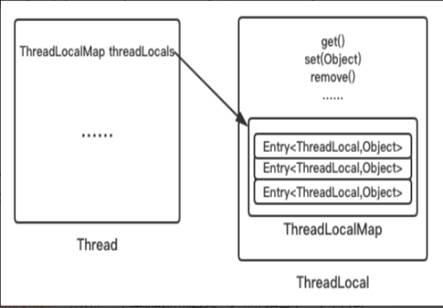

每个Thread对象维护着一个ThreadLocalMap的引用

ThreadLocalMap是ThreadLocal的内部类，用Entry来进行存储

调用ThreadLocal的set()方法时，实际上就是往ThreadLocalMap设置值，key是ThreadLocal对象，值Value是传递进来的对象

调用ThreadLocal的get()方法时，实际上就是往ThreadLocalMap获取值，key是ThreadLocal对象

ThreadLocal本身并不存储值，它只是自己作为一个key来让线程从ThreadLocalMap获取value，正因为这个原理，所以ThreadLocal能够实现“数据隔离”，获取当前线程的局部变量值，不受其他线程影响～

10.4.4.   为什么要用弱引用?不用如何？

**public void** function01()
 {
   ThreadLocal tl = **new** ThreadLocal<Integer>();   *//line1
\*   tl.set(2021);                  *//line2
\*   tl.get();                    *//line3
\* }

  line1新建了一个ThreadLocal对象，t1 是强引用指向这个对象；  line2调用set()方法后新建一个Entry，通过源码可知Entry对象里的k是弱引用指向这个对象。  

 

 

 

·     为什么源代码用弱引用？

 

为什么源代码用弱引用?

当function01方法执行完毕后，栈帧销毁强引用 tl 也就没有了。但此时线程的ThreadLocalMap里某个entry的key引用还指向这个对象

若这个key引用是**强引用**，就会导致key指向的ThreadLocal对象及v指向的对象不能被gc回收，造成内存泄漏；

若这个key引用是**弱引用**就大概率会减少内存泄漏的问题(还有一个key为null的雷)。使用弱引用，就可以使ThreadLocal对象在方法执行完毕后顺利被回收且Entry的key引用指向为null。

 

 

  --下面这句话，我们后续聊，本节先忽略  **此后我们调用****get,set****或****remove****方法时，就会尝试删除****key****为****null****的****entry****，可以释放****value****对象所占用的内存。**  

 

 

·     弱引用就万事大吉了吗？

·     埋雷

 

  --下面这句话，我们后续聊，本节先忽略  **此后我们调用****get,set****或****remove****方法时，就会尝试删除****key****为****null****的****entry****，可以释放****value****对象所占用的内存。**  

 

  1 当我们为threadLocal变量赋值，实际上就是当前的Entry(threadLocal实例为key，值为value)往这个threadLocalMap中存放。Entry中的key是弱引用，当threadLocal外部强引用被置为null(tl=null),那么系统 GC 的时候，根据可达性分析，这个threadLocal实例就没有任何一条链路能够引用到它，这个ThreadLocal势必会被回收，这样一来，ThreadLocalMap中就会出现key为null的Entry，就没有办法访问这些key为null的Entry的value，如果当前线程再迟迟不结束的话，这些key为null的Entry的value就会一直存在一条强引用链：Thread  Ref -> Thread -> ThreaLocalMap -> Entry -> value永远无法回收，造成内存泄漏。     2当然，如果当前thread运行结束，threadLocal，threadLocalMap,Entry没有引用链可达，在垃圾回收的时候都会被系统进行回收。     3 但在实际使用中我们有时候会用线程池去维护我们的线程，比如在Executors.newFixedThreadPool()时创建线程的时候，为了复用线程是不会结束的，所以threadLocal内存泄漏就值得我们小心  

 

·     **key为null的entry**，原理解析

 

ThreadLocalMap使用ThreadLocal的弱引用作为key，如果一个ThreadLocal没有外部强引用引用他，那么系统gc的时候，这个ThreadLocal势必会被回收，这样一来，ThreadLocalMap中就会出现key为null的Entry，就没有办法访问这些key为null的Entry的value，如果当前线程再迟迟不结束的话(比如正好用在线程池)，这些key为null的Entry的value就会一直存在一条强引用链。

 

虽然弱引用，保证了key指向的ThreadLocal对象能被及时回收，但是v指向的value对象是需要ThreadLocalMap调用get、set时发现key为null时才会去回收整个entry、value，因此弱引用不能100%保证内存不泄露。**我们要在不使用某个****ThreadLocal****对象后，手动调用****remoev****方法来删除它**，尤其是在线程池中，不仅仅是内存泄露的问题，因为线程池中的线程是重复使用的，意味着这个线程的ThreadLocalMap对象也是重复使用的，如果我们不手动调用remove方法，那么后面的线程就有可能获取到上个线程遗留下来的value值，造成bug。

·     set、get方法会去检查所有键为null的Entry对象

·     set()

·     get()

·     remove()

 

·     结论

 

 

从前面的set,getEntry,remove方法看出，在threadLocal的生命周期里，针对threadLocal存在的内存泄漏的问题，

都会通过expungeStaleEntry，cleanSomeSlots,replaceStaleEntry这三个方法清理掉key为null的脏entry。

 

·     结论

10.4.5.   最佳实践

·     如何定义

·     定义

 

·     用完记得手动remove

10.5.   小总结

10.5.1.   ThreadLocal 并不解决线程间共享数据的问题

10.5.2.   ThreadLocal 适用于变量在线程间隔离且在方法间共享的场景

10.5.3.   ThreadLocal 通过隐式的在不同线程内创建独立实例副本避免了实例线程安全的问题

10.5.4.   每个线程持有一个只属于自己的专属Map并维护了ThreadLocal对象与具体实例的映射， 该Map由于只被持有它的线程访问，故不存在线程安全以及锁的问题

10.5.5.   ThreadLocalMap的Entry对ThreadLocal的引用为弱引用，避免了ThreadLocal对象无法被回收的问题

10.5.6.   都会通过expungeStaleEntry，cleanSomeSlots,replaceStaleEntry这三个方法回收键为 null 的 Entry 对象的值（即为具体实例）以及 Entry 对象本身从而防止内存泄漏，属于安全加固的方法

10.5.7.   群雄逐鹿起纷争，人各一份天下安

\11.   Java对象内存布局和对象头

11.1.   先从阿里及其它大厂面试题说起

11.1.1.   同学反馈2020.6.27

11.1.2.   。。。。。。

11.2.   Object object = new Object()谈谈你对这句话的理解? 一般而言JDK8按照默认情况下，new一个对象占多少内存空间

11.2.1.   位置所在

·     JVM里堆→新生区→伊甸园区

11.2.2.   构成布局

·     头体？想想我们的HTML报文

11.3.   对象在堆内存中布局

11.3.1.   权威定义

·     周志明老师JVM第3版

 

 

11.3.2.   对象在堆内存中的存储布局

​        

  对象内部结构分为：对象头、实例数据、对齐填充（保证8个字节的倍数）。  对象头分为对象标记（markOop）和类元信息（klassOop），类元信息存储的是指向该对象类元数据（klass）的首地址。  

 

·     对象头

·     对象标记Mark Word

·     它保存什么

 

​          

 

在64位系统中，Mark Word占了8个字节，类型指针占了8个字节，一共是16个字节

​     

 

 

·     默认存储对象的HashCode、分代年龄和锁标志位等信息。 这些信息都是与对象自身定义无关的数据，所以MarkWord被设计成一个非固定的数据结构以便在极小的空间内存存储尽量多的数据。 它会根据对象的状态复用自己的存储空间，也就是说在运行期间MarkWord里存储的数据会随着锁标志位的变化而变化。

·     类元信息(又叫类型指针)

·     参考尚硅谷宋红康老师原图

·     对象指向它的类元数据的指针，虚拟机通过这个指针来确定这个对象是哪个类的实例。

·     对象头多大

·     在64位系统中，Mark Word占了8个字节，类型指针占了8个字节，一共是16个字节。

·     实例数据

·     存放类的属性(Field)数据信息，包括父类的属性信息， 如果是数组的实例部分还包括数组的长度，这部分内存按4字节对齐。

·     对齐填充

·     虚拟机要求对象起始地址必须是8字节的整数倍。 填充数据不是必须存在的，仅仅是为了字节对齐 这部分内存按8字节补充对齐。

11.3.3.   官网理论

·     Hotspot术语表官网

·     http://openjdk.java.net/groups/hotspot/docs/HotSpotGlossary.html

·     底层源码理论证明

·     http://hg.openjdk.java.net/jdk8u/jdk8u/hotspot/file/89fb452b3688/src/share/vm/oops/oop.hpp

 

_mark字段是mark word，_metadata是类指针klass pointer，

对象头（object header）即是由这两个字段组成，这些术语可以参考Hotspot术语表，

 

11.4.   再说对象头的MarkWord

11.4.1.   32位(看一下即可，不用学了，以64位为准)

11.4.2.   ***64位重要\***

 

 

 

 

 

·     oop.hpp

 

·     markOop.hpp

  hash： 保存对象的哈希码  age： 保存对象的分代年龄  biased_lock： 偏向锁标识位  lock： 锁状态标识位  JavaThread* ：保存持有偏向锁的线程ID  epoch： 保存偏向时间戳  

 

·     markword(64位)分布图， 对象布局、GC回收和后面的锁升级就是 对象标记MarkWord里面标志位的变化

11.5.   聊聊Object obj = new Object()

11.5.1.   JOL证明

·     JOL官网

·     http://openjdk.java.net/projects/code-tools/jol/

·     POM

 

*<!--
\* *官网：**http://openjdk.java.net/projects/code-tools/jol/
\* *定位：分析对象在**JVM**的大小和分布**
\* *-->
\* <**dependency**>
   <**groupId**>org.openjdk.jol</**groupId**>
   <**artifactId**>jol-core</**artifactId**>
   <**version**>0.9</**version**>
 </**dependency**>

 

 

·     小试一下

 

  **package**  com.atguigu.juc.senior.inner.object;      **import** org.openjdk.jol.vm.VM;      */**    \* **@auther** zzyy    \* **@create** 2020-06-13 11:24    \*/ *  **public class** MyObject   {     **public static void** main(String[] args){       *//VM**的细节详细情况** *      System.***out\***.println(VM.*current*().details());       *//**所有的对象分配的字节都是**8**的整数倍。** *      System.***out\***.println(VM.*current*().objectAlignment());     }   }  

 

11.5.2.   代码

**package** com.atguigu.juc.prepare;
 
 **import** org.openjdk.jol.info.ClassLayout;
 
 
 */**
 \* **@auther** zzyy
 \* **@create** 2020-04-12 15:11
 \*/
\* **public class** JOLDemo
 {
   **public static void** main(String[] args)
   {
     Object o = **new** Object();
     System.***out\***.println( ClassLayout.*parseInstance*(o).toPrintable());
   }
 }

 

·     结果呈现说明

 

 

| OFFSET      | 偏移量，也就是到这个字段位置所占用的byte数 |
| ----------- | ------------------------------------------ |
| SIZE        | 后面类型的字节大小                         |
| TYPE        | 是Class中定义的类型                        |
| DESCRIPTION | DESCRIPTION是类型的描述                    |
| VALUE       | VALUE是TYPE在内存中的值                    |

 

11.5.3.   GC年龄采用4位bit存储，最大为15， 例如MaxTenuringThreshold参数默认值就是15

·     try try

·     *-XX:MaxTenuringThreshold=16*

·     

 

|      |                                         |
| ---- | --------------------------------------- |
|      |  |

11.5.4.   尾巴参数说明

·     命令

·     java -XX:+PrintCommandLineFlags -version

·     默认开启压缩说明

·     -XX:+UseCompressedClassPointers

·     结果

·     上述表示开启了类型指针的压缩，以节约空间，假如不加压缩？？？

·     手动关闭压缩再看看

·     -XX:-UseCompressedClassPointers

·     结果

11.6.   换成其他对象试试

11.6.1.   结果

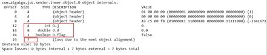

\12.   Synchronized与锁升级

12.1.   先从阿里及其它大厂面试题说起

12.1.1.   谈谈你对Synchronized的理解

12.1.2.   Synchronized的锁升级你聊聊

12.1.3.   Synchronized的性能是不是一定弱于Lock

12.1.4.   同学反馈2020.6.17

 

 

12.1.5.   。。。。。。

12.2.   本章路线总纲

12.2.1.   说明

 

 

synchronized 锁优化的背景

  用锁能够实现数据的安全性，但是会带来性能下降。  无锁能够基于线程并行提升程序性能，但是会带来安全性下降。  求平衡？？？  

 

 

12.2.2.   synchronized锁：由对象头中的Mark Word根据锁标志位的不同而被复用及锁升级策略

12.3.   Synchronized的性能变化

12.3.1.   java5以前，只有Synchronized，这个是操作系统级别的重量级操作

·     重量级锁，假如锁的竞争比较激烈的话，性能下降

·     Java5之前，用户态和内核态之间的切换

 java的线程是映射到操作系统原生线程之上的，如果要阻塞或唤醒一个线程就需要操作系统介入，需要在户态与核心态之间切换，这种切换会消耗大量的系统资源，因为用户态与内核态都有各自专用的内存空间，专用的寄存器等，用户态切换至内核态需要传递给许多变量、参数给内核，内核也需要保护好用户态在切换时的一些寄存器值、变量等，以便内核态调用结束后切换回用户态继续工作。

 

在Java早期版本中，synchronized属于重量级锁，效率低下，因为监视器锁（monitor）是依赖于底层的操作系统的Mutex Lock来实现的，挂起线程和恢复线程都需要转入内核态去完成，阻塞或唤醒一个Java线程需要操作系统切换CPU状态来完成，这种状态切换需要耗费处理器时间，如果同步代码块中内容过于简单，这种切换的时间可能比用户代码执行的时间还长”，时间成本相对较高，这也是为什么早期的synchronized效率低的原因

Java 6之后，为了减少获得锁和释放锁所带来的性能消耗，引入了轻量级锁和偏向锁

12.3.2.   为什么每一个对象都可以成为一个锁？？？？

·     markOop.hpp

 

Monitor可以理解为一种同步工具，也可理解为一种同步机制，常常被描述为一个Java对象。Java对象是天生的Monitor，每一个Java对象都有成为Monitor的潜质，因为在Java的设计中 ，每一个Java对象自打娘胎里出来就带了一把看不见的锁，它叫做内部锁或者Monitor锁。

Monitor的本质是依赖于底层操作系统的Mutex Lock实现，操作系统实现线程之间的切换需要从用户态到内核态的转换，成本非常高。

·     Monitor(监视器锁)

 

**Mutex Lock** 

Monitor是在jvm底层实现的，底层代码是c++。本质是依赖于底层操作系统的Mutex Lock实现，操作系统实现线程之间的切换需要从用户态到内核态的转换，状态转换需要耗费很多的处理器时间成本非常高。所以synchronized是Java语言中的一个重量级操作。 

 

 

**Monitor****与****java****对象以及线程是如何关联** **？**

1.如果一个java对象被某个线程锁住，则该java对象的Mark Word字段中LockWord指向monitor的起始地址

2.Monitor的Owner字段会存放拥有相关联对象锁的线程id

 

Mutex Lock 的切换需要从用户态转换到核心态中，因此状态转换需要耗费很多的处理器时间。

 

12.3.3.   java6开始，优化Synchronized

·     Java 6之后，为了减少获得锁和释放锁所带来的性能消耗，引入了轻量级锁和偏向锁

·     需要有个逐步升级的过程，别一开始就捅到重量级锁

12.4.   synchronized锁种类及升级步骤

12.4.1.   多线程访问情况，3种

·     只有一个线程来访问，有且唯一Only One

·     有2个线程A、B来交替访问

·     竞争激烈，多个线程来访问

12.4.2.   升级流程

·     synchronized用的锁是存在Java对象头里的Mark Word中 锁升级功能主要依赖MarkWord中锁标志位和释放偏向锁标志位

·     64位标记图再看

12.4.3.   无锁

·     Code演示

 

**package** com.atguigu.juc.senior.inner.object;
 
 **import** org.openjdk.jol.info.ClassLayout;
 
 */**
 \* **@auther** zzyy
 \* **@create** 2020-06-13 11:24
 \*/
\* **public class** MyObject
 {
   **public static void** main(String[] args)
   {
     Object o = **new** Object();
 
     System.***out\***.println(**"10****进制****hash****码：****"**+o.hashCode());
     System.***out\***.println(**"16****进制****hash****码：****"**+Integer.*toHexString*(o.hashCode()));
     System.***out\***.println(**"2****进制****hash****码：****"**+Integer.*toBinaryString*(o.hashCode()));
 
     System.***out\***.println( ClassLayout.*parseInstance*(o).toPrintable());
   }
 }
 
 

 

·     程序不会有锁的竞争

 

 

12.4.4.   偏锁

·     主要作用

·     当一段同步代码一直被同一个线程多次访问， 由于只有一个线程那么该线程在后续访问时便会自动获得锁

·     同一个老顾客来访，直接老规矩行方便

·     看看多线程卖票，同一个线程获得体会一下

·     小结论

Hotspot 的作者经过研究发现，大多数情况下：

 

多线程的情况下，锁不仅不存在多线程竞争，还存在锁由同一线程多次获得的情况，

 

偏向锁就是在这种情况下出现的，它的出现是为了解决只有在一个线程执行同步时提高性能。

·     64位标记图再看

·     通过CAS方式修改markword中的线程ID

·     偏向锁的持有

·     说明

理论落地：

   在实际应用运行过程中发现，“锁总是同一个线程持有，很少发生竞争”，也就是说锁总是被第一个占用他的线程拥有，这个线程就是锁的偏向线程。

   那么只需要在锁第一次被拥有的时候，记录下偏向线程ID。这样偏向线程就一直持有着锁(后续这个线程进入和退出这段加了同步锁的代码块时，不需要再次加锁和释放锁。而是直接比较对象头里面是否存储了指向当前线程的偏向锁)。

如果相等表示偏向锁是偏向于当前线程的，就不需要再尝试获得锁了，直到竞争发生才释放锁。以后每次同步，检查锁的偏向线程ID与当前线程ID是否一致，如果一致直接进入同步。无需每次加锁解锁都去CAS更新对象头。**如果自始至终使用锁的线程只有一个**，很明显偏向锁几乎没有额外开销，性能极高。

   假如不一致意味着发生了竞争，锁已经不是总是偏向于同一个线程了，这时候可能需要升级变为轻量级锁，才能保证线程间公平竞争锁。偏向锁只有遇到其他线程尝试竞争偏向锁时，持有偏向锁的线程才会释放锁，线程是不会主动释放偏向锁的。

 

技术实现：

一个synchronized方法被一个线程抢到了锁时，那这个方法所在的对象就会在其所在的Mark Word中将偏向锁修改状态位，同时还

会有占用前54位来存储线程指针作为标识。若该线程再次访问同一个synchronized方法时，该线程只需去对象头的Mark Word 中去判断一下是否有偏向锁指向本身的ID，无需再进入 Monitor 去竞争对象了。

·     细化案例Account对象举例说明

偏向锁的操作不用直接捅到操作系统，不涉及用户到内核转换，不必要直接升级为最高级，我们以一个account对象的“对象头”为例，

假如有一个线程执行到synchronized代码块的时候，JVM使用CAS操作把线程指针ID记录到Mark Word当中，并修改标偏向标示，标示当前线程就获得该锁。锁对象变成偏向锁（通过CAS修改对象头里的锁标志位），字面意思是“偏向于第一个获得它的线程”的锁。执行完同步代码块后，线程并不会主动释放偏向锁。

这时线程获得了锁，可以执行同步代码块。当该线程第二次到达同步代码块时会判断此时持有锁的线程是否还是自己（持有锁的线程ID也在对象头里），JVM通过account对象的Mark Word判断：当前线程ID还在，说明还持有着这个对象的锁，就可以继续进入临界区工作。由于之前没有释放锁，这里也就不需要重新加锁。 **如果自始至终使用锁的线程只有一个**，很明显偏向锁几乎没有额外开销，性能极高。

 

结论：JVM不用和操作系统协商设置Mutex(争取内核)，它只需要记录下线程ID就标示自己获得了当前锁，不用操作系统接入。

上述就是偏向锁：在没有其他线程竞争的时候，一直偏向偏心当前线程，当前线程可以一直执行。

·     偏向锁JVM命令

·     java -XX:+PrintFlagsInitial |grep BiasedLock*

·     重要参数说明

 

  *** *实际上偏向锁在**JDK1.6**之后是默认开启的，但是启动时间有延迟，** *  *** *所以需要添加参数**-XX:BiasedLockingStartupDelay=0**，让其在程序启动时立刻启动。** *  ** *  *** *开启偏向锁：** *  ** -XX:+UseBiasedLocking -XX:BiasedLockingStartupDelay=0   \* *  *** *关闭偏向锁：关闭之后程序默认会直接进入**------------------------------------------>>>>>>>>   轻量级锁状态。 *  ** -XX:-UseBiasedLocking*     

 

·     Code演示

 

·     一切默认

**package** com.atguigu.juc.senior.inner.object;
 
 **import** org.openjdk.jol.info.ClassLayout;
 
 */**
 \* **@auther** zzyy
 \* **@create** 2020-06-13 11:24
\* **/
\* **public class** MyObject
 {
   **public static void** main(String[] args)
   {
     Object o = **new** Object();
 
     **new** Thread(() -> {
       **synchronized** (o){
         System.***out\***.println(ClassLayout.*parseInstance*(o).toPrintable());
       }
     },**"t1"**).start();
   }
 }
 
 

 

·     演示无效果

·     因为参数系统默认开启

 

  *-XX:+UseBiasedLocking*             开启偏向锁(默认)        *-XX:-UseBiasedLocking*             关闭偏向锁  *-XX:BiasedLockingStartupDelay=0*        关闭延迟(演示偏向锁时需要开启)  

 

 

 

  参数说明：  偏向锁在JDK1.6以上默认开启，开启后程序启动几秒后才会被激活，可以使用JVM参数来关闭延迟 -XX:BiasedLockingStartupDelay=0     如果确定锁通常处于竞争状态则可通过JVM参数 *-XX:-UseBiasedLocking* 关闭偏向锁，那么默认会进入轻量级锁  

 

·     关闭延时参数，启用该功能

·     *-XX:BiasedLockingStartupDelay=0*

·     好日子终会到头......o(╥﹏╥)o

·     开始有第2个线程来抢夺了

·     偏向锁的撤销

·     当有另外线程逐步来竞争锁的时候，就不能再使用偏向锁了，要升级为轻量级锁

·     竞争线程尝试CAS更新对象头失败，会等待到全局安全点（此时不会执行任何代码）撤销偏向锁。

·     撤销

 

**偏向锁的撤销**

偏向锁使用一种等到竞争出现才释放锁的机制，只有当其他线程竞争锁时，持有偏向锁的原来线程才会被撤销。

撤销需要等待全局安全点(该时间点上没有字节码正在执行)，同时检查持有偏向锁的线程是否还在执行： 

 

① 第一个线程正在执行synchronized方法(处于同步块)，它还没有执行完，其它线程来抢夺，该偏向锁会被取消掉并出现**锁升级**。

此时轻量级锁由原持有偏向锁的线程持有，继续执行其同步代码，而正在竞争的线程会进入自旋等待获得该轻量级锁。

② 第一个线程执行完成synchronized方法(退出同步块)，则将对象头设置成无锁状态并撤销偏向锁，重新偏向 。

 

 

·     总体步骤流程图示

·     

 

|      |                                         |
| ---- | --------------------------------------- |
|      |  |

12.4.5.   轻锁

·     主要作用

·     有线程来参与锁的竞争，但是获取锁的冲突时间极短

·     本质就是自旋锁

·     64位标记图再看

·     轻量级锁的获取

轻量级锁是为了在线程近乎交替执行同步块时提高性能。

主要目的： 在没有多线程竞争的前提下，通过CAS减少重量级锁使用操作系统互斥量产生的性能消耗，说白了先自旋再阻塞。

升级时机： 当关闭偏向锁功能或多线程竞争偏向锁会导致偏向锁升级为轻量级锁

 

假如线程A已经拿到锁，这时线程B又来抢该对象的锁，由于该对象的锁已经被线程A拿到，当前该锁已是偏向锁了。

而线程B在争抢时发现对象头Mark Word中的线程ID不是线程B自己的线程ID(而是线程A)，那线程B就会进行CAS操作希望能获得锁。

此时线程B操作中有两种情况：

**如果锁获取成功**，直接替换Mark Word中的线程ID为B自己的ID(A → B)，重新偏向于其他线程(即将偏向锁交给其他线程，相当于当前线程"被"释放了锁)，该锁会保持偏向锁状态，A线程Over，B线程上位；

**如果锁获取失败**，则偏向锁升级为轻量级锁，此时轻量级锁由原持有偏向锁的线程持有，继续执行其同步代码，而正在竞争的线程B会进入自旋等待获得该轻量级锁。

 

·     Code演示

·     如果关闭偏向锁，就可以直接进入轻量级锁

·     *-XX:-UseBiasedLocking*

·     步骤流程图示

·     

 

|      |                                         |
| ---- | --------------------------------------- |
|      |  |

·     自旋达到一定次数和程度

·     java6之前

·     默认启用，默认情况下自旋的次数是 10 次

·     -XX:PreBlockSpin=10来修改

·     或者自旋线程数超过cpu核数一半

·     上述了解即可，别用了。

·     Java6之后

·     自适应

·     自适应意味着自旋的次数不是固定不变的

·     而是根据：

·     同一个锁上一次自旋的时间。

·     拥有锁线程的状态来决定。

·     轻量锁与偏向锁的区别和不同

·     争夺轻量级锁失败时，自旋尝试抢占锁

·     轻量级锁每次退出同步块都需要释放锁，而偏向锁是在竞争发生时才释放锁

12.4.6.   重锁

·     有大量的线程参与锁的竞争，冲突性很高

·     锁标志位

 

·     Code演示

12.4.7.   小总结

·     各种锁优缺点、synchronized锁升级和实现原理

 

synchronized锁升级过程总结：一句话，就是先自旋，不行再阻塞。

实际上是把之前的悲观锁(重量级锁)变成在一定条件下使用偏向锁以及使用轻量级(自旋锁CAS)的形式

 

synchronized在修饰方法和代码块在字节码上实现方式有很大差异，但是内部实现还是基于对象头的MarkWord来实现的。

JDK1.6之前synchronized使用的是重量级锁，JDK1.6之后进行了优化，拥有了无锁->偏向锁->轻量级锁->重量级锁的升级过程，而不是无论什么情况都使用重量级锁。

 

偏向锁:适用于单线程适用的情况，在不存在锁竞争的时候进入同步方法/代码块则使用偏向锁。

轻量级锁：适用于竞争较不激烈的情况(这和乐观锁的使用范围类似)， 存在竞争时升级为轻量级锁，轻量级锁采用的是自旋锁，如果同步方法/代码块执行时间很短的话，采用轻量级锁虽然会占用cpu资源但是相对比使用重量级锁还是更高效。

重量级锁：适用于竞争激烈的情况，如果同步方法/代码块执行时间很长，那么使用轻量级锁自旋带来的性能消耗就比使用重量级锁更严重，这时候就需要升级为重量级锁。

12.5.   JIT编译器对锁的优化

12.5.1.   JIT

·     Just In Time Compiler，一般翻译为即时编译器

12.5.2.   锁消除

·     LockClearUPDemo

**package** com.atguigu.itdachang;
 
 */**
 ** *锁消除**
\* *** *从**JIT**角度看相当于无视它，**synchronized (o)**不存在了**,**这个锁对象并没有被共用扩散到其它线程使用，**
\* *** *极端的说就是根本没有加这个锁对象的底层机器码，消除了锁的使用**
\* **/
\* **public class** LockClearUPDemo
 {
   **static** Object *objectLock* = **new** Object();*//**正常的**
 
\*   **public void** m1()
   {
     *//**锁消除**,JIT**会无视它，**synchronized(**对象锁**)**不存在了。不正常的**
\*     Object o = **new** Object();
 
     **synchronized** (o)
     {
       System.***out\***.println(**"-----hello LockClearUPDemo"**+**"****\t****"**+o.hashCode()+**"****\t****"**+*objectLock*.hashCode());
     }
   }
 
   **public static void** main(String[] args)
   {
     LockClearUPDemo demo = **new** LockClearUPDemo();
 
     **for** (**int** i = 1; i <=10; i++) {
       **new** Thread(() -> {
         demo.m1();
       },String.*valueOf*(i)).start();
     }
   }
 }
 

 

12.5.3.   锁粗化

·     LockBigDemo

**package** com.atguigu.itdachang;
 
 */**
 ** *锁粗化**
\* *** *假如方法中首尾相接，前后相邻的都是同一个锁对象，那**JIT编译器就会把这几个**synchronized**块合并成一个大块，**
\* *** *加粗加大范围，一次申请锁使用即可，避免次次的申请和释放锁，提升了性能**
\* **/
\* **public class** LockBigDemo
 {
   **static** Object *objectLock* = **new** Object();
 
 
   **public static void** main(String[] args)
   {
     **new** Thread(() -> {
       **synchronized** (*objectLock*) {
         System.***out\***.println(**"11111"**);
       }
       **synchronized** (*objectLock*) {
         System.***out\***.println(**"22222"**);
       }
       **synchronized** (*objectLock*) {
         System.***out\***.println(**"33333"**);
       }
     },**"a"**).start();
 
     **new** Thread(() -> {
       **synchronized** (*objectLock*) {
         System.***out\***.println(**"44444"**);
       }
       **synchronized** (*objectLock*) {
         System.***out\***.println(**"55555"**);
       }
       **synchronized** (*objectLock*) {
         System.***out\***.println(**"66666"**);
       }
     },**"b"**).start();
 
   }
 }
 

 

\13.   AbstractQueuedSynchronizer之AQS

13.1.   先从阿里及其它大厂面试题说起

13.1.1.   同学反馈2020.6.27

 

13.1.2.   。。。。。。

13.2.   前置知识

13.2.1.   公平锁和非公平锁

13.2.2.   可重入锁

13.2.3.   自旋锁

13.2.4.   LockSupport

13.2.5.   数据结构之链表

13.2.6.   设计模式之模板设计模式

13.3.   是什么

13.3.1.   字面意思

·     抽象的队列同步器

·     源代码

   

AbstractOwnableSynchronizer

AbstractQueuedLongSynchronizer

AbstractQueuedSynchronizer         通常地：AbstractQueuedSynchronizer简称为AQS

13.3.2.   技术解释

·     是用来构建锁或者其它同步器组件的重量级基础框架及整个JUC体系的基石， 通过内置的FIFO队列来完成资源获取线程的排队工作，并通过一个int类变量 表示持有锁的状态

 

  CLH：Craig、Landin and Hagersten 队列，是一个单向链表，AQS中的队列是CLH变体的虚拟双向队列FIFO  

 

13.4.   AQS为什么是JUC内容中最重要的基石

13.4.1.   和AQS有关的

·     ReentrantLock

·     CountDownLatch

·     ReentrantReadWriteLock

·     Semaphore

·     。。。。。。

13.4.2.   进一步理解锁和同步器的关系

·     锁，面向锁的使用者

·     定义了程序员和锁交互的使用层API，隐藏了实现细节，你调用即可。

·     同步器，面向锁的实现者

·     比如Java并发大神DougLee，提出统一规范并简化了锁的实现， 屏蔽了同步状态管理、阻塞线程排队和通知、唤醒机制等。

13.5.   能干嘛

13.5.1.   加锁会导致阻塞

·     有阻塞就需要排队，实现排队必然需要队列

13.5.2.   解释说明

 

抢到资源的线程直接使用处理业务，抢不到资源的必然涉及一种排队等候机制。抢占资源失败的线程继续去等待(类似银行业务办理窗口都满了，暂时没有受理窗口的顾客只能去候客区排队等候)，但等候线程仍然保留获取锁的可能且获取锁流程仍在继续(候客区的顾客也在等着叫号，轮到了再去受理窗口办理业务)。

 

既然说到了排队等候机制，那么就一定会有某种队列形成，这样的队列是什么数据结构呢？

 

如果共享资源被占用，就需要一定的阻塞等待唤醒机制来保证锁分配。这个机制主要用的是CLH队列的变体实现的，将暂时获取不到锁的线程加入到队列中，这个队列就是AQS的抽象表现。它将请求共享资源的线程封装成队列的结点（**Node**），通过CAS、自旋以及LockSupport.park()的方式，维护state变量的状态，使并发达到同步的效果。

 

 

13.6.   AQS初步

13.6.1.   AQS初识

·     官网解释

·     有阻塞就需要排队，实现排队必然需要队列

·     AQS使用一个volatile的int类型的成员变量来表示同步状态，通过内置的 FIFO队列来完成资源获取的排队工作将每条要去抢占资源的线程封装成 一个Node节点来实现锁的分配，通过CAS完成对State值的修改。

13.6.2.   AQS内部体系架构

 

 

·     AQS自身

·     AQS的int变量

| 关系 | 重要 - 指向 [Node的int变量](#bZ6bPtZF3UmsD1+oTgrGlA==) |
| ---- | ------------------------------------------------------ |
|      |                                                        |

·     AQS的同步状态State成员变量

·     

 

|      |                                         |
| ---- | --------------------------------------- |
|      |  |

·     银行办理业务的受理窗口状态

·     零就是没人，自由状态可以办理

·     大于等于1，有人占用窗口，等着去

·     AQS的CLH队列

·     CLH队列(三个大牛的名字组成)，为一个双向队列

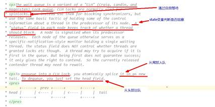

·     银行候客区的等待顾客

·     小总结

·     ***有阻塞就需要排队，实现排队必然需要队列\***

·     state变量+CLH双端队列

·     内部类Node(Node类在AQS类内部)

·     Node的int变量

| 关系 | 重要 - 开始 [AQS的int变量](#a4byaPyziki0OZSI0OMuRQ==) |
| ---- | ----------------------------------------------------- |
|      |                                                       |

·     Node的等待状态waitState成员变量

·     **volatile int** **waitStatus**

·     说人话

·     等候区其它顾客(其它线程)的等待状态

·     队列中每个排队的个体就是一个 Node

·     Node此类的讲解

·     内部结构

·     属性说明

13.6.3.   AQS同步队列的基本结构

 

  CLH：Craig、Landin  and Hagersten 队列，是个单向链表，AQS中的队列是CLH变体的虚拟双向队列（FIFO）  

 

13.7.   从我们的ReentrantLock开始解读AQS

13.7.1.   Lock接口的实现类，基本都是通过【聚合】了一个【队列同步器】的子类完成线程访问控制的

13.7.2.   ReentrantLock的原理

13.7.3.   从最简单的lock方法开始看看公平和非公平

 

 

| 可以明显看出公平锁与非公平锁的lock()方法唯一的区别就在于公平锁在获取同步状态时多了一个限制条件：  hasQueuedPredecessors()  hasQueuedPredecessors是公平锁加锁时判断等待队列中是否存在有效节点的方法 |
| ------------------------------------------------------------ |
| 下面源码的解读和分析，作为家庭作业                           |

 

 

13.7.4.   非公平锁走起，方法lock()

对比公平锁和非公平锁的 tryAcquire()方法的实现代码，其实差别就在于非公平锁获取锁时比公平锁中少了一个判断 !hasQueuedPredecessors()

 

hasQueuedPredecessors() 中判断了是否需要排队，导致公平锁和非公平锁的差异如下：

 

公平锁：公平锁讲究先来先到，线程在获取锁时，如果这个锁的等待队列中已经有线程在等待，那么当前线程就会进入等待队列中；

 

非公平锁：不管是否有等待队列，如果可以获取锁，则立刻占有锁对象。也就是说队列的第一个排队线程在unpark()，之后还是需要竞争锁（存在线程竞争的情况下）

 

·     本次讲解我们走非公平锁作为案例突破口

·     源码解读比较困难，别着急---阳哥的全系列脑图给大家做好笔记

·     源码解读走起

·     lock()

·     acquire()

·     源码和3大流程走向

·     tryAcquire(arg)

·     本次走非公平锁

 

 

下一步：

 

·     nonfairTryAcquire(acquires)

 

·     **return false**;

·     继续推进条件，走下一个方法

·     **return true**;

·     结束

·     addWaiter(Node.EXCLUSIVE)

·     addWaiter(Node mode)

·     enq(node);

·     双向链表中，第一个节点为虚节点(也叫哨兵节点)，其实并不存储任何信息，只是占位。 真正的第一个有数据的节点，是从第二个节点开始的。

·     假如3号ThreadC线程进来

·     **prev**

·     compareAndSetTail

·     **next**

·     acquireQueued(addWaiter(Node.EXCLUSIVE), arg)

·     acquireQueued

·     假如再抢抢失败就会进入

·     shouldParkAfterFailedAcquire 和 parkAndCheckInterrupt 方法中

·     shouldParkAfterFailedAcquire

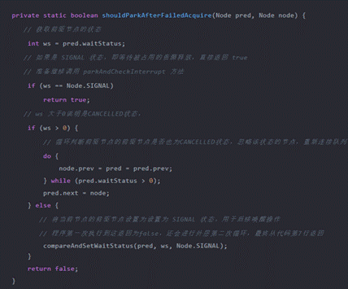

·     如果前驱节点的 waitStatus 是 SIGNAL状态，即 shouldParkAfterFailedAcquire 方法会返回 true 程序会继续向下执行 parkAndCheckInterrupt 方法，用于将当前线程挂起

·     parkAndCheckInterrupt

13.7.5.   unlock

·     sync.release(1);

·     tryRelease(arg)

·     unparkSuccessor

\14.   ReentrantLock、ReentrantReadWriteLock、StampedLock讲解

14.1.   本章路线总纲

14.1.1.   无锁→独占锁→读写锁→邮戳锁

14.2.   关于锁的大厂面试题

14.2.1.   你知道Java里面有哪些锁?

14.2.2.   你说你用过读写锁，锁饥饿问题是什么？

14.2.3.   有没有比读写锁更快的锁？

14.2.4.   StampedLock知道吗?(邮戳锁/票据锁)

14.2.5.   ReentrantReadWriteLock有锁降级机制策略你知道吗？

14.2.6.   。。。。。。

14.3.   **请你简单聊聊****ReentrantReadWriteLock**

14.3.1.   是什么

·     读写锁说明

 

  读写锁定义为  一个资源能够被多个读线程访问，或者被一个写线程访问，但是不能同时存在读写线程。  

 

                 

  一体两面，读写互斥，读读共享  刀刃、刀背互斥  

 

·     再说说演变

·     『读写锁』意义和特点

 

『**读写锁****ReentrantReadWriteLock**』并不是真正意义上的读写分离，它只允许读读共存，而读写和写写依然是互斥的，

大多实际场景是“读/读”线程间并不存在互斥关系，只有"读/写"线程或"写/写"线程间的操作需要互斥的。因此引入ReentrantReadWriteLock。

 

 

一个ReentrantReadWriteLock同时只能存在一个写锁但是可以存在多个读锁，但不能同时存在写锁和读锁(切菜还是拍蒜选一个)。

也即一个资源可以被多个读操作访问或一个写操作访问，但两者不能同时进行。

 

 

只有在读多写少情境之下，读写锁才具有较高的性能体现。

 

 

14.3.2.   特点

·     可重入

·     读写分离

·     无锁无序→加锁→读写锁演变复习

·     code演示ReentrantReadWriteLockDemo

**package** com.atguigu.juc.rwlock;
 
 
 **import** java.util.HashMap;
 **import** java.util.Map;
 **import** java.util.concurrent.TimeUnit;
 **import** java.util.concurrent.locks.Lock;
 **import** java.util.concurrent.locks.ReentrantLock;
 **import** java.util.concurrent.locks.ReentrantReadWriteLock;
 
 **class** MyResource
 {
   Map<String,String> **map** = **new** HashMap<>();
   *//=====ReentrantLock* *等价于* *=====synchronized
\*   Lock **lock** = **new** ReentrantLock();
   *//=====ReentrantReadWriteLock* *一体两面，读写互斥，读读共享**
\*   ReentrantReadWriteLock **rwLock** = **new** ReentrantReadWriteLock();
 
   **public void** write(String key,String value)
   {
     **rwLock**.writeLock().lock();
     **try
**     {
       System.***out\***.println(Thread.*currentThread*().getName()+**"****\t****"**+**"---****正在写入****"**);
       **map**.put(key,value);
       *//**暂停毫秒**
\*       **try** { TimeUnit.***MILLISECONDS\***.sleep(500); } **catch** (InterruptedException e) { e.printStackTrace(); }
       System.***out\***.println(Thread.*currentThread*().getName()+**"****\t****"**+**"---****完成写入****"**);
     }**finally** {
       **rwLock**.writeLock().unlock();
     }
   }
   **public void** read(String key)
   {
     **rwLock**.readLock().lock();
     **try
**     {
       System.***out\***.println(Thread.*currentThread*().getName()+**"****\t****"**+**"---****正在读取****"**);
       String result = **map**.get(key);
       *//**后续开启注释修改为**2000**，演示一体两面，读写互斥，读读共享，读没有完成时候写锁无法获得**
\*       *//try { TimeUnit.MILLISECONDS.sleep(200); } catch (InterruptedException e) { e.printStackTrace(); }
\*       System.***out\***.println(Thread.*currentThread*().getName()+**"****\t****"**+**"---****完成读取****result****：****"**+result);
     }**finally** {
       **rwLock**.readLock().unlock();
     }
   }
 }
 
 
 
 
 */**
 \* **@auther** zzyy
 \* **@create** 2021-03-28 11:04
 \*/
\* **public class** ReentrantReadWriteLockDemo
 {
   **public static void** main(String[] args)
   {
     MyResource myResource = **new** MyResource();
 
     **for** (**int** i = 1; i <=10; i++) {
       **int** finalI = i;
       **new** Thread(() -> {
         myResource.write(finalI +**""**, finalI +**""**);
       },String.*valueOf*(i)).start();
     }
 
     **for** (**int** i = 1; i <=10; i++) {
       **int** finalI = i;
       **new** Thread(() -> {
         myResource.read(finalI +**""**);
       },String.*valueOf*(i)).start();
     }
 
     *//**暂停几秒钟线程**
\*     **try** { TimeUnit.***SECONDS\***.sleep(1); } **catch** (InterruptedException e) { e.printStackTrace(); }
 
     *//**读全部**over**才可以继续写**
\*     **for** (**int** i = 1; i <=3; i++) {
       **int** finalI = i;
       **new** Thread(() -> {
         myResource.write(finalI +**""**, finalI +**""**);
       },**"newWriteThread==="**+String.*valueOf*(i)).start();
     }
   }
 }
 

 

·     **从写锁→读锁，****ReentrantReadWriteLock可以降级**

·     《Java 并发编程的艺术》中关于锁降级的说明：

 **锁的严苛程度变强叫做升级，反之叫做降级**

 

why锁降级？？？

见后面《Oracle公司ReentrantWriteReadLock源码总结》

·     说人话

·     锁降级：将写入锁降级为读锁(类似Linux文件读写权限理解，就像写权限要高于读权限一样)

·     读写锁降级演示

·     可以降级

 

锁降级：遵循获取写锁→再获取读锁→再释放写锁的次序，写锁能够降级成为读锁。

如果一个线程占有了写锁，在不释放写锁的情况下，它还能占有读锁，即写锁降级为读锁。

 

 

Java8 官网说明

重入还允许通过获取写入锁定，然后读取锁然后释放写锁从写锁到读取锁, 

但是，从读锁定升级到写锁是不可能的。

 

 

 

 

·     锁降级是为了让当前线程感知到数据的变化，目的是保证数据可见性

·     code演示LockDownGradingDemo

**package** com.atguigu.juc.rwlock;
 
 **import** java.util.concurrent.locks.ReentrantReadWriteLock;
 
 */**
 \* **@auther** zzyy
 \* **@create** 2021-03-28 10:18
 ** *锁降级：遵循获取写锁**→**再获取读锁**→**再释放写锁的次序，写锁能够降级成为读锁。**
\* **
 ** *如果一个线程占有了写锁，在不释放写锁的情况下，它还能占有读锁，即写锁降级为读锁。**
\* **/
\* **public class** LockDownGradingDemo
 {
   **public static void** main(String[] args)
   {
     ReentrantReadWriteLock readWriteLock = **new** ReentrantReadWriteLock();
 
     ReentrantReadWriteLock.ReadLock readLock = readWriteLock.readLock();
     ReentrantReadWriteLock.WriteLock writeLock = readWriteLock.writeLock();
 
 
     writeLock.lock();
     System.***out\***.println(**"-------****正在写入****"**);
 
 
     readLock.lock();
     System.***out\***.println(**"-------****正在读取****"**);
 
     writeLock.unlock();
 
 
 
 
 
   }
 }
 

 

·     结论

·     如果有线程在读，那么写线程是无法获取写锁的，是悲观锁的策略

·     不可锁升级

线程获取读锁是不能直接升级为写入锁的。

 

在ReentrantReadWriteLock中，当读锁被使用时，如果有线程尝试获取写锁，该写线程会被阻塞。

所以，需要释放所有读锁，才可获取写锁，

 

·     写锁和读锁是互斥的

 

写锁和读锁是互斥的（这里的互斥是指线程间的互斥，

当前线程可以获取到写锁又获取到读锁，但是获取到了读锁不能继续获取写锁），这是因为读写锁要保持写操作的可见性。

因为，如果允许读锁在被获取的情况下对写锁的获取，那么正在运行的其他读线程无法感知到当前写线程的操作。

 

因此，

*分析读写锁**ReentrantReadWriteLock*，会发现它有个潜在的问题：

读锁全完，写锁有望；写锁独占，读写全堵；

如果有线程正在读，写线程需要等待读线程释放锁后才能获取写锁，见前面Case《code演示LockDownGradingDemo》

即ReadWriteLock读的过程中不允许写，只有等待线程都释放了读锁，当前线程才能获取**写锁**，

也就是写入必须等待，这是一种***悲观的读锁\***，o(╥﹏╥)o，人家还在读着那，你先别去写，省的数据乱。

 

*================================**后续讲解**StampedLock**时再详细展开**=======================*

*分析**StampedLock(**后面详细讲解**)*，会发现它改进之处在于：

读的过程中也允许获取写锁介入(相当牛B，读和写两个操作也让你“共享”(注意引号))，这样会导致我们读的数据就可能不一致！

所以，需要额外的方法来判断读的过程中是否有写入，这是一种***乐观的读锁\***，O(∩_∩)O哈哈~。 

显然乐观锁的并发效率更高，但一旦有小概率的写入导致读取的数据不一致，需要能检测出来，再读一遍就行。

 

 

·     读写锁之读写规矩，再说降级

·     Oracle公司ReentrantWriteReadLock源码总结

 

锁降级 下面的示例代码摘自ReentrantWriteReadLock源码中：

ReentrantWriteReadLock支持锁降级，遵循按照获取写锁，获取读锁再释放写锁的次序，写锁能够降级成为读锁，不支持锁升级。

解读在最下面:

 

  1 代码中声明了一个volatile类型的cacheValid变量，保证其可见性。     2 首先获取读锁，如果cache不可用，则释放读锁，获取写锁，在更改数据之前，再检查一次cacheValid的值，然后修改数据，将cacheValid置为true，然后在释放写锁前获取读锁；此时，cache中数据可用，处理cache中数据，最后释放读锁。这个过程就是一个完整的锁降级的过程，目的是保证数据可见性。     ***如果违背锁降级的步骤\***   如果当前的线程C在修改完cache中的数据后，没有获取读锁而是直接释放了写锁，那么假设此时另一个线程D获取了写锁并修改了数据，那么C线程无法感知到数据已被修改，则数据出现错误。     ***如果遵循锁降级的步骤\***   线程C在释放写锁之前获取读锁，那么线程D在获取写锁时将被阻塞，直到线程C完成数据处理过程，释放读锁。这样可以保证返回的数据是这次更新的数据，该机制是专门为了缓存设计的。  

 

14.4.   面试题：有没有比读写锁更快的锁？

14.5.   **邮戳锁****StampedLock**

14.5.1.   无锁→独占锁→读写锁→邮戳锁

14.5.2.   是什么

·     StampedLock是JDK1.8中新增的一个读写锁， 也是对JDK1.5中的读写锁ReentrantReadWriteLock的优化。

·     邮戳锁

·     也叫票据锁

·     stamp（戳记，long类型）

·     代表了锁的状态。当stamp返回零时，表示线程获取锁失败。 并且，当释放锁或者转换锁的时候，都要传入最初获取的stamp值。

14.5.3.   它是由锁饥饿问题引出

·     锁饥饿问题

 

锁饥饿问题：

 

ReentrantReadWriteLock实现了读写分离，但是一旦读操作比较多的时候，想要获取写锁就变得比较困难了，

假如当前1000个线程，999个读，1个写，有可能999个读取线程长时间抢到了锁，那1个写线程就悲剧了 

因为当前有可能会一直存在读锁，而无法获得写锁，根本没机会写，o(╥﹏╥)o

 

 

·     如何缓解锁饥饿问题？

·     使用“公平”策略可以一定程度上缓解这个问题

·     **new** ReentrantReadWriteLock(**true**);

·     但是“公平”策略是以牺牲系统吞吐量为代价的

·     StampedLock类的乐观读锁闪亮登场

·     Why闪亮

 

ReentrantReadWriteLock

允许多个线程同时读，但是只允许一个线程写，在线程获取到写锁的时候，其他写操作和读操作都会处于阻塞状态，

读锁和写锁也是互斥的，所以在读的时候是不允许写的，读写锁比传统的synchronized速度要快很多，

原因就是在于ReentrantReadWriteLock支持读并发

 

 

StampedLock横空出世

ReentrantReadWriteLock的读锁被占用的时候，其他线程尝试获取写锁的时候会被阻塞。

但是，StampedLock采取乐观获取锁后，其他线程尝试获取写锁时不会被阻塞，这其实是对读锁的优化，

所以，在获取乐观读锁后，还需要对结果进行校验。

14.5.4.   StampedLock的特点

·     所有获取锁的方法，都返回一个邮戳（Stamp），Stamp为零表示获取失败，其余都表示成功；

·     所有释放锁的方法，都需要一个邮戳（Stamp），这个Stamp必须是和成功获取锁时得到的Stamp一致；

·     StampedLock是不可重入的，危险(如果一个线程已经持有了写锁，再去获取写锁的话就会造成死锁)

·     StampedLock有三种访问模式

·     ①Reading（读模式）：功能和ReentrantReadWriteLock的读锁类似

·     ②Writing（写模式）：功能和ReentrantReadWriteLock的写锁类似

·     ③Optimistic reading（乐观读模式）：无锁机制，类似于数据库中的乐观锁， 支持读写并发，很乐观认为读取时没人修改，假如被修改再实现升级为悲观读模式

·     乐观读模式code演示

**package** com.atguigu.itdachang;
 
 **import** java.util.concurrent.TimeUnit;
 **import** java.util.concurrent.locks.StampedLock;
 
 */**
 \* **@auther** zzyy
 \* **@create** 2020-07-22 16:03
 \*/
\* **public class** StampedLockDemo
 {
   **static int** *number* = 37;
   **static** StampedLock *stampedLock* = **new** StampedLock();
 
   **public void** write()
   {
     **long** stamp = *stampedLock*.writeLock();
     System.***out\***.println(Thread.*currentThread*().getName()+**"****\t****"**+**"=====****写线程准备修改****"**);
     **try
**     {
       *number* = *number* + 13;
     }**catch** (Exception e){
       e.printStackTrace();
     }**finally** {
       *stampedLock*.unlockWrite(stamp);
     }
     System.***out\***.println(Thread.*currentThread*().getName()+**"****\t****"**+**"=====****写线程结束修改****"**);
   }
 
   *//**悲观读**
\*   **public void** read()
   {
     **long** stamp = *stampedLock*.readLock();
     System.***out\***.println(Thread.*currentThread*().getName()+**"****\t** **come in readlock block,4 seconds continue..."**);
     *//**暂停几秒钟线程**
\*     **for** (**int** i = 0; i <4 ; i++) {
       **try** { TimeUnit.***SECONDS\***.sleep(1); } **catch** (InterruptedException e) { e.printStackTrace(); }
       System.***out\***.println(Thread.*currentThread*().getName()+**"****\t** **正在读取中****......"**);
     }
     **try
**     {
       **int** result = *number*;
       System.***out\***.println(Thread.*currentThread*().getName()+**"****\t****"**+**"** **获得成员变量值****result****：****"** + result);
       System.***out\***.println(**"****写线程没有修改值，因为** **stampedLock.readLock()****读的时候，不可以写，读写互斥****"**);
     }**catch** (Exception e){
       e.printStackTrace();
     }**finally** {
       *stampedLock*.unlockRead(stamp);
     }
   }
 
   *//**乐观读**
\*   **public void** tryOptimisticRead()
   {
     **long** stamp = *stampedLock*.tryOptimisticRead();
     **int** result = *number*;
     *//**间隔**4**秒钟，我们很乐观的认为没有其他线程修改过**number**值，实际靠判断。**
\*     System.***out\***.println(**"4****秒前****stampedLock.validate****值****(true****无修改，****false****有修改****)"**+**"****\t****"**+*stampedLock*.validate(stamp));
     **for** (**int** i = 1; i <=4 ; i++) {
       **try** { TimeUnit.***SECONDS\***.sleep(1); } **catch** (InterruptedException e) { e.printStackTrace(); }
       System.***out\***.println(Thread.*currentThread*().getName()+**"****\t** **正在读取中****......"**+i+
           **"****秒后****stampedLock.validate****值****(true****无修改，****false****有修改****)"**+**"****\t****"
**           +*stampedLock*.validate(stamp));
     }
     **if**(!*stampedLock*.validate(stamp)) {
       System.***out\***.println(**"****有人动过****--------****存在写操作！****"**);
       stamp = *stampedLock*.readLock();
       **try** {
         System.***out\***.println(**"****从乐观读 升级为 悲观读****"**);
         result = *number*;
         System.***out\***.println(**"****重新悲观读锁通过获取到的成员变量值****result****：****"** + result);
       }**catch** (Exception e){
         e.printStackTrace();
       }**finally** {
         *stampedLock*.unlockRead(stamp);
       }
     }
     System.***out\***.println(Thread.*currentThread*().getName()+**"****\t** **finally value: "**+result);
   }
 
   **public static void** main(String[] args)
   {
     StampedLockDemo resource = **new** StampedLockDemo();
 
     **new** Thread(() -> {
       resource.read();
       *//resource.tryOptimisticRead();
\*     },**"readThread"**).start();
 
     *// 2**秒钟时乐观读失败，**6**秒钟乐观读取成功**resource.tryOptimisticRead();**，修改切换演示**
\*     *//try { TimeUnit.SECONDS.sleep(6); } catch (InterruptedException e) { e.printStackTrace(); }
 
\*     **new** Thread(() -> {
       resource.write();
     },**"writeThread"**).start();
   }
 }
 
 
 

 

·     读的过程中也允许获取写锁介入

14.5.5.   StampedLock的缺点

·     StampedLock 不支持重入，没有Re开头

·     StampedLock 的悲观读锁和写锁都不支持条件变量（Condition），这个也需要注意。

·     使用 StampedLock一定不要调用中断操作，即不要调用interrupt() 方法

·     如果需要支持中断功能，一定使用可中断的悲观读锁 readLockInterruptibly()和写锁writeLockInterruptibly()

\15.   课程总结与回顾

 

这基本上接近本课程终点了，O(∩_∩)O

 

请同学们务必动手学会+跳槽时动嘴可说，

你所谓的懂了可能只是理解了，一动手一动嘴估计可能挂了，请下苦功夫打磨自己

 

 

最后的梳理走走......

15.1.   终章の回顾

15.1.1.   **CompletableFuture**

15.1.2.   “锁”事儿

·     悲观锁

·     乐观锁

·     自旋锁

·     可重入锁(递归锁)

·     写锁(独占锁)/读锁(共享锁)

·     公平锁/非公平锁

·     死锁

·     偏向锁

·     轻量锁

·     重量锁

·     邮戳(票据)锁

15.1.3.   JMM

15.1.4.   synchronized及升级优化

·     锁的到底是什么

 

作用于实例方法，当前实例加锁，进入同步代码前要获得当前实例的锁；

作用于代码块，对括号里配置的对象加锁。

作用于静态方法，当前类加锁，进去同步代码前要获得当前类对象的锁；

 

·     无锁→偏向锁→轻量锁→重量锁

·     Java对象内存布局和对象头

·     64位图

15.1.5.   CAS

·     CAS的底层原理

 

比较并交换

  //unsafe.cpp  UNSAFE_ENTRY(jboolean,  Unsafe_CompareAndSwapInt(JNIEnv *env, jobject unsafe, jobject obj, jlong offset,  jint e, jint x))     UnsafeWrapper("Unsafe_CompareAndSwapInt");   oop p =  JNIHandles::resolve(obj);   jint* addr = (jint *)  index_oop_from_field_offset_long(p, offset);   return (jint)(Atomic::cmpxchg(x, addr, e)) == e;  UNSAFE_END     

 

JDK提供的CAS机制，在汇编层级，会禁止变量两侧的指令优化，然后使用cmpxchg指令比较并更新变量值(原子性)

·     CAS问题

·     ABA问题

 

问题：

线程X准备将变量的值从A改为B，然而这期间线程Y将变量的值从A改为C，然后再改为A；最后线程X检测变量值是A，并置换为B。

 

但实际上，A已经不再是原来的A了解决方法，是把变量定为唯一类型。值可以加上版本号，或者时间戳。

 

解决：

如加上版本号，线程Y的修改变为A1->B2->A3，此时线程X再更新则可以判断出A1不等于A3

15.1.6.   volatile

·     特性

·     内存屏障

15.1.7.   LockSupport

·     是什么

 

LockSupport是基于Unsafe类，由JDK提供的线程操作工具类，主要作用就是挂起线程，唤醒线程。

 

LockSupport.park

 

LockSupport.unpark

 

 

·     LockSupport.park和Object.wait区别

 

 

线程在Object.wait之后必须等到Object.notify才能唤醒

 

LockSupport可以先unpark线程，等线程执行LockSupport.park是不会挂起的，可以继续执行

15.1.8.   AbstractQueuedSynchronizer

·     是什么

volatile+cas机制实现的锁模板，保证了代码的同步性和可见性，而AQS封装了线程阻塞等待挂起，解锁唤醒其他线程的逻辑。AQS子类只需根据状态变量，判断是否可获取锁，是否释放锁，使用LockSupport挂起、唤醒线程即可

  //AbstractQueuedSynchronizer.java  public class  AbstractQueuedSynchronizer{    //线程节点      static final class Node {        volatile Node prev;        volatile Node next;        volatile Thread thread;        ...      }      //head 等待队列头尾节点    private  transient volatile Node head;    private  transient volatile Node  tail;      private volatile int state;     // The synchronization state. 同步状态    ...    //提供CAS操作，状态具体的修改由子类实现    protected  final boolean compareAndSetState(int expect, int update) {        return STATE.compareAndSet(this, expect, update);    }  }  

 

·     出队入队Node

 

AQS内部维护一个同步队列，元素就是包装了线程的Node。

 

同步队列中首节点是获取到锁的节点，它在释放锁的时会唤醒后继节点，后继节点获取到锁的时候，会把自己设为首节点。 

线程会先尝试获取锁，失败则封装成Node，CAS加入同步队列的尾部。在加入同步队列的尾部时，会判断前驱节点是否是head结点，并尝试加锁(可能前驱节点刚好释放锁)，否则线程进入阻塞等待。

15.1.9.   ThreadLocal

 

当使用ThreadLocal声明变量时，ThreadLocal为每个使用该变量的线程提供独立的变量副本，

每一个线程都可以独立地改变自己的副本，而不会影响其它线程所对应的副本

15.1.10.  原子增强类

 